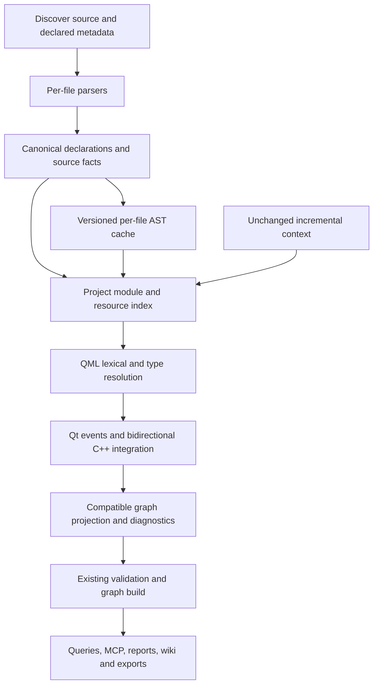

# Qt and QML analysis architecture

Status: local QML-00 through QML-03 implementation, with later Qt integration explicitly planned. The historical audit describes Graphify 0.9.74 at upstream commit `0b60d47e6cd9338c51143f39f35b6c45c8453385` on 3 October 2026; that imported revision lacked QML extraction. This checkout now has dedicated QML extraction, `qmldir`/scope resolution and static QML/JavaScript relationships. [IMPLEMENTATION.md](IMPLEMENTATION.md), [VALIDATION.md](VALIDATION.md) and [traceability](../../tests/TRACEABILITY.md) own current acceptance evidence; [AUDIT.md](AUDIT.md) remains the baseline record.

The baseline/reuse review includes [feature request #1716](https://github.com/Graphify-Labs/graphify/issues/1716) and [implementation proposal #1748](https://github.com/Graphify-Labs/graphify/pull/1748), covering QML and Qt/C++ bridging. The recorded proposal review and parser decision informed the local implementation. Refresh the proposal's head before upstream delivery; its historical installation instructions and an open PR do not establish shipped support. This design retains the wider metadata, bidirectional bridge, incremental and consumer contracts needed for complete support.

## Objective and boundaries

Extend Graphify's existing deterministic extraction pipeline so an agent can trace a QML component, its imports, property dependencies, handlers, JavaScript helpers, and explicitly exposed C++ API. Make both integration directions first-class: C++ APIs supplied to QML (QML-008), native Qt C++ signal/slot connections and emissions (QML-016), and C++ loading and accessing QML object APIs (QML-017). Keep the implementation suitable for small upstream contributions. Preserve existing public APIs, graph formats, installation behavior, and analysis of other languages.

The default analysis reads source files and declared metadata. It does not instantiate QML, load plugins, run CMake or qmake, execute JavaScript, or require Qt, PySide, PyQt, libclang, a compiler, or Node.js. A locally installed Qt tool can be an optional validation oracle in development or an explicitly selected enrichment adapter later. It is never necessary for ordinary extraction.

Static analysis must report its limits. A literal declaration can be certain while its runtime availability remains unknown. Missing import paths, dynamic creation, context properties, conditional compilation, overloads, and runtime-selected resources must remain visible as unresolved or conditional facts.

Non-goals for the first release:

- Full QML engine equivalence, executable evaluation, runtime signal ordering, lifecycle or thread analysis.
- Replacement of Graphify's generic JavaScript/C++ extractors, resolver registry, graph storage, CLI, or MCP API.
- A mandatory graph-wide migration to a multigraph or a new required node/edge schema.
- Full CMake/qmake interpretation, macro expansion, automatic SDK discovery, fetching remote imports, or loading binary plugins.
- Qt Widgets Designer `.ui` XML, binary `.rcc`, compiled QML caches, Qt for Python registration, and QML written inside arbitrary strings.

## Declared compatibility targets

The agreed first-release target is ordinary Qt 6 QML and Qt Quick projects, with both CMake and qmake metadata support. Current source fixtures distinguish Qt 6.5 and Qt 6.8 syntax profiles; CMake modules using `qt_add_qml_module` and literal qmake declarations remain QML-05 work. These are fixture targets, not a claim of complete support for either SDK release. Qt 6.8 module-layout policy differences need their own fixtures. Additional Qt 6 versions earn a support claim only when relevant constructs pass the corpus; unknown syntax produces coverage diagnostics.

Qt 5.15 semantic compatibility forms a separate legacy profile. Versioned imports, manual `qmldir`, qmake, and literal procedural registration are also supported forms to test in Qt 6; they are not deferred solely because older Qt projects use them. Common syntax can parse earlier, but passing Qt 6 fixtures does not establish Qt 5 semantic support. Qt module import versions are not Qt library release numbers and must be stored separately.

Host packaging targets are Graphify's Python 3.10+ baseline on Windows x64, Linux x64/ARM64, and macOS x64/ARM64, subject to the parser spike and upstream CI matrix. Windows ARM64, Linux musl, PyPy, and new Python releases remain unverified until installation and extraction are tested. Source analysis is independent of the application's deployment platform.

Executed local validation is Windows x64/Python 3.12. A published wheel for another host is packaging evidence, not a passed extraction or semantic test lane. Qt 6.5/6.8 fixture profiles do not assert QML-engine equivalence or an installed Qt SDK.

## Existing integration contracts

The baseline has the extension points needed for an additive implementation:

| Contract | Existing source | Consequence for Qt/QML |
| --- | --- | --- |
| Filename classification and collection | `graphify/detect.py`, `graphify/extract.py:collect_files` | Add extensions and explicit filename predicates; `qmldir` and `CMakeLists.txt` cannot be covered by suffixes alone. |
| Per-file extraction and facade | `graphify/extractors/`, `graphify/extract.py` | Add separate extractor modules; keep facade re-exports and package registry consistent. |
| Root and ID normalization | `graphify/extract.py:extract`, `graphify/ids.py` | Pass the explicit scan root. QML scope identities must survive root remapping and normalization. |
| Cross-file resolver registry | `graphify/resolver_registry.py` | Reuse the post-extraction seam, while accounting for activation on metadata-only changes. |
| Incremental context | `extract(..., resolution_context_nodes=..., resolution_context_edges=...)` | Unchanged declarations can extend resolution, but changed metadata may require recomputation of edges sourced by unchanged QML. |
| Schema | `graphify/validate.py` | Nodes retain `id`, `label`, `file_type`, `source_file`; edges retain `source`, `target`, `relation`, `confidence`, `source_file`. |
| Confidence | `EXTRACTED`, `INFERRED`, `AMBIGUOUS` | Reuse these three labels, with structured evidence explaining what was resolved. |
| Cache | `graphify/cache.py` | Current AST cache is namespaced by package version and cache schema. Cache source facts, not project-context decisions. |
| Graph construction | `graphify/build.py:build_from_json` | Graph/DiGraph keeps one edge per node pair. Distinct Qt facts cannot depend on parallel edges surviving. |
| Queries and exports | `affected.py`, `cli.py`, `serve.py`, `callflow_html.py`, exporters/wiki/report | Relation filters and field serialization must be checked explicitly; schema acceptance alone does not establish usability. |

The migration rules in `graphify/extractors/MIGRATION.md` concern moving existing extractors verbatim. Add QML functionality as feature contributions without combining it with unrelated extraction refactors. Modules under `extractors/` must not import `graphify.extract`.

## Pipeline and module seams

The pipeline shows the target system, including future resource/Qt bridge and
versioned-cache stages. The table below distinguishes implemented seams.

Implemented seams and later proposed owners:

| Module | Responsibility |
| --- | --- |
| `extractors/qml.py`, `qml_ast.py`, `qml_declarations.py`, `qml_facts.py` | Implemented: lazy parser, bounded source input, portable declaration/scope IDs and lossless literal metadata. `.qml`/`.ui.qml` use the same parser. |
| `extractors/qml_metadata.py` | Implemented: literal `qmldir` records, versions, singleton/internal/script exports and import/dependency facts. `.qmltypes` remains planned. |
| `qml_module_index.py`, `qml_scope.py`, `qml_resolution.py` | Implemented: per-run read-only lookup contract over accepted facts; document-local aliases, observed module versions, component/member scopes and source-owned resolution sites. |
| `extractors/qml_expressions.py`, `qml_js_scopes.py`, `qml_scripts.py`, `qml_script_syntax.py` | Implemented: static bindings/read/call/alias/handler facts and bounded QML-owned overlays of admitted JS resources. |
| `qml_relationship_lookup.py`, `qml_relationships.py`, `qml_projection.py`, `qml_safety.py` | Implemented: alias/script lookup, relationship projection, narrow script cross-language proof and publication guards. |
| `extractors/qt_cpp.py` | Collect meta-object, exposure, signal emission, connect/disconnect, loader, context and object-access facts from C++ syntax and source ranges; decorate or refer to existing C++ declaration IDs rather than creating duplicate C++ classes. |
| `extractors/qt_project.py` | Collect literal CMake/qmake declarations and `.qrc` mappings. Recognize unsupported expressions without evaluating them. |
| Future Qt bridge/resource resolvers | Planned: project/resource and engine/component provenance, native C++ events and both QML/C++ integration directions. They must preserve existing C++ identities and work independently where QML parsing is unnecessary. |
| Existing facade and registry | Dispatch/re-export extractors, forward the scan root, and invoke the resolver; retain current callers. |

Per-file extraction is independent of filesystem-wide lookup and safe in worker processes. The coordinator supplies the scan root explicitly to the QML/Qt entry points; extending `_safe_extract` and worker forwarding for that purpose is a small required integration change. Do not emulate the existing XAML ambient root with new global Qt state. Indexes are scoped to one extraction run and invalidated between watch/MCP runs.

The implemented resolver rebuilds bounded project indexes each run. It owns lookup tables and borrows accepted declarations read-only; fresh expression sites receive resolution status, while borrowed incremental context is never mutated. Optimize after correctness and incremental parity are established. Deterministic tie handling is required; Windows tests do not establish cross-platform parity.

## Parser decision and packaging gate

D2 is accepted for the optional language-pack adapter. The
[QML-00 decision](PARSER_DECISION.md) records installed ABI, license, footprint,
offline invocation, executed platform lanes and remaining evidence gaps.

QML is a dedicated grammar with embedded JavaScript. Parsing all QML as JavaScript or recovering types with regular expressions cannot support reliable scope and bindings.

Verified candidate evidence as of 3 October 2026:

| Candidate | Verified facts | Decision |
| --- | --- | --- |
| Standalone `tree-sitter-qmljs==0.3.1` | [PyPI release](https://pypi.org/project/tree-sitter-qmljs/0.3.1/) lists one source distribution and no wheels. [Grammar license](https://github.com/yuja/tree-sitter-qmljs/blob/master/LICENSE) is MIT. [Python metadata](https://github.com/yuja/tree-sitter-qmljs/blob/master/pyproject.toml) declares optional `core` dependency `tree-sitter~=0.21`; [binding source](https://github.com/yuja/tree-sitter-qmljs/blob/master/bindings/python/tree_sitter_qmljs/binding.c) returns an integer language pointer. | Do not add as a mandatory dependency or assume compatibility with Graphify's `tree-sitter>=0.23,<0.26`. Test a maintained binding/package path before selection. |
| `tree-sitter-language-pack==0.11.0` | Already used by Graphify's optional R/Erlang extras. [Release page](https://pypi.org/project/tree-sitter-language-pack/0.11.0/) lists `qmljs`/`qmldir`, MIT/Apache licensing, and wheels for Windows x64, Linux x64/ARM64, macOS x64/ARM64. [Versioned metadata](https://github.com/Goldziher/tree-sitter-language-pack/blob/v0.11.0/pyproject.toml) requires `tree-sitter>=0.25.2`. [Grammar manifest](https://github.com/Goldziher/tree-sitter-language-pack/blob/v0.11.0/sources/language_definitions.json) pins QML grammar revision `0bec4359a7eb2f6c9220cd57372d87d236f66d59`. | Selected optional adapter, with installed Windows API/parser evidence in the decision record. Dependency intersection is `>=0.25.2,<0.26`; published wheels do not establish unexecuted platform lanes. |
| Dedicated maintained QML Python wheels | A smaller optional dependency could avoid a many-language pack. It would require compatible bindings, generated grammar, platform build/release maintenance, and preserved notices. | Alternative if the pack fails coverage/size criteria; do not silently create a permanent vendored parser. |
| Qt tooling | [qmllint](https://doc.qt.io/qt-6.8/qtqml-tooling-qmllint.html) and [qmltyperegistrar](https://doc.qt.io/qt-6.8/qtqml-tooling-qmltyperegistrar.html) provide Qt-aware tooling. | Optional test oracle or future explicit metadata adapter. Avoid embedding Qt private parser APIs or requiring a Qt installation. |

The [QML grammar](https://github.com/yuja/tree-sitter-qmljs/blob/master/grammar.js) defines import/version/alias, property, signal, inline component, and enum constructs using a TypeScript-derived grammar. Its [README](https://github.com/yuja/tree-sitter-qmljs#pitfalls) explicitly documents that grouped property notation parses as an object definition. These facts identify spike cases; they do not prove semantic correctness or coverage of modern Qt.

QML-00 recorded proposal #1748 reuse findings, installed API/ABI, grammar/licensing and Windows parser evidence in [PARSER_DECISION.md](PARSER_DECISION.md). Remaining CI hosts and later `.qmltypes` semantics still need their own evidence. The optional adapter is selected; the broader release gates below remain applicable.

The optional `qml` extra uses the pinned language-pack adapter; the standard-library `qmldir` reader does not require it. Parser absence/load/syntax failure emits no authoritative QML nodes or edges and a diagnostic; CLI/watch reject incomplete publication and retain the prior graph. No lexical fallback is implemented. Any future fallback needs a separate reduced-coverage contract and must not masquerade as a complete AST result.

## Source facts, identity, and graph projection

### Identity and scope

IDs are derived from the explicit repository root and normalized with Graphify's existing ID utility. Use the complete repository-relative filename, including suffix, so `Panel.qml`, `Panel.ui.qml`, `Panel.qmltypes`, and `Panel.cpp` remain distinct. Keep source spelling case-sensitive in resolution even though Graphify normalizes persisted IDs using casefold/NFKC.

A QML declaration identity consists of `(relative file, component scope, object scope, declaration kind, exact name/signature)`. Append a deterministic digest of the exact identity tuple before normalization to prevent different case or punctuation spelling from collapsing. Named properties/functions/signals should survive line insertions. Inline components get their own named component scope. An object with an `id` uses that id within its component scope; an anonymous object uses a deterministic structural anchor and sibling ordinal. Anonymous IDs may change when siblings are reordered; document that limitation instead of claiming full edit stability. Line/byte ranges describe evidence and are not the sole identity for named declarations.

Module/type lookup keys are separate from display IDs: `(project/target, module URI, export name, major/minor availability, import root/provider)`. An alias is document-local lookup context, not a new global module name. An `id` in one component does not match an equal `id` in another file or component. Test relocation, duplicate filenames, `foo` versus `Foo`, Unicode normalization, inline-component shadowing, and Windows separator handling through the complete extract/build/export path.

### Additive contract

Retain `file_type="code"` for source/metadata nodes. Use existing optional `type` values where appropriate (`file`, `class`, `function`, `property`) and a namespaced `metadata.qml` or `metadata.qt` object for precise kinds. Do not add new required top-level fields or confidence labels. The namespace has its own `contract_version` so future extractors can reject stale fact shapes while old consumers ignore optional metadata.

Implemented QML metadata has `contract_version=1`, `kind`, exact literal names/types, `component_key`, `object_scope_key`, parent/enclosing scope keys, imports/versions, modifiers and UTF-8 spans as appropriate to each fact. Fixed-width scope hashes avoid multiplying parent-ID length. Occurrence sites carry their owner and exact expression span. `raw_values` holds bounded base64 companions for literal strings so HTML sanitation does not alter semantic lookup; the getter validates map/field types, base64/UTF-8 and the 512-encoded-byte bound. Consumers use `qml_facts.qml_metadata` rather than interpreting escaped display strings. Corrupt transport rejects analysis rather than changing a target silently.

Keep facts necessary for future resolution on their owning nodes in bounded metadata: imports, type exports, member signatures, raw reference paths, and resolution status. Per-file transient `qml_facts` may aid coordination, but unchanged-file resolution cannot depend on transient data discarded by graph serialization. Keep fact ownership explicit so changing/deleting a source removes its facts and derived edges. Avoid storing whole files, credentials, SDK paths, or machine-specific configuration in graph output.

The graph is a conservative projection of these facts:

| Fact | Compatible projection | Context/evidence |
| --- | --- | --- |
| Component/object/member declaration | Owner `contains` declaration | `metadata.qml.kind=declaration`, exact source span |
| Module/directory/JS import | Import declaration `contains` resolution site; site `imports` provider/namespace/file | `qml_import_resolution`; URI/path, version, alias, import kind |
| QML component root/base | Type/member lookup follows a known source component | Explicit `inherits` projection remains planned |
| Object creation/type use | Object `contains` type-use site; site `uses` resolved component | `qml_type_resolution`, provider evidence |
| Property alias | Alias member `contains` alias site; site `references` resolved target | `qml_alias_target`, bounded alias-chain evidence |
| Property binding | Owner `contains` binding; binding `contains` per-occurrence read; read `uses` target | `qml_binding_read`; possible reads, no evaluation order |
| Handler | Object `contains` handler; handler `references` signal | `qml_signal_subscription`; declaration and subscription remain separate |
| Direct function call | Owner `contains` call site; site `calls` resolved function | `qml_js_call` or `qml_script_call`, lexical/type/import evidence |
| Signal emission | Caller `contains` emission site; site `uses` declared signal | `qml_signal_emit` or `qt_signal_emit`; do not label event propagation as an ordinary direct call |
| Qt connection | Caller `contains` connection site; site `references` signal and `uses` receiver callable/signal | `qt_connect_signal`, `qt_connect_receiver`; sender/receiver/context, signature, declared connection flags and condition evidence |
| Qt disconnect | Caller `contains` disconnect site; site `references` resolved connection or explicit endpoints | `qt_disconnect`; no assumed removal of every possible runtime connection |
| Qt registration | Export/provider node `uses` existing C++ class | `qt_type_registration`, macro or literal registration evidence |
| C++ property access | QML binding/handler `uses` C++ property node | `qml_cpp_member`, registration + receiver + member evidence |
| C++ loads QML | Caller `contains` loader site; site `uses` QML component | `qt_cpp_qml_load`, literal URL/module and engine/component provenance |
| C++ finds QML object | Caller `contains` lookup site; site `references` scoped QML object | `qt_cpp_qml_find_child`, literal `objectName`, type/options and root evidence |
| C++ accesses QML API | Caller `contains` access site; site `uses` QML member | `qt_cpp_qml_property_read`, `qt_cpp_qml_property_write`, `qt_cpp_qml_invoke`; API variant, member signature and object provenance |
| Context/initial properties | Source owner `contains` exposure site; site `uses` provider/member | `qt_context_exposure`, `qt_initial_property`; named mapping scoped to the supplied context/component |
| Resource reference | Site `references` resource mapping/file | `qml_resource`, URL + prefix/alias evidence |

Binding/handler/registration/resource and Qt event/access site nodes distinguish relations that would otherwise compete for one edge between the same pair. Keep sender, receiver, context and bridge direction in `metadata.qt`, including distinct endpoint roles when a signal connects to itself. They do not eliminate all duplicate edges: preserve the bounded underlying facts and adopt a deterministic projection rule. Round-trip tests must show which facts survive the simple graph. A multigraph change is a separate upstream design proposal if precision later demands it.

Do not globally put QML, JavaScript, and C++ into one language family. The baseline deliberately prevents inferred calls crossing unrelated language families. A direct QML-to-C++ `calls` edge requires a narrow, validated Qt bridge marker checked by the builder and tests; until that contract exists, expose member dependencies through `uses`. Changing an edge to `EXTRACTED` merely to bypass the cross-language guard is invalid.

The implemented builder exception covers only dedicated QML script import/call sites. Import edges prove the accepted script-file ID/path/role; call targets are dedicated QML script-function overlays. A context string or same label alone cannot enable a bridge. On undirected JSON reload, `paths.load_node_link_graph` restores `_src`/`_tgt` for contract-versioned QML edges from serialized endpoints. Consumers must use that retained orientation rather than NetworkX iteration order. This restores producer direction without converting the graph or promising that every consumer already exposes every mechanism.

### Evidence and confidence

Every edge has a source file and relation-site location. Resolved edges also carry bounded namespaced evidence: method, source span, relevant import/export/registration IDs, candidate count, selected provider/target, and assumptions. Store repository-relative evidence paths and preserve `source_location="L<number>"` for current consumers; optional end/column/byte fields can provide precise spans.

- `EXTRACTED`: an explicit source relationship with uniquely established endpoints, such as containment or a local lexical reference. A literal import declaration can be extracted even when the module's runtime implementation is unavailable.
- `INFERRED`: a unique target derived through declared imports, type/member data, or a narrowly proven C++ bridge. Explain that chain. Static exposure does not prove the code executes.
- `AMBIGUOUS`: competing providers or a dependency requiring unresolved context. Prefer a diagnostic or scoped unresolved reference node over edges claiming that every candidate is used.

Unknown is distinct from external. Current missing providers/members remain source-owned unresolved sites; external SDK leaf stubs are not emitted. A future typed external leaf would need URI/type/version identity and could not pretend SDK source is present. Do not create global nodes for every unresolved `width`, `model`, or `submit`. Confidence scores, if emitted, express policy rather than a calibrated probability and do not override the categorical/evidence contract.

## Resolution semantics

### Imports, exports, and versions

Collect module imports (`import Example.Controls 1.2 as Controls`), directory imports, JavaScript aliases, and implicit local-directory visibility. Qt supports qualified namespaces and directory/JavaScript import forms; these need distinct lookup behavior. Resolve only against the scanned repository and explicit, declared import roots. Do not read ambient `QML_IMPORT_PATH` or search a developer's SDK silently. See [QML import syntax](https://doc.qt.io/qt-6/qtqml-syntax-imports.html).

`qmldir` supplies module URI, versioned exports, singleton/internal flags, JS exports, plugin/typeinfo declarations, dependencies/imports, and preferred paths. Preserve the difference between a packaging dependency (`depends`) and an imported visible namespace. Module imports may share a qualifier, while a JS resource has its own alias. A module URI is not sufficient to pick between competing project targets. Include declared import-root priority only when configured; otherwise record duplicate providers.

Keep requested versions, exported versions, and C++ member revisions independently. Select a provider only when the supported Qt profile and available metadata establish visibility. Test versionless, major-only, exact major/minor, missing version, incompatible major, singleton, internal, and multiple-export-version cases. Unknown revisions remain unresolved rather than choosing a filename or the highest version globally. [Qt's module definition documentation](https://doc.qt.io/qt-6.8/qtqml-modules-qmldir.html) distinguishes exports, imports, dependencies, and tooling-only type information.

`.qmltypes` is declarative tooling metadata, not executable QML or a replacement for runtime registration. Parse its module/components, prototypes, exports/revisions, properties, methods, signals, enums, singleton/creatability and known flags with a supported format profile. Unknown fields are retained as coverage diagnostics. Imported metadata is evidence for an API surface; it is not proof that a matching plugin is built or loaded. Source/generated metadata disagreements are reported, with both origins preserved.

Current module lookup defaults to the explicit scan root, with ordered root-relative import roots available at the index API. It accepts unversioned provider directories and explicitly requested `.major`/`.major.minor` layouts. Requested versions need observed `qmldir` export-version evidence; type introduction selects the latest compatible export only after module availability is established. Versionless/major-only selection uses observed versions in an eligible provider. Script exports have a separate lookup role from object types. Missing roots/versions, internal exports, conflicting eligible targets and resource `prefer` paths retain reasons. `.qmltypes`, CMake/qmake registrations, resource redirects and runtime plugin availability are not implemented by this reader.

Bounds are 1 MiB/10,000 meaningful `qmldir` records, 50 diagnostics/evidence/candidate entries, 32 module/inheritance/alias depth and 1,024 module-query steps. The member-continuation API accepts at most 32 parts; collected qualified source paths are capped at 256 characters. Limits produce explicit rejection/coverage reasons; truncating lookup identity is prohibited.

### Components, properties, and JavaScript

Resolution follows a supported subset of QML's actual scopes: JavaScript lexical locals/parameters first, component IDs, the binding's scope-object members, component root members, and imported types/JS. Inheritance lookup requires a known type. Keep named inline components, `Component` bodies, delegates, and outer instance-context lookups explicit; do not treat all descendants as sharing one unrestricted property namespace. [Qt scope documentation](https://doc.qt.io/qt-6.8/qtqml-documents-scope.html) explains component scope and runtime instance hierarchy; context-dependent outer lookups stay conditional.

Resolve grouped properties against the known property's declared type. Resolve attached properties/handlers through an attaching type. Grammar shape or initial capitalization alone cannot decide whether `font { ... }` is a property group or an object instance. If type information is missing, retain the ambiguous syntax fact and suppress a confident instantiation edge. Aliases refer to scoped objects/properties; they are not arbitrary JavaScript expressions. Required/default/readonly properties and list/object values are declaration facts. [Qt object attributes](https://doc.qt.io/qt-6.8/qtqml-syntax-objectattributes.html) provides the semantic distinctions.

Embedded JavaScript uses the QML parser's subtrees or a byte-preserving JS adapter. Share existing JS traversal utilities where safe, but do not apply Node/npm resolution to QML script imports. Ordinary QML `.js` supports `.pragma library` and `.import` directives, while `.mjs` uses ECMAScript module semantics. Detect that context and preserve original line/column offsets if directive masking is needed. JS files shared with an ordinary web project must retain normal Graphify JS behavior. See [JavaScript resource imports](https://doc.qt.io/qt-6.8/qtqml-javascript-imports.html).

Recognize local `signal` declarations, `onSignal` handlers, property change handlers, attached handlers, and `Connections` with a statically resolved `target`. A handler-to-signal dependency and calls in its body are separate facts. Derive `on<Property>Changed` from the exposed property, including C++ NOTIFY information; do not derive it solely from the C++ notifier's spelling. Dynamic `Connections.target`, `signal.connect()` callback replacement, disconnection, and lifetime behavior are recorded without simulating execution. See [Qt signals and handlers](https://doc.qt.io/qt-6.8/qtqml-syntax-signals.html).

Current expressions resolve component-local reads, typed-property continuations, bounded alias chains, local functions and source-visible signals. JS parameters, block/loop/catch bindings and function-scoped `var` shadow QML names; reassigned local callables stay dynamic. A per-use shadow flag survives bounded lexical-name display lists. Pure assignment targets are writes; receiver/index evaluation and augmented assignments retain their reads. No getter/expression is invoked. `Connections` needs a static supported target; mixed legacy/function handler styles retain the ignored-function reason. Property change handlers use a separate inferred notify-signal node. Attached providers, dynamic targets and full signal lifetime behavior remain unresolved.

`Component`, `delegate` and `sourceComponent` name-based barriers conservatively separate template-body IDs from their enclosing document. These are scope safeguards, not type-proven Qt runtime context: a custom type/property using those spellings can be conservatively unresolved. Creation/outer context, arbitrary model roles and implicit runtime ancestry remain unproven. `this` uses the source owner; `parent` needs an explicit `static_parent_scope_key`, not lexical containment alone.

Accepted `.js`/`.mjs` imports get distinct QML-owned file/function/use overlays; generic JS declarations and callers keep their original graph. Classic `.pragma library`/literal `.import` directives are masked without changing byte offsets, while supported ESM exports control `.mjs` visibility. Script bodies do not inherit an arbitrary importing QML document's IDs or context. Computed dispatch, unsupported re-exports and full dynamic JS dataflow are coverage gaps. Overlays read only admitted script paths, with a 5 MB/100,000-node/depth-256 input limit and at most 256 enriched script files.

`.ui.qml` uses the same QML extraction pipeline and preserves its compound suffix identity. Its companion `.qml` implementation can reference exported aliases using normal module/type rules. Qt Creator [documents a restricted UI-file subset](https://doc.qt.io/qtcreator/creator-quick-ui-forms.html); Graphify analyzes files as written and may report restrictions, but does not rewrite them or claim to enforce every Designer rule.

### C++ and Qt meta-object exposure

This subsection and the following native-event, reverse-access and build/resource
contracts are planned QML-04/QML-05 behavior, not QML-03 capabilities.

Overlay Qt facts on the existing C++ extractor. Collect explicit `Q_OBJECT`, `Q_GADGET`, `Q_NAMESPACE`, `Q_PROPERTY` attributes, `Q_INVOKABLE`, signal/slot sections and macros, `Q_ENUM`/`Q_FLAG`, and class/member source ranges. Record READ/WRITE/MEMBER/NOTIFY/BINDABLE/REVISION/CONSTANT flags without requiring `moc`. A public C++ method is not automatically callable from QML. Supported member exposure must come from meta-object declarations or supplied `.qmltypes`. See [Qt C++ attributes exposed to QML](https://doc.qt.io/qt-6.8/qtqml-cppintegration-exposecppattributes.html).

Combine declarative registration (`QML_ELEMENT`, `QML_NAMED_ELEMENT`, singleton/uncreatable and version macros) with the enclosing CMake/qmake module declaration. A `QML_ELEMENT` alone does not identify a module URI. Literal `qmlRegisterType<T>`, uncreatable and singleton registrations can supply URI/version/export name when template/type and argument values are established. Dynamic registrations, macro wrappers, factories and complex expressions remain unresolved. [Integration macros](https://doc.qt.io/qt-6.8/qqmlintegration-h.html), [registration functions](https://doc.qt.io/qt-6.8/qqml-h.html), and [defining C++ QML types](https://doc.qt.io/qt-6.8/qtqml-cppintegration-definetypes.html) describe these different paths.

Parse supported macro arguments with balanced syntax and source offsets. `QML_NAMED_ELEMENT(EventDatabase)` takes an identifier; a quoted argument is not the documented syntax. The reuse review of #1748 must correct its quoted-name regex/test case and preserve upstream C++ macro normalization before adopting that overlay.

Join QML member usage to a C++ member only with a resolved module export, receiver type, exposed member name, visibility/revision, and unique declaration. Distinguish property reads/writes, getter/setter dependencies, signal dependencies, and invokable/slot calls. Do not infer a method call to the getter from every binding; the property dependency is the core fact. Overloads, typedefs, conditional compilation and inherited members need explicit handling or an ambiguity diagnostic.

Literal `setContextProperty("backend", &backend)` produces a scoped exposure fact when the provider type and engine/component path can be traced. Supported `setContextObject(&provider)` also supplies its declared properties to that specific context. Preserve explicit-property precedence over context-object properties and known parent/child context mappings; unknown creation context stays conditional. Neither form injects a global provider into every QML file. [QQmlContext](https://doc.qt.io/qt-6.8/qqmlcontext.html) defines these context boundaries and precedence. Context properties are invisible to Qt's ahead-of-time QML tooling, as [Qt documents](https://doc.qt.io/qt-6.8/qtqml-cppintegration-contextproperties.html); our source heuristics also require bounded application-context evidence.

Collect literal initial-property maps from `QQmlApplicationEngine::setInitialProperties` and `QQmlComponent::createWithInitialProperties`, retaining the supplied member names, provider values and owning loader/component. Resolve an object-valued provider's exposed surface only when its C++ type and the QML target property are established. These are initial property assignments, not context-global names. Preserve unresolved values and conditional ordering. Arbitrary interprocedural context-object/initial-property dataflow remains deferred. See [engine initial properties](https://doc.qt.io/qt-6.8/qqmlapplicationengine.html#setInitialProperties) and [component creation](https://doc.qt.io/qt-6.8/qqmlcomponent.html#createWithInitialProperties).

### Native Qt C++ signals, slots and connections

QML-016 extends ordinary C++ analysis even when no QML files are present. Retain `signals`/`Q_SIGNALS` sections, `Q_SIGNAL`, access-qualified slot sections, `Q_SLOTS`/`Q_SLOT`, full member signatures and declaration ownership. Collect `emit`/`Q_EMIT` sites, and classify a resolved invocation of a declared signal as emission even if the optional keyword is absent. A direct call to a slot remains an ordinary C++ call. A signal emission refers to its signal declaration; it does not invent immediate calls to connected receivers. Qt's [signals and slots documentation](https://doc.qt.io/qt-6.8/signalsandslots.html) distinguishes normal direct C++ access from meta-object delivery, which can reach private slots. Preserve access and invocation mechanism separately; do not expose every private slot as a QML API.

Recognize `QObject::connect` and receiver/bare `connect` only where syntax/type evidence identifies the Qt API. Support member pointers, signal-to-signal connections, `qOverload`/supported `static_cast` selectors, lambda/functor callbacks with or without a context object, and string-based `SIGNAL`/`SLOT` forms. Resolve signatures against the sender/receiver type and visible declarations, rather than a global label. A pointer-form receiver can be a compatible ordinary member; a string-form private slot is a meta-object endpoint. A lambda has its own source-owned callable identity, and calls in its body stay ordinary calls from that callable. Preserve explicit `disconnect` endpoints or a traceable connection handle as separate source facts. [QObject's connection overloads](https://doc.qt.io/qt-6.8/qobject.html#connect) define these forms; source analysis records a declaration of intent, not successful runtime registration.

Store the declared `Qt::ConnectionType` and literal flags, including default `AutoConnection`, in connection metadata. Keep `DirectConnection`, `QueuedConnection`, `BlockingQueuedConnection`, `UniqueConnection` and `SingleShotConnection` distinct when present. `AutoConnection` depends on runtime thread affinity at emission; static source must not choose a delivery mode or claim thread safety/order. Flag expressions outside the supported literal subset remain unresolved. `UniqueConnection` has a documented limitation for lambda/functor targets; report that limitation without predicting execution. See [connection types](https://doc.qt.io/qt-6.8/qt.html#ConnectionType-enum) and [QObject](https://doc.qt.io/qt-6.8/qobject.html#connect).

### C++ consumption of QML object APIs

QML-017 follows a bounded source-backed chain: literal loader/module reference, the same engine or component handle, selected root/created object, optional named child, then a literal property/method/signal name. Collect `QQmlApplicationEngine::load`/`loadFromModule`, `QQmlComponent` URL construction/loading and `create`/`createWithInitialProperties`, and `rootObjects` access. `loadFromModule` is a Qt 6.5+ API and resolves through the declared module index. Component-relative URLs use the engine base URL; absent source-backed configuration, do not resolve them relative to the C++ source directory. Record possible loaded/created component types without asserting that creation succeeded or returns a live object. See [QQmlApplicationEngine](https://doc.qt.io/qt-6.8/qqmlapplicationengine.html) and [QQmlComponent](https://doc.qt.io/qt-6.8/qqmlcomponent.html).

The Qt Quick view profile also supports literal `QQuickView::setSource` paired with the same view's `rootObject`, engine/root context and initial-property declarations. Use the same URL/member/provenance rules. `QQuickView::loadFromModule` is available only from Qt 6.7, unlike the engine's Qt 6.5 method; do not conflate their version gates. Qt documents these entry points in [QQuickView](https://doc.qt.io/qt-6.8/qquickview.html). `QQuickWidget` and custom loader wrappers need a separately reviewed profile.

Initially support local assignments, typed handles and explicit receiver chains within a documented function scope. Reassignment, escaping pointers, multiple possible loaders/root objects, computed names or dynamic creation stop a unique resolution. A root selection must be tied to the same engine and a uniquely supported load; a `QObject*` declaration alone is insufficient. Map literal QML `objectName` values to potential child objects under that component, respecting established object-tree/type/search-option evidence. A QML `id` is not an `objectName` lookup key. Duplicate names and delegate/runtime-created descendants remain ambiguous; the QML visual hierarchy alone does not establish a particular runtime QObject child tree.

With that provenance, resolve supported literal `QObject::property`/`setProperty`, `QQmlProperty` read/write, and `QMetaObject::invokeMethod` to QML properties/functions/signals. Preserve read/write direction and the API variant; do not simulate binding effects or property values. Retain invocation signature and declared connection type where supplied. Unknown signatures, missing members, computed names and dynamic properties keep diagnostics. A meta-object invocation is an access/dispatch dependency; it is not a proven synchronous direct call. QML-declared signals can connect to C++ slots/callables through the same connection-site contract, using known meta-object signatures. C++-to-QML handlers use the resolved exposed signal/object contract in the other direction. Qt documents these surfaces in [C++ interaction with QML objects](https://doc.qt.io/qt-6.8/qtqml-cppintegration-interactqmlfromcpp.html), [QQmlProperty](https://doc.qt.io/qt-6.8/qqmlproperty.html), and [QMetaObject invocation](https://doc.qt.io/qt-6.8/qmetaobject.html#invokeMethod).

### Build declarations and resources

Collect literal target/module facts from `qt_add_qml_module`/`qt6_add_qml_module`: target, URI, VERSION, PAST_MAJOR_VERSIONS, SOURCES, QML_FILES, RESOURCES, imports/dependencies, resource prefix, output/import directory, typeinfo and relevant source properties. CMake's command introduced in Qt 6.2 integrates QML, C++ and generated metadata; Qt 6.8's QTP0004 can produce additional `qmldir` files for subdirectories. Store policy/configuration evidence rather than assuming one generated layout. See [qt_add_qml_module](https://doc.qt.io/qt-6.8/qt-add-qml-module.html).

Support a documented literal subset of `set`, list appends and includes confined to the scan root only if required by fixtures. Unevaluated conditions, generator expressions, function scopes, toolchain inputs and environment substitutions become conditional/unresolved facts. Existing generated `qmldir`/`.qmltypes` from an explicitly included build directory may enrich the index, with their provenance and staleness recorded. Do not start a configure/build to obtain them automatically.

For qmake, collect literal `.pro`/`.pri` module name/version/config declarations, SOURCES/HEADERS, QML import paths and RESOURCES. Preserve included-file and conditional provenance. This is metadata extraction, not an implementation of qmake. Prefer explicit source/generated module metadata over guesses from directory names.

Parse `.qrc` XML without DTD/entity expansion. Map each file's path relative to the `.qrc`, runtime prefix and alias, and any locale/selector qualification. Keep filesystem paths and resource URLs distinct. Normalize `:/...` and `qrc:/...` to a common resource key while preserving source spelling. A `.qrc` alias can differ from the source basename; CMake's QML resource prefix also affects URLs. See [Qt resource system](https://doc.qt.io/qt-6.8/resources.html).

Resolve literal `Loader.source`, `Qt.createComponent`, `QQmlApplicationEngine::load`, `loadFromModule`, QUrl wrappers, and selected resource-valued properties when the supported API/context and URL can be established. A resolved literal gives a possible load/reference dependency, not proof of object creation. Variable URLs, `Qt.createQmlObject`, concatenated QML strings, remote URLs and runtime import/resource registration remain diagnostic facts. See [dynamic object creation](https://doc.qt.io/qt-6.8/qtqml-javascript-dynamicobjectcreation.html).

## Incremental behavior and consumers

Current safety bypasses AST cache reads/writes for QML and `qmldir` facts. QML/metadata edits, and JS edits in a corpus containing QML, conservatively re-extract accepted code before update/watch reconciliation. Failed/partial/omitted contributions and script/join failures reject publication even under force; prior graph, manifest and report outputs remain intact. Unsupported subfolder scoped-ID rebases reject with `QML_ROOT_MISMATCH`. Earlier scan/stat bookkeeping lies outside this publication boundary. Dependency-directed caching remains QML-06 work.

Separate the cacheable source-fact layer from project-context resolution. Existing AST cache versioning must invalidate incompatible Qt fact shapes; include parser/grammar and Qt contract versions in the selected cache identity. A warm cache cannot reuse a decision whose `qmldir`, `.qmltypes`, C++ exposure, import root or resource mapping has changed.

The first correct implementation may conservatively recompute all Qt/QML-derived resolution edges within the affected project target after metadata/exposure changes. Implement and test this fallback before enabling its update/watch path; otherwise reject the unsupported operation before graph/cache writes. A warning cannot make a known stale-output path acceptable. Reuse unchanged source facts from persisted node metadata. Later, use a dependency fingerprint/index for narrower invalidation. Track reverse dependencies on module providers, exports, member surfaces, resource maps and scoped loader/context/object provenance. Changes to QML members or literal object names must also re-resolve unchanged C++ consumers; changes to C++ signals/connect sites must update native event facts without needing modified QML. Deletion, rename, changed version, duplicate provider, and removed registration must remove obsolete edges and diagnostics.

Resolver activation must consider exact filenames and persisted QML/Qt context, not just suffixes in changed paths. A `qmldir`-only, CMake-only, `.qrc`-only or C++-header-only update can affect unchanged QML. Graphify's existing incremental context pass normally emits edges from fresh source files; the Qt increment must explicitly regenerate affected source-owned edges or resubmit those source files, and merge them using existing ownership rules. A suffix registration by itself does not solve this.

Discovery, code-only mode, direct single-file extraction, CLI update, watch batching and ignore/symlink containment all use the same filename classification policy. Add `.qml`, `.qmltypes`, `.qrc`, `.pro`, `.pri`, `.cmake` and exact `qmldir`/`CMakeLists.txt` rules as relevant increments land; `.ui.qml` is a specialization of `.qml`. Do not allow a metadata reference to escape the explicitly scanned/approved roots or fetch an HTTP import. External paths are represented without publishing absolute machine paths.

Consumer acceptance must cover `query`, node detail, `explain`, `affected`, MCP responses, reports, wiki, graph JSON, HTML, callflow, and selected export formats. Show original names, kinds, relation-site locations, exposure evidence, confidence and unresolved reasons. Keep ordinary functions in callflow; signal emissions/connections, meta-object dispatch and reactive dependencies must be labeled by their mechanisms. `affected` must preserve event and both bridge directions without fabricating direct call chains. Optional fields must survive relevant round trips or be intentionally omitted with a documented limitation. Check new kinds against summary/skill extraction instructions and regenerate skill artifacts through the existing generator if needed.

## Support matrix and release gates

The first column distinguishes implemented source-analysis scope from planned Qt work. Individual acceptance evidence and unexecuted lanes remain in [traceability](../../tests/TRACEABILITY.md); this matrix does not claim engine/runtime or cross-platform equivalence.

| Area | First accepted scope | Later/deferred scope |
| --- | --- | --- |
| `.qml` | File/root type, objects, IDs, members, source ranges, imports, parser diagnostics | Unknown future syntax, annotations beyond the tested parser profile |
| `.ui.qml` | Normal QML declarations and aliases; distinct compound filename | Complete Designer validation and editing |
| `qmldir` | Module URI, literal exports/versions, singleton/internal, JS/typeinfo, imports/dependencies | Runtime plugin availability, remote modules |
| `.qmltypes` | Planned tested metadata profile, exports/prototypes/members/revisions | Unknown schema variants and semantic equivalence to a loaded plugin |
| Imports | Repository-local modules/directories/JS, explicit roots, version/alias handling | Ambient SDK search, package installation, runtime engine path changes |
| Scope | Local lexical scope, component IDs, known members, named inline components | Full runtime instance hierarchy, arbitrary delegates/model-role typing |
| Bindings | Scoped alias targets, statically identified property reads, explicit conditional reads | Precise runtime dependency sets, evaluation order, cycles requiring execution |
| QML signals | Implemented local declarations/handlers, static supported `Connections`, property-change signals | Attached/C++-exposed providers, dynamic target/connect/disconnect lifetime modeling |
| JavaScript | Implemented embedded sites, accepted classic/ESM resource overlays and original locations | Arbitrary computed dispatch, re-export evaluation, scripts/QML strings execution |
| Qt C++ | Planned explicit meta-object members plus module/literal registration evidence | Arbitrary macro wrappers, compiler-level templates/overloads, full context dataflow |
| Qt C++ events | Planned signal/slot, emission, typed/signature connect, lambda/overload and disconnect profiles | Proving registration success, runtime delivery order, thread affinity/lifetimes, arbitrary callback wrappers |
| C++ consumes QML | Planned engine/component/view loaders, roots/objectName lookup and declared member access | Dynamic URLs/names, arbitrary pointer/dataflow, duplicate runtime object selection, custom loaders and QQuickWidget |
| Context and initial properties | Planned literal properties, typed context objects and scoped initial-property maps | Arbitrary interprocedural providers, runtime replacements and full context hierarchy reconstruction |
| CMake/qmake | Planned literal metadata subset and supplied generated files | Full configure/build evaluation and toolchain/platform conditional resolution |
| Resources | Planned `.qrc` prefixes/aliases, static CMake mappings and literal URL references | Binary `.rcc`, runtime registration, locale/file-selector selection |
| Qt 6 | Current Qt 6.5/6.8 source fixtures; broader bridge/metadata acceptance pending | Additional release profiles only after fixtures and tooling checks |
| Qt 5.15 | Planned separate legacy fixtures for manual/qmake/literal registration | Full historical Qt QML behavior and unsupported old syntax |
| Incremental | Implemented conservative QML/qmldir/JS refresh and fail-before-publication guards | Cache/dependency optimization and C++/resource invalidation parity |
| Consumers | Implemented site-preserving build/JSON reload and bounded metadata/evidence | Full QML-07 query/MCP/report/wiki/HTML/export mechanism acceptance |

Before advertising the first Qt/QML release, require:

1. A parser decision record with reproducible install, ABI, grammar, license and syntax results on declared platforms.
2. Positive fixtures and false-positive tests for duplicate IDs, names/modules, alias/version scope, grouped/attached syntax and unrelated C++ methods.
3. A small mixed QML/JS/C++ project whose expected dependencies are independently specified, including missing modules and deliberate ambiguity.
4. Cold, warm, sequential, parallel, relocated-root, full-update and metadata-only incremental outputs that agree after canonical sorting.
5. Regression tests proving unrelated language resolution, install without the extra, schema validation, graph build and essential consumers still work.
6. Explicit coverage/diagnostics documentation and an upstream review of any builder interop exception or cache/registry contract change.
7. Native Qt event fixtures distinguishing direct slot calls, emissions, private-slot/string connections, ordinary pointer-form receivers, lambdas, overload selectors and connection flags, including false positives from unrelated `connect` names.
8. Bidirectional fixtures with engine/component/view provenance, literal context/initial properties, objectName versus id, multiple roots/duplicate names, property read/write/invoke and QML-signal-to-C++ connections; validate QML-only and C++-only incremental edits through consumers.

## Decisions and alternatives

- **D1: Extend the existing pipeline.** New extractor/metadata/resolver modules preserve upstream reviewability. A separate Qt-only Graphify rewrite would duplicate orchestration and fragment consumers.
- **D2: Parser choice follows evidence.** The optional language-pack adapter is accepted from the recorded Windows spike. Other host lanes remain unexecuted; a smaller maintained binding is an alternative if coverage or package footprint later fails. Preserve optional core installation.
- **D3: Source facts precede resolution.** Resolve owned declarations using a per-run project index. Current QML caching is bypassed; future caching needs parser/fact invalidation. Avoid hidden filesystem lookups inside workers and stale context-dependent per-file edges.
- **D4: Precision requires scope and exposure evidence.** Do not resolve by global short-name matching or combine all language families. Qt bridging is a narrow extension with independent evidence and consumer tests.
- **D5: Preserve the stable public schema.** Namespaced optional metadata and compatible relations land first. Any new relation or graph storage mode requires a separate consumer/migration design.
- **D6: Ambiguity is a result.** Store a reason/candidate summary and avoid inventing runtime behavior. Optional Qt validation can strengthen the test corpus without becoming an execution dependency.
- **D7: Metadata is read, not executed.** Explicit import/build roots and supplied generated files provide reproducibility. Full build-system evaluation and dynamic runtime resolution remain separate future work.
- **D8: Qt events and both object API directions retain their mechanisms.** Emission/connection/load/access sites preserve source ownership, roles and evidence. Ordinary calls remain ordinary calls; event delivery and meta-object dispatch are dependencies with declared semantics and runtime limits.
