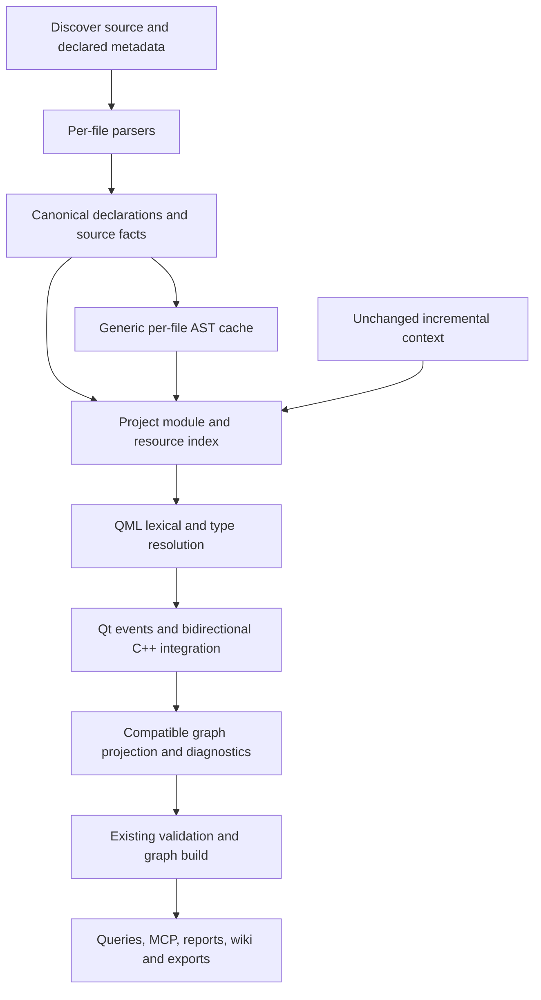

# Qt and QML analysis architecture

Status: INC-QML-00 through INC-QML-07 are implemented and verified for the bounded static source profile, with final declared hosted source/artifact evidence recorded. The historical audit describes Graphify 0.9.74 at upstream commit `0b60d47e6cd9338c51143f39f35b6c45c8453385` on 3 October 2026; that imported revision lacked QML extraction. This checkout has QML/JavaScript scopes, native Qt events and bidirectional bridges, literal project/resource/type-description metadata, and conservative configuration-aware refresh. [IMPLEMENTATION.md](IMPLEMENTATION.md), [VALIDATION.md](VALIDATION.md) and [traceability](../../tests/TRACEABILITY.md) own current acceptance evidence; [AUDIT.md](AUDIT.md) remains the baseline record.

The baseline/reuse review includes [feature request #1716](https://github.com/Graphify-Labs/graphify/issues/1716) and [implementation proposal #1748](https://github.com/Graphify-Labs/graphify/pull/1748), covering QML and Qt/C++ bridging. The recorded proposal review and parser decision informed the local implementation. Refresh the proposal's head before upstream delivery; its historical installation instructions and an open PR do not establish shipped support. This design retains the wider metadata, bidirectional bridge, incremental and consumer contracts needed for complete support.

## Objective and boundaries

The [follow-up audit](FOLLOWUP_AUDIT.md) invalidates broader receiver, engine and
type-alias scope claims for the reproduced cases at `95adbdc`. Corrective
INC-QML-17–20 preserve this architecture while establishing actual object,
declaration, type and literal-loader authority. They have bounded local evidence;
historical and correction passes do not imply
those semantic joins are correct.

Extend Graphify's existing deterministic extraction pipeline so an agent can trace a QML component, its imports, property dependencies, handlers, JavaScript helpers, and explicitly exposed C++ API. Make both integration directions first-class: C++ APIs supplied to QML (REQ-QML-008), native Qt C++ signal/slot connections and emissions (REQ-QML-016), and C++ loading and accessing QML object APIs (REQ-QML-017). Keep the implementation suitable for small upstream contributions. Preserve existing public APIs, graph formats, installation behavior, and analysis of other languages.

The default analysis reads source files and declared metadata. It does not instantiate QML, load plugins, run CMake or qmake, execute JavaScript, or require Qt, PySide, PyQt, libclang, a compiler, or Node.js. A locally installed Qt tool can be an optional validation oracle in development or an explicitly selected enrichment adapter later. It is never necessary for ordinary extraction.

Static analysis must report its limits. A literal declaration can be certain while its runtime availability remains unknown. Missing import paths, dynamic creation, context properties, conditional compilation, overloads, and runtime-selected resources must remain visible as unresolved or conditional facts.

Non-goals for the first release:

- Full QML engine equivalence, executable evaluation, runtime signal ordering, lifecycle or thread analysis.
- Replacement of Graphify's generic JavaScript/C++ extractors, resolver registry, graph storage, CLI, or MCP API.
- A mandatory graph-wide migration to a multigraph or a new required node/edge schema.
- Full CMake/qmake interpretation, macro expansion, automatic SDK discovery, fetching remote imports, or loading binary plugins.
- Qt Widgets Designer `.ui` XML, binary `.rcc`, compiled QML caches, Qt for Python registration, and QML written inside arbitrary strings.

## Declared compatibility targets

The agreed first-release target is ordinary Qt 6 QML and Qt Quick projects, with both CMake and qmake metadata support. Current source fixtures distinguish Qt 6.5 and Qt 6.8 syntax profiles; CMake modules using `qt_add_qml_module` and literal qmake declarations remain INC-QML-05 work. These are fixture targets, not a claim of complete support for either SDK release. Qt 6.8 module-layout policy differences need their own fixtures. Additional Qt 6 versions earn a support claim only when relevant constructs pass the corpus; unknown syntax produces coverage diagnostics.

Qt 5.15 semantic compatibility forms a separate legacy profile. Versioned imports, manual `qmldir`, qmake, and literal procedural registration are also supported forms to test in Qt 6; they are not deferred solely because older Qt projects use them. Common syntax can parse earlier, but passing Qt 6 fixtures does not establish Qt 5 semantic support. Qt module import versions are not Qt library release numbers and must be stored separately.

The declared hosted matrix is Ubuntu, Windows and macOS runners with Python 3.10/3.12/3.13/3.14, as recorded in [PLATFORM_MATRIX.md](PLATFORM_MATRIX.md). Graphify's package baseline is Python 3.10+; published grammar wheels alone do not extend that tested matrix to other architectures, Python 3.11, musl or PyPy. Source analysis is independent of the application's deployment platform.

Local development validation is Windows. INC-QML-03 through INC-QML-06 have revision-specific hosted source/artifact evidence in the platform matrix; INC-QML-07 proof applies to the reviewed source head recorded in VALIDATION.md. Qt 6.5/6.8 fixture profiles do not assert QML-engine equivalence, runtime dispatch or an installed Qt SDK.

## Existing integration contracts

The baseline has the extension points needed for an additive implementation:

| Contract | Existing source | Consequence for Qt/QML |
| --- | --- | --- |
| Filename classification and collection | `graphify/detect.py`, `graphify/extract.py:collect_files` | Add extensions and explicit filename predicates; `qmldir` and `CMakeLists.txt` cannot be covered by suffixes alone. |
| Per-file extraction and facade | `graphify/extractors/`, `graphify/extract.py` | Add separate extractor modules; keep facade re-exports and package registry consistent. |
| Root and ID normalization | `graphify/extract.py:extract`, `graphify/ids.py` | Pass the explicit scan root. QML scope identities must survive root remapping and normalization. |
| Cross-file resolver registry | `graphify/resolver_registry.py` | Reuse the post-extraction seam, while accounting for activation on metadata-only changes. |
| Incremental context | `extract(..., resolution_context_nodes=..., resolution_context_edges=...)` | Unchanged declarations can extend resolution, but changed metadata may require recomputation of edges sourced by unchanged QML. |
| Schema | `graphify/validate.py` | Nodes retain `id`, `label`, `file_type`, `source_file`; edges retain `source`, `target`, `relation`, `confidence`, `source_file`. |
| Confidence | `EXTRACTED`, `INFERRED`, `AMBIGUOUS` | Reuse these three labels, with structured evidence explaining what was resolved. |
| Cache | `graphify/cache.py` | Current AST cache is namespaced by package version and cache schema. Cache source facts, not project-context decisions. |
| Graph construction | `graphify/build.py:build_from_json` | Graph/DiGraph keeps one edge per node pair. Distinct Qt facts cannot depend on parallel edges surviving. |
| Queries and exports | `affected.py`, `cli.py`, `serve.py`, `callflow_html.py`, exporters/wiki/report | Relation filters and field serialization must be checked explicitly; schema acceptance alone does not establish usability. |

The migration rules in `graphify/extractors/MIGRATION.md` concern moving existing extractors verbatim. Add QML functionality as feature contributions without combining it with unrelated extraction refactors. Modules under `extractors/` must not import `graphify.extract`.

## Pipeline and module seams

The pipeline shows current source/index/bridge/consumer ownership. Generic AST
caching remains available, while Qt source/metadata and native syntax in a Qt
context bypass syntax cache under the conservative refresh policy.

Implemented seams and compatibility boundaries:

| Module | Responsibility |
| --- | --- |
| `extractors/qml.py`, `qml_ast.py`, `qml_declarations.py`, `qml_facts.py` | Implemented: lazy parser, bounded source input, portable declaration/scope IDs and lossless literal metadata. `.qml`/`.ui.qml` use the same parser. |
| `extractors/qml_metadata.py` | Literal `qmldir` records, versions, singleton/internal/script exports and import/dependency facts; `.qmltypes` has a separate bounded reader. |
| `qml_module_index.py`, `qml_scope.py`, `qml_resolution.py` | Implemented: per-run read-only lookup contract over accepted facts; document-local aliases, observed module versions, component/member scopes and source-owned resolution sites. |
| `extractors/qml_expressions.py`, `qml_js_scopes.py`, `qml_scripts.py`, `qml_script_syntax.py` | Implemented: static bindings/read/call/alias/handler facts and bounded QML-owned overlays of admitted JS resources. |
| `qml_relationship_lookup.py`, `qml_relationships.py`, `qml_projection.py`, `qml_safety.py` | Implemented: alias/script lookup, relationship projection, narrow script cross-language proof and publication guards. |
| `extractors/qt_cpp_syntax.py`, `qt_cpp_exposure.py`, `qt_cpp_events.py`, `qt_cpp_access.py` and focused helpers | Source-local normalization, meta-object/registration, emission/connect/disconnect and loader/provider/access facts referring to accepted canonical C++ IDs. |
| `extractors/qml_cmake.py`, `qml_qmake.py`, `qml_resources.py`, `qml_types.py`, `qml_project_read.py` | Bounded literal build/resource/tooling facts and original-byte evidence; unsupported expressions never execute. |
| `qt_project_index.py`, `qt_resource_index.py`, `qt_qml_bridge.py`, `qt_event_resolution.py`, `qt_qml_access_resolution.py` | Accepted project/resource membership, native event endpoints and both QML/C++ directions; preserve canonical declarations and isolate per-run lookup. |
| `qt_incremental.py`, `qt_analysis_state.py` | Conservative accepted-corpus refresh and parser/root/admission compatibility checkpoints; publication owners commit state. |
| `qt_qml_search.py`, `qt_affected.py`, `qt_html.py`, `qt_relationship_views.py`, `qt_export.py`, `qt_coverage.py` | Local INC-QML-07 consumer views, typed direction, export transport and unresolved-site coverage. |
| Existing facade and registry | Dispatch/re-export extractors, forward the scan root, and invoke the resolver; retain current callers. |

Per-file extraction is independent of filesystem-wide lookup and runs in worker processes. The facade and workers forward the explicit root and immutable native-cache policy. No new ambient Qt root/state is introduced. Indexes are scoped to one extraction run; MCP loads persisted graph facts rather than retaining a project resolver cache.

The resolver rebuilds bounded project indexes each run. It owns lookup tables and borrows accepted declarations read-only; fresh expression sites receive resolution status, while borrowed incremental context is never mutated. Deterministic tie handling is required. Hosted parity evidence is revision-specific; final INC-QML-07 changes require their own recorded head.

## Parser decision and packaging gate

D2 is accepted for the optional language-pack adapter. The
[INC-QML-00 decision](PARSER_DECISION.md) records installed ABI, license, footprint,
offline invocation, executed platform lanes and remaining evidence gaps.

QML is a dedicated grammar with embedded JavaScript. Parsing all QML as JavaScript or recovering types with regular expressions cannot support reliable scope and bindings.

Verified candidate evidence as of 3 October 2026:

| Candidate | Verified facts | Decision |
| --- | --- | --- |
| Standalone `tree-sitter-qmljs==0.3.1` | [PyPI release](https://pypi.org/project/tree-sitter-qmljs/0.3.1/) lists one source distribution and no wheels. [Grammar license](https://github.com/yuja/tree-sitter-qmljs/blob/master/LICENSE) is MIT. [Python metadata](https://github.com/yuja/tree-sitter-qmljs/blob/master/pyproject.toml) declares optional `core` dependency `tree-sitter~=0.21`; [binding source](https://github.com/yuja/tree-sitter-qmljs/blob/master/bindings/python/tree_sitter_qmljs/binding.c) returns an integer language pointer. | Do not add as a mandatory dependency or assume compatibility with Graphify's `tree-sitter>=0.23,<0.26`. Test a maintained binding/package path before selection. |
| `tree-sitter-language-pack==0.11.0` | Already used by Graphify's optional R/Erlang extras. [Release page](https://pypi.org/project/tree-sitter-language-pack/0.11.0/) lists `qmljs`/`qmldir`, MIT/Apache licensing, and wheels for Windows x64, Linux x64/ARM64, macOS x64/ARM64. [Versioned metadata](https://github.com/Goldziher/tree-sitter-language-pack/blob/v0.11.0/pyproject.toml) requires `tree-sitter>=0.25.2`. [Grammar manifest](https://github.com/Goldziher/tree-sitter-language-pack/blob/v0.11.0/sources/language_definitions.json) pins QML grammar revision `0bec4359a7eb2f6c9220cd57372d87d236f66d59`. | Selected optional adapter, with installed Windows API/parser evidence in the decision record. Dependency intersection is `>=0.25.2,<0.26`; published wheels do not establish unexecuted platform lanes. |
| Dedicated maintained QML Python wheels | A smaller optional dependency could avoid a many-language pack. It would require compatible bindings, generated grammar, platform build/release maintenance, and preserved notices. | Alternative if the pack fails coverage/size criteria; do not silently create a permanent vendored parser. |
| Qt tooling | [qmllint](https://doc.qt.io/qt-6.8/qtqml-tooling-qmllint.html) and [qmltyperegistrar](https://doc.qt.io/qt-6.8/qtqml-tooling-qmltyperegistrar.html) provide Qt-aware tooling. | Optional test oracle or future explicit metadata adapter. Avoid embedding Qt private parser APIs or requiring a Qt installation. |

The [QML grammar](https://github.com/yuja/tree-sitter-qmljs/blob/master/grammar.js) defines import/version/alias, property, signal, inline component, and enum constructs using a TypeScript-derived grammar. Its [README](https://github.com/yuja/tree-sitter-qmljs#pitfalls) explicitly documents that grouped property notation parses as an object definition. These facts identify spike cases; they do not prove semantic correctness or coverage of modern Qt.

INC-QML-00 recorded proposal #1748 reuse findings, installed API/ABI, grammar/licensing and Windows parser evidence in [PARSER_DECISION.md](PARSER_DECISION.md). Hosted proof now extends through INC-QML-06 at recorded heads. The optional adapter is selected; final INC-QML-07 release proof and the bounded support gates below remain applicable.

The optional `qml` extra uses the pinned language-pack adapter; the standard-library `qmldir` reader does not require it. Parser absence/load/syntax failure emits no authoritative QML nodes or edges and a diagnostic; CLI/watch reject incomplete publication and retain the prior graph. No lexical fallback is implemented. Any future fallback needs a separate reduced-coverage contract and must not masquerade as a complete AST result.

## Source facts, identity, and graph projection

### Identity and scope

IDs are derived from the explicit repository root and normalized with Graphify's existing ID utility. Use the complete repository-relative filename, including suffix, so `Panel.qml`, `Panel.ui.qml`, `Panel.qmltypes`, and `Panel.cpp` remain distinct. Keep source spelling case-sensitive in resolution even though Graphify normalizes persisted IDs using casefold/NFKC.

A QML declaration identity consists of `(relative file, component scope, object scope, declaration kind, exact name/signature)`. Append a deterministic digest of the exact identity tuple before normalization to prevent different case or punctuation spelling from collapsing. Named properties/functions/signals should survive line insertions. Inline components get their own named component scope. An object with an `id` uses that id within its component scope; an anonymous object uses a deterministic structural anchor and sibling ordinal. Anonymous IDs may change when siblings are reordered; document that limitation instead of claiming full edit stability. Line/byte ranges describe evidence and are not the sole identity for named declarations.

Module/type lookup keys are separate from display IDs: `(project/target, module URI, export name, major/minor availability, import root/provider)`. An alias is document-local lookup context, not a new global module name. An `id` in one component does not match an equal `id` in another file or component. Test relocation, duplicate filenames, `foo` versus `Foo`, Unicode normalization, inline-component shadowing, and Windows separator handling through the complete extract/build/export path.

### Additive contract

Retain `file_type="code"` for source/metadata nodes. Use existing optional `type` values where appropriate (`file`, `class`, `function`, `property`) and a namespaced `metadata.qml` or `metadata.qt` object for precise kinds. Do not add new required top-level fields or confidence labels. The namespace has its own `contract_version` so future extractors can reject stale fact shapes while old consumers ignore optional metadata.

Implemented QML metadata has `contract_version=1`, `kind`, exact literal names/types, `component_key`, `object_scope_key`, parent/enclosing scope keys, imports/versions, modifiers and UTF-8 spans as appropriate to each fact. Fixed-width scope hashes avoid multiplying parent-ID length. Occurrence sites carry their owner and exact expression span. `raw_values` holds bounded base64 companions for literal strings so HTML sanitation does not alter semantic lookup; the getter validates map/field types, base64/UTF-8 and the 512-encoded-byte bound. Consumers use `qml_facts.qml_metadata` rather than interpreting escaped display strings. Corrupt transport rejects analysis rather than changing a target silently.

Keep facts necessary for future resolution on their owning nodes in bounded metadata: imports, type exports, member signatures, raw reference paths, and resolution status. Per-file transient `qml_facts` may aid coordination, but unchanged-file resolution cannot depend on transient data discarded by graph serialization. Keep fact ownership explicit so changing/deleting a source removes its facts and derived edges. Avoid storing whole files, credentials, SDK paths, or machine-specific configuration in graph output.

The graph is a conservative projection of these facts:

| Fact | Compatible projection | Context/evidence |
| --- | --- | --- |
| Component/object/member declaration | Owner `contains` declaration | `metadata.qml.kind=declaration`, exact source span |
| Module/directory/JS import | Import declaration `contains` resolution site; site `imports` provider/namespace/file | `qml_import_resolution`; URI/path, version, alias, import kind |
| QML component root/base | Type/member lookup follows a known source component | Explicit `inherits` projection remains planned |
| Object creation/type use | Object `contains` type-use site; site `uses` resolved component | `qml_type_resolution`, provider evidence |
| Property alias | Alias member `contains` alias site; site `references` resolved target | `qml_alias_target`, bounded alias-chain evidence |
| Property binding | Owner `contains` binding; binding `contains` per-occurrence read; read `uses` target | `qml_binding_read`; possible reads, no evaluation order |
| Handler | Object `contains` handler; handler `references` signal | `qml_signal_subscription`; declaration and subscription remain separate |
| Direct function call | Owner `contains` call site; site `calls` resolved function | `qml_js_call` or `qml_script_call`, lexical/type/import evidence |
| Signal emission | Caller `contains` emission site; site `uses` declared signal | `qml_signal_emit` or `qt_signal_emit`; do not label event propagation as an ordinary direct call |
| Qt connection | Caller `contains` connection site; site `references` signal and `uses` receiver callable/signal | `qt_connect_signal`, `qt_connect_receiver`; sender/receiver/context, signature, declared connection flags and condition evidence |
| Qt disconnect | Caller `contains` disconnect site; site `references` resolved connection or explicit endpoints | `qt_disconnect`; no assumed removal of every possible runtime connection |
| Qt registration | Export/provider node `uses` existing C++ class | `qt_type_registration`, macro or literal registration evidence |
| C++ property access | QML binding/handler `uses` C++ property node | `qml_cpp_member`, registration + receiver + member evidence |
| C++ loads QML | Caller `contains` loader site; site `uses` QML component | `qt_cpp_qml_load`, literal URL/module and engine/component provenance |
| C++ finds QML object | Caller `contains` lookup site; site `references` scoped QML object | `qt_cpp_qml_find_child`, literal `objectName`, type/options and root evidence |
| C++ accesses QML API | Caller `contains` access site; site `uses` QML member | `qt_cpp_qml_property_read`, `qt_cpp_qml_property_write`, `qt_cpp_qml_invoke`; API variant, member signature and object provenance |
| Context/initial properties | Source owner `contains` exposure site; site `uses` provider/member | `qt_context_exposure`, `qt_initial_property`; named mapping scoped to the supplied context/component |
| Resource reference | Site `references` resource mapping/file | `qml_resource`, URL + prefix/alias evidence |

Binding/handler/registration/resource and Qt event/access site nodes distinguish relations that would otherwise compete for one edge between the same pair. Keep sender, receiver, context and bridge direction in `metadata.qt`, including distinct endpoint roles when a signal connects to itself. They do not eliminate all duplicate edges: preserve the bounded underlying facts and adopt a deterministic projection rule. Round-trip tests must show which facts survive the simple graph. A multigraph change is a separate upstream design proposal if precision later demands it.

Do not globally put QML, JavaScript, and C++ into one language family. The baseline deliberately prevents inferred calls crossing unrelated language families. A direct QML-to-C++ `calls` edge requires a narrow, validated Qt bridge marker checked by the builder and tests; until that contract exists, expose member dependencies through `uses`. Changing an edge to `EXTRACTED` merely to bypass the cross-language guard is invalid.

The implemented builder exception covers only dedicated QML script import/call sites. Import edges prove the accepted script-file ID/path/role; call targets are dedicated QML script-function overlays. A context string or same label alone cannot enable a bridge. On undirected JSON reload, `paths.load_node_link_graph` restores `_src`/`_tgt` for contract-versioned QML edges from serialized endpoints. Consumers must use that retained orientation rather than NetworkX iteration order. This restores producer direction without converting the graph or promising that every consumer already exposes every mechanism.

### Evidence and confidence

Every edge has a source file and relation-site location. Resolved edges also carry bounded namespaced evidence: method, source span, relevant import/export/registration IDs, candidate count, selected provider/target, and assumptions. Store repository-relative evidence paths and preserve `source_location="L<number>"` for current consumers; optional end/column/byte fields can provide precise spans.

- `EXTRACTED`: an explicit source relationship with uniquely established endpoints, such as containment or a local lexical reference. A literal import declaration can be extracted even when the module's runtime implementation is unavailable.
- `INFERRED`: a unique target derived through declared imports, type/member data, or a narrowly proven C++ bridge. Explain that chain. Static exposure does not prove the code executes.
- `AMBIGUOUS`: competing providers or a dependency requiring unresolved context. Prefer a diagnostic or scoped unresolved reference node over edges claiming that every candidate is used.

Unknown is distinct from external. Current missing providers/members remain source-owned unresolved sites; external SDK leaf stubs are not emitted. A future typed external leaf would need URI/type/version identity and could not pretend SDK source is present. Do not create global nodes for every unresolved `width`, `model`, or `submit`. Confidence scores, if emitted, express policy rather than a calibrated probability and do not override the categorical/evidence contract.

## Resolution semantics

### Imports, exports, and versions

Collect module imports (`import Example.Controls 1.2 as Controls`), directory imports, JavaScript aliases, and implicit local-directory visibility. Qt supports qualified namespaces and directory/JavaScript import forms; these need distinct lookup behavior. Resolve only against the scanned repository and explicit, declared import roots. Do not read ambient `QML_IMPORT_PATH` or search a developer's SDK silently. See [QML import syntax](https://doc.qt.io/qt-6/qtqml-syntax-imports.html).

`qmldir` supplies module URI, versioned exports, singleton/internal flags, JS exports, plugin/typeinfo declarations, dependencies/imports, and preferred paths. Preserve the difference between a packaging dependency (`depends`) and an imported visible namespace. Module imports may share a qualifier, while a JS resource has its own alias. A module URI is not sufficient to pick between competing project targets. Include declared import-root priority only when configured; otherwise record duplicate providers.

Keep requested versions, exported versions, and C++ member revisions independently. Select a provider only when the supported Qt profile and available metadata establish visibility. Test versionless, major-only, exact major/minor, missing version, incompatible major, singleton, internal, and multiple-export-version cases. Unknown revisions remain unresolved rather than choosing a filename or the highest version globally. [Qt's module definition documentation](https://doc.qt.io/qt-6.8/qtqml-modules-qmldir.html) distinguishes exports, imports, dependencies, and tooling-only type information.

`.qmltypes` is declarative tooling metadata, not executable QML or a replacement for runtime registration. Parse its module/components, prototypes, exports/revisions, properties, methods, signals, enums, singleton/creatability and known flags with a supported format profile. Unknown fields are retained as coverage diagnostics. Imported metadata is evidence for an API surface; it is not proof that a matching plugin is built or loaded. Source/generated metadata disagreements are reported, with both origins preserved.

Current module lookup defaults to the explicit scan root. CLI/watch and generated assistant AST guidance inspect ordered project-relative `GRAPHIFY_QML_IMPORT_ROOTS` and pass the roots explicitly to extraction/indexes; direct API callers provide `qml_import_roots`. It accepts unversioned provider directories and explicitly requested `.major`/`.major.minor` layouts. Requested versions need observed export/module availability; type introduction selects the latest compatible export only after module availability is established. Script exports have a separate lookup role from object types. Missing roots/versions, internal exports, conflicting eligible targets and unsupported `qmldir prefer` paths retain reasons. Separate INC-QML-05 indexes supply accepted build/native/resource metadata. Generated `.qmltypes` keeps tooling provenance and conflict evidence, without proving runtime plugin availability.

Bounds are 1 MiB/10,000 meaningful `qmldir` records, 50 diagnostics/evidence/candidate entries, 32 module/inheritance/alias depth and 1,024 module-query steps. The member-continuation API accepts at most 32 parts; collected qualified source paths are capped at 256 characters. Limits produce explicit rejection/coverage reasons; truncating lookup identity is prohibited.

### Components, properties, and JavaScript

Resolution follows a supported subset of QML's actual scopes: JavaScript lexical locals/parameters first, component IDs, the binding's scope-object members, component root members, and imported types/JS. Inheritance lookup requires a known type. Keep named inline components, `Component` bodies, delegates, and outer instance-context lookups explicit; do not treat all descendants as sharing one unrestricted property namespace. [Qt scope documentation](https://doc.qt.io/qt-6.8/qtqml-documents-scope.html) explains component scope and runtime instance hierarchy; context-dependent outer lookups stay conditional.

Resolve grouped properties against the known property's declared type. Resolve attached properties/handlers through an attaching type. Grammar shape or initial capitalization alone cannot decide whether `font { ... }` is a property group or an object instance. If type information is missing, retain the ambiguous syntax fact and suppress a confident instantiation edge. Aliases refer to scoped objects/properties; they are not arbitrary JavaScript expressions. Required/default/readonly properties and list/object values are declaration facts. [Qt object attributes](https://doc.qt.io/qt-6.8/qtqml-syntax-objectattributes.html) provides the semantic distinctions.

Embedded JavaScript uses the QML parser's subtrees or a byte-preserving JS adapter. Share existing JS traversal utilities where safe, but do not apply Node/npm resolution to QML script imports. Ordinary QML `.js` supports `.pragma library` and `.import` directives, while `.mjs` uses ECMAScript module semantics. Detect that context and preserve original line/column offsets if directive masking is needed. JS files shared with an ordinary web project must retain normal Graphify JS behavior. See [JavaScript resource imports](https://doc.qt.io/qt-6.8/qtqml-javascript-imports.html).

Recognize local `signal` declarations, `onSignal` handlers, property change handlers, attached handlers, and `Connections` with a statically resolved `target`. A handler-to-signal dependency and calls in its body are separate facts. Derive `on<Property>Changed` from the exposed property, including C++ NOTIFY information; do not derive it solely from the C++ notifier's spelling. Dynamic `Connections.target`, `signal.connect()` callback replacement, disconnection, and lifetime behavior are recorded without simulating execution. See [Qt signals and handlers](https://doc.qt.io/qt-6.8/qtqml-syntax-signals.html).

Current expressions resolve component-local reads, typed-property continuations, bounded alias chains, local functions and source-visible signals. JS parameters, block/loop/catch bindings and function-scoped `var` shadow QML names; reassigned local callables stay dynamic. A per-use shadow flag survives bounded lexical-name display lists. Pure assignment targets are writes; receiver/index evaluation and augmented assignments retain their reads. No getter/expression is invoked. `Connections` needs a static supported target; mixed legacy/function handler styles retain the ignored-function reason. Property change handlers use a separate inferred notify-signal node. Attached providers, dynamic targets and full signal lifetime behavior remain unresolved.

`Component`, `delegate` and `sourceComponent` name-based barriers conservatively separate template-body IDs from their enclosing document. These are scope safeguards, not type-proven Qt runtime context: a custom type/property using those spellings can be conservatively unresolved. Creation/outer context, arbitrary model roles and implicit runtime ancestry remain unproven. `this` uses the source owner; `parent` needs an explicit `static_parent_scope_key`, not lexical containment alone.

Accepted `.js`/`.mjs` imports get distinct QML-owned file/function/use overlays; generic JS declarations and callers keep their original graph. Classic `.pragma library`/literal `.import` directives are masked without changing byte offsets, while supported ESM exports control `.mjs` visibility. Script bodies do not inherit an arbitrary importing QML document's IDs or context. Computed dispatch, unsupported re-exports and full dynamic JS dataflow are coverage gaps. Overlays read only admitted script paths, with a 5 MB/100,000-node/depth-256 input limit and at most 256 enriched script files.

`.ui.qml` uses the same QML extraction pipeline and preserves its compound suffix identity. Its companion `.qml` implementation can reference exported aliases using normal module/type rules. Qt Creator [documents a restricted UI-file subset](https://doc.qt.io/qtcreator/creator-quick-ui-forms.html); Graphify analyzes files as written and may report restrictions, but does not rewrite them or claim to enforce every Designer rule.

### C++ and Qt meta-object exposure

This subsection describes the bounded INC-QML-04/INC-QML-05 source contracts. Larger
compiler/runtime behavior remains outside the implemented profile.

The source-local Qt overlay borrows canonical class/member IDs from the existing C++ extractor. Supported `Q_PROPERTY`, `Q_INVOKABLE`, signal/slot sections, registration macros and their flags retain original source evidence without running `moc`. A public C++ method is not automatically callable from QML. Member exposure requires the accepted registration/provider and declared meta-object surface. Supplied `.qmltypes` contributes generated tooling metadata and conflict evidence, without inventing canonical runtime providers. See [Qt C++ attributes exposed to QML](https://doc.qt.io/qt-6.8/qtqml-cppintegration-exposecppattributes.html).

Combine declarative registration (`QML_ELEMENT`, `QML_NAMED_ELEMENT`, singleton/uncreatable and version macros) with the enclosing CMake/qmake module declaration. A `QML_ELEMENT` alone does not identify a module URI. Literal `qmlRegisterType<T>`, uncreatable and singleton registrations can supply URI/version/export name when template/type and argument values are established. Dynamic registrations, macro wrappers, factories and complex expressions remain unresolved. [Integration macros](https://doc.qt.io/qt-6.8/qqmlintegration-h.html), [registration functions](https://doc.qt.io/qt-6.8/qqml-h.html), and [defining C++ QML types](https://doc.qt.io/qt-6.8/qtqml-cppintegration-definetypes.html) describe these different paths.

Supported macro arguments use balanced syntax and original source offsets. `QML_NAMED_ELEMENT(EventDatabase)` takes an identifier; a quoted argument is not the documented syntax. The reuse review of #1748 identified its quoted-name regex/test error; the implemented scanner accepts the documented form and preserves upstream C++ normalization.

Join QML member usage to a C++ member only with a resolved module export, receiver type, exposed member name, visibility/revision, and unique declaration. Distinguish property reads/writes, getter/setter dependencies, signal dependencies, and invokable/slot calls. Do not infer a method call to the getter from every binding; the property dependency is the core fact. Overloads, typedefs, conditional compilation and inherited members need explicit handling or an ambiguity diagnostic.

Literal `setContextProperty("backend", &backend)` produces a scoped exposure fact when the provider type and engine/component path can be traced. Supported `setContextObject(&provider)` also supplies its declared properties to that specific context. Preserve explicit-property precedence over context-object properties and known parent/child context mappings; unknown creation context stays conditional. Neither form injects a global provider into every QML file. [QQmlContext](https://doc.qt.io/qt-6.8/qqmlcontext.html) defines these context boundaries and precedence. Context properties are invisible to Qt's ahead-of-time QML tooling, as [Qt documents](https://doc.qt.io/qt-6.8/qtqml-cppintegration-contextproperties.html); source analysis also requires bounded application-context evidence.

Collect literal initial-property maps from `QQmlApplicationEngine::setInitialProperties` and `QQmlComponent::createWithInitialProperties`, retaining the supplied member names, provider values and owning loader/component. Resolve an object-valued provider's exposed surface only when its C++ type and the QML target property are established. These are initial property assignments, not context-global names. Preserve unresolved values and conditional ordering. Arbitrary interprocedural context-object/initial-property dataflow remains deferred. See [engine initial properties](https://doc.qt.io/qt-6.8/qqmlapplicationengine.html#setInitialProperties) and [component creation](https://doc.qt.io/qt-6.8/qqmlcomponent.html#createWithInitialProperties).

### Native Qt C++ signals, slots and connections

REQ-QML-016 extends ordinary C++ analysis even when no QML files are present. Retain `signals`/`Q_SIGNALS` sections, `Q_SIGNAL`, access-qualified slot sections, `Q_SLOTS`/`Q_SLOT`, full member signatures and declaration ownership. Collect `emit`/`Q_EMIT` sites, and classify a resolved invocation of a declared signal as emission even if the optional keyword is absent. A direct call to a slot remains an ordinary C++ call. A signal emission refers to its signal declaration; it does not invent immediate calls to connected receivers. Qt's [signals and slots documentation](https://doc.qt.io/qt-6.8/signalsandslots.html) distinguishes normal direct C++ access from meta-object delivery, which can reach private slots. Preserve access and invocation mechanism separately; do not expose every private slot as a QML API.

Recognize `QObject::connect` and receiver/bare `connect` only where syntax/type evidence identifies the Qt API. Support member pointers, signal-to-signal connections, `qOverload`/supported `static_cast` selectors, lambda/functor callbacks with or without a context object, and string-based `SIGNAL`/`SLOT` forms. Resolve signatures against the sender/receiver type and visible declarations, rather than a global label. A pointer-form receiver can be a compatible ordinary member; a string-form private slot is a meta-object endpoint. A lambda has its own source-owned callable identity, and calls in its body stay ordinary calls from that callable. Preserve explicit `disconnect` endpoints or a traceable connection handle as separate source facts. [QObject's connection overloads](https://doc.qt.io/qt-6.8/qobject.html#connect) define these forms; source analysis records a declaration of intent, not successful runtime registration.

Store the declared `Qt::ConnectionType` and literal flags, including default `AutoConnection`, in connection metadata. Keep `DirectConnection`, `QueuedConnection`, `BlockingQueuedConnection`, `UniqueConnection` and `SingleShotConnection` distinct when present. `AutoConnection` depends on runtime thread affinity at emission; static source must not choose a delivery mode or claim thread safety/order. Flag expressions outside the supported literal subset remain unresolved. `UniqueConnection` has a documented limitation for lambda/functor targets; report that limitation without predicting execution. See [connection types](https://doc.qt.io/qt-6.8/qt.html#ConnectionType-enum) and [QObject](https://doc.qt.io/qt-6.8/qobject.html#connect).

### C++ consumption of QML object APIs

REQ-QML-017 follows a bounded source-backed chain: literal loader/module reference, the same engine or component handle, selected root/created object, optional named child, then a literal property/method/signal name. Collect `QQmlApplicationEngine::load`/`loadFromModule`, `QQmlComponent` URL construction/loading and `create`/`createWithInitialProperties`, and `rootObjects` access. `loadFromModule` is a Qt 6.5+ API and resolves through the declared module index. Component-relative URLs use the engine base URL; absent source-backed configuration, do not resolve them relative to the C++ source directory. Record possible loaded/created component types without asserting that creation succeeded or returns a live object. See [QQmlApplicationEngine](https://doc.qt.io/qt-6.8/qqmlapplicationengine.html) and [QQmlComponent](https://doc.qt.io/qt-6.8/qqmlcomponent.html).

The Qt Quick view profile also supports literal `QQuickView::setSource` paired with the same view's `rootObject`, engine/root context and initial-property declarations. Use the same URL/member/provenance rules. `QQuickView::loadFromModule` is available only from Qt 6.7, unlike the engine's Qt 6.5 method; do not conflate their version gates. Qt documents these entry points in [QQuickView](https://doc.qt.io/qt-6.8/qquickview.html). `QQuickWidget` and custom loader wrappers need a separately reviewed profile.

Initially support local assignments, typed handles and explicit receiver chains within a documented function scope. Reassignment, escaping pointers, multiple possible loaders/root objects, computed names or dynamic creation stop a unique resolution. A root selection must be tied to the same engine and a uniquely supported load; a `QObject*` declaration alone is insufficient. Map literal QML `objectName` values to potential child objects under that component, respecting established object-tree/type/search-option evidence. A QML `id` is not an `objectName` lookup key. Duplicate names and delegate/runtime-created descendants remain ambiguous; the QML visual hierarchy alone does not establish a particular runtime QObject child tree.

With that provenance, resolve supported literal `QObject::property`/`setProperty`, `QQmlProperty` read/write, and `QMetaObject::invokeMethod` to QML properties/functions/signals. Preserve read/write direction and the API variant; do not simulate binding effects or property values. Retain invocation signature and declared connection type where supplied. Unknown signatures, missing members, computed names and dynamic properties keep diagnostics. A meta-object invocation is an access/dispatch dependency; it is not a proven synchronous direct call. QML-declared signals can connect to C++ slots/callables through the same connection-site contract, using known meta-object signatures. C++-to-QML handlers use the resolved exposed signal/object contract in the other direction. Qt documents these surfaces in [C++ interaction with QML objects](https://doc.qt.io/qt-6.8/qtqml-cppintegration-interactqmlfromcpp.html), [QQmlProperty](https://doc.qt.io/qt-6.8/qqmlproperty.html), and [QMetaObject invocation](https://doc.qt.io/qt-6.8/qmetaobject.html#invokeMethod).

### Build declarations and resources

Collect literal target/module facts from `qt_add_qml_module`/`qt6_add_qml_module`: target, URI, VERSION, PAST_MAJOR_VERSIONS, SOURCES, QML_FILES, RESOURCES, imports/dependencies, resource prefix, output/import directory, typeinfo and relevant source properties. CMake's command introduced in Qt 6.2 integrates QML, C++ and generated metadata; Qt 6.8's QTP0004 can produce additional `qmldir` files for subdirectories. Store policy/configuration evidence rather than assuming one generated layout. See [qt_add_qml_module](https://doc.qt.io/qt-6.8/qt-add-qml-module.html).

The accepted reader handles literal top-level Qt module arguments. It does not evaluate `set`, list expansion, includes, conditions, generator expressions, function scopes, toolchain inputs or environment substitutions; unsupported module-affecting syntax retains incomplete evidence and blocks authoritative publication. Existing generated `qmldir`/`.qmltypes` can contribute only when already admitted by the caller, with generated provenance retained. No configure/build is started to obtain them.

For qmake, accepted `.pro`/`.pri` files contribute literal assignments for module/version/config, SOURCES/HEADERS, import paths and RESOURCES. Includes, conditions and expansions are not evaluated. A literal major-only registration has default minor zero with explicit provenance; it does not establish arbitrary later minor availability. This is metadata extraction, not an implementation of qmake. Prefer exact source/generated declarations over directory-name guesses.

Parse `.qrc` XML without DTD/entity expansion. Map each file's path relative to the `.qrc`, runtime prefix and alias, and any locale/selector qualification. Keep filesystem paths and resource URLs distinct. Normalize `:/...` and `qrc:/...` to a common resource key while preserving source spelling. A `.qrc` alias can differ from the source basename; CMake's QML resource prefix also affects URLs. See [Qt resource system](https://doc.qt.io/qt-6.8/resources.html).

Accepted C++ loaders resolve literal module/resource/file URLs and supported QUrl wrappers only with established source/context evidence. A resolved literal gives a possible load/reference dependency, not proof of object creation. General QML `Loader.source`/`Qt.createComponent` resource dependency resolution is a later profile; current QML expression analysis does not establish their runtime-created object type. Variable URLs, `Qt.createQmlObject`, concatenated QML strings, remote URLs and runtime registration remain unresolved. See [dynamic object creation](https://doc.qt.io/qt-6.8/qtqml-javascript-dynamicobjectcreation.html).

## Incremental behavior and consumers

INC-QML-06 bypasses syntax cache for QML/Qt metadata and native syntax in a Qt context, preserving plain generic C++ caching. Provider/source/script and parser/import/admission changes conservatively re-extract already accepted code before reconciliation. Failed/partial/omitted contributions and script/join failures reject publication even under force; prior graph, manifest and report outputs remain intact. Unsupported subfolder scoped-ID rebases reject with `QML_ROOT_MISMATCH`. Earlier scan/stat bookkeeping lies outside this publication boundary. Dependency-directed caching is deferred optimization.

Source facts and project-context resolution remain separate owners. The hash-only analysis checkpoint covers installed parser/package and Qt fact/policy versions, ordered import roots and accepted-corpus/ignore configuration. CLI/watch commit it only after successful graph and manifest publication. A warm run cannot reuse a decision whose provider or compatibility inputs changed.

The implemented fallback rebuilds accepted code and regenerates Qt/QML-derived resolution after provider/configuration changes. Deletion, rename, changed version, duplicate-provider introduction and removed registrations clean obsolete edges. QML changes also refresh unchanged C++ consumers; native event changes require no modified QML. A later dependency-directed optimization may reuse more source facts only after proving equivalent mutation/configuration output and failure behavior.

Refresh activation uses exact filenames, accepted inputs and persisted Qt context, including last-provider deletion. A `qmldir`-only, CMake-only, `.qrc`-only or C++-header-only update resubmits affected accepted inputs for fresh joins rather than relying on changed-file suffix registration alone. Ownership filtering prevents borrowed old inferred edges from surviving beside fresh resolution.

Discovery, code-only mode, direct single-file extraction, CLI update, watch batching and ignore/symlink containment use the same filename classification policy: `.qml`, `.qmltypes`, `.qrc`, `.pro`, `.pri`, `.cmake` and exact `qmldir`/`CMakeLists.txt`; `.ui.qml` preserves its compound identity. Metadata references cannot escape accepted root/corpus boundaries or fetch an HTTP import. External paths retain bounded reasons without publishing absolute machine paths.

INC-QML-07 consumers cover query/node detail/explain/path/affected, installed MCP, coverage/report/HTML views and selected semantic exports. Source names, roles, locations, direction and confidence remain visible; event/meta-object/reactive mechanisms remain distinct from direct calls. Wiki and presentation formats have explicit omissions in [EXPORT_MATRIX.md](EXPORT_MATRIX.md). Assistant changes originate in authoritative fragments and are regenerated with frozen baseline checks. Revision-specific hosted evidence is recorded in [VALIDATION.md](VALIDATION.md); later HTML changes retain separate local and unexecuted platform/browser evidence.

## Support matrix and release gates

The first column lists implemented bounded source-analysis scope. Individual acceptance evidence and revision-specific platform limits remain in [traceability](../../tests/TRACEABILITY.md); this matrix does not claim Qt engine/runtime equivalence. Export-specific preservation and omissions are in [EXPORT_MATRIX.md](EXPORT_MATRIX.md).

| Area | First accepted scope | Later/deferred scope |
| --- | --- | --- |
| `.qml` | File/root type, objects, IDs, members, source ranges, imports, parser diagnostics | Unknown future syntax, annotations beyond the tested parser profile |
| `.ui.qml` | Normal QML declarations and aliases; distinct compound filename | Complete Designer validation and editing |
| `qmldir` | Module URI, literal exports/versions, singleton/internal, JS/typeinfo, imports/dependencies | Runtime plugin availability, remote modules |
| `.qmltypes` | Bounded tooling exports/prototypes/members/flags/revisions with generated provenance and source conflicts | Unknown schema variants, runtime-provider synthesis and loaded-plugin equivalence |
| Imports | Repository-local modules/directories/JS, explicit roots, version/alias handling | Ambient SDK search, package installation, runtime engine path changes |
| Scope | Local lexical scope, component IDs, known members, named inline components | Full runtime instance hierarchy, arbitrary delegates/model-role typing |
| Bindings | Scoped alias targets, statically identified property reads, explicit conditional reads | Precise runtime dependency sets, evaluation order, cycles requiring execution |
| QML signals | Local/known exposed signals, static supported handlers/`Connections`, property-change signals | Attached providers, dynamic target/connect/disconnect lifetime modeling |
| JavaScript | Implemented embedded sites, accepted classic/ESM resource overlays and original locations | Arbitrary computed dispatch, re-export evaluation, scripts/QML strings execution |
| Qt C++ | Explicit supported meta-object members plus exact module/literal registration evidence | Arbitrary macro wrappers, compiler-level templates/overloads, full context dataflow |
| Qt C++ events | Source signal/slot, emission, typed/signature connect, lambda/overload and disconnect profiles | Proving registration success, runtime delivery order, thread affinity/lifetimes, arbitrary callback wrappers |
| C++ consumes QML | Literal engine/component/view loaders, roots/objectName lookup and declared member access | Dynamic URLs/names, arbitrary pointer/dataflow, duplicate runtime object selection, custom loaders and QQuickWidget |
| Context and initial properties | Literal properties, typed context objects and scoped initial-property maps | Arbitrary interprocedural providers, runtime replacements and full context hierarchy reconstruction |
| CMake/qmake | Accepted literal metadata, exact source membership and admitted generated files | Full configure/build evaluation, includes/expansion and toolchain/platform conditional resolution |
| Resources | Entity-safe QRC prefixes/aliases, explicit CMake mappings and accepted C++ loader URLs | Binary `.rcc`, runtime registration, locale/file selectors, general QML dynamic-loader object typing |
| Qt 6 | Qt 6.5/6.8 source fixtures with bounded bridge/metadata support | Additional release profiles only after fixtures and tooling checks |
| Qt 5.15 | Planned separate legacy fixtures for manual/qmake/literal registration | Full historical Qt QML behavior and unsupported old syntax |
| Incremental | Conservative accepted-corpus provider/config refresh, stale-edge cleanup and fail-before-publication guards | Dependency-directed optimization and new mutation profiles |
| Consumers | Local query/explain/path/affected/MCP, coverage/HTML and documented semantic export transports | Final INC-QML-07 hosted proof, live database system checks and omitted presentation facts |

Before advertising the first Qt/QML release, require:

1. A parser decision record with reproducible install, ABI, grammar, license and syntax results on declared platforms.
2. Positive fixtures and false-positive tests for duplicate IDs, names/modules, alias/version scope, grouped/attached syntax and unrelated C++ methods.
3. A small mixed QML/JS/C++ project whose expected dependencies are independently specified, including missing modules and deliberate ambiguity.
4. Cold, warm, sequential, parallel, relocated-root, full-update and metadata-only incremental outputs that agree after canonical sorting.
5. Regression tests proving unrelated language resolution, install without the extra, schema validation, graph build and essential consumers still work.
6. Explicit coverage/diagnostics documentation and an upstream review of any builder interop exception or cache/registry contract change.
7. Native Qt event fixtures distinguishing direct slot calls, emissions, private-slot/string connections, ordinary pointer-form receivers, lambdas, overload selectors and connection flags, including false positives from unrelated `connect` names.
8. Bidirectional fixtures with engine/component/view provenance, literal context/initial properties, objectName versus id, multiple roots/duplicate names, property read/write/invoke and QML-signal-to-C++ connections; validate QML-only and C++-only incremental edits through consumers.

## Decisions and alternatives

- **D1: Extend the existing pipeline.** New extractor/metadata/resolver modules preserve upstream reviewability. A separate Qt-only Graphify rewrite would duplicate orchestration and fragment consumers.
- **D2: Parser choice follows evidence.** The optional language-pack adapter is accepted from the recorded spike and revision-specific hosted lanes through INC-QML-07. Final implementation-head proof is recorded in VALIDATION.md. A smaller maintained binding is an alternative if coverage or package footprint later fails. Preserve optional core installation.
- **D3: Source facts precede resolution.** Resolve owned declarations using a per-run project index. Qt syntax cache bypass plus the analysis compatibility checkpoint provides the current safe policy. Future source caching must preserve parser/fact/config invalidation, explicit worker inputs and fresh project joins.
- **D4: Precision requires scope and exposure evidence.** Do not resolve by global short-name matching or combine all language families. Qt bridging is a narrow extension with independent evidence and consumer tests.
- **D5: Preserve the stable public schema.** Namespaced optional metadata and compatible relations land first. Any new relation or graph storage mode requires a separate consumer/migration design.
- **D6: Ambiguity is a result.** Store a reason/candidate summary and avoid inventing runtime behavior. Optional Qt validation can strengthen the test corpus without becoming an execution dependency.
- **D7: Metadata is read, not executed.** Explicit import/build roots and supplied generated files provide reproducibility. Full build-system evaluation and dynamic runtime resolution remain separate future work.
- **D8: Qt events and both object API directions retain their mechanisms.** Emission/connection/load/access sites preserve source ownership, roles and evidence. Ordinary calls remain ordinary calls; event delivery and meta-object dispatch are dependencies with declared semantics and runtime limits.

## INC-QML-04 implemented boundary

Known Qt annotations are normalized in place before generic C++ extraction.
Byte length, CRLF and original offsets stay unchanged. The existing C++/CLI
normalization and generic C++ extractor still own canonical declarations. Qt
class/member/property/registration/event/access facts are separate source-owned
`metadata.qt.contract_version=1` overlays. Their joins run after final canonical
ID and path remapping; they never reconstruct a target from its label or ID recipe.

- **D9: Canonical declarations precede Qt joins.** A valid inline Qt annotation
  previously made the generic parser invent a `public()` method and omit the real
  invokable. Byte-preserving normalization fixes the parser input; accepting a
  guessed replacement ID would leave an invalid endpoint. AST cache schema 5
  invalidates earlier generic declarations while semantic cache entries survive.

Registered QML types and scoped supplied instances use independent provider
proofs. Class/member identity, exact source scope and endpoint evidence authorize
cross-family links in the builder. Source-owned occurrence and endpoint-role nodes
retain signal-to-signal subscriptions, emissions, disconnects, reflective access
and repeated dependencies in the default simple graph. Versioned Qt edges retain
producer direction through undirected JSON export/reload.

INC-QML-05 activated the metadata-index foundation for accepted literal CMake/qmake,
QRC and type-description input. INC-QML-06 verified conservative provider/configuration
refresh and deletion cleanup. Native member revisions, foreign/extended/attached
providers and compiler conversions remain unsupported evidence in this profile.

### D10 — Conservative Qt refresh and explicit syntax policy

Use a full refresh of already accepted code when Qt inputs or analysis compatibility
change. It trades extraction cost for equivalent cold/warm/manual/watch output and
last-provider cleanup. Qt contexts reparse native syntax; plain C++ retains baseline
portable caching. No prior cache is deleted to recover a failed Qt analysis. A
future dependency-directed optimization must prove the same mutation/configuration
contracts before replacing this policy. The writer commits the hash-only Qt state
after the graph and manifest, so a failed publication cannot mark the input current.

### D11 — Typed facts survive consumers with explicit format limits

INC-QML-07 projects bounded decoded semantic fields into search, retains logical
source direction in JSON/query/MCP, promotes source-owned dependency sites for
affected traversal, and displays event/access mechanisms separately from calls.
Coverage counts unresolved sites rather than treating a graph with few ambiguous
edges as fully resolved. [EXPORT_MATRIX.md](EXPORT_MATRIX.md) distinguishes
semantic transports from presentation views and records live database gaps.
Generated assistant AST guidance inspects ordered configuration read-only and
passes it explicitly to extraction; final checkpoint ownership stays with the
successful graph publisher. This implementation is locally tested; final hosted
source/artifact proof must match the INC-QML-07 reviewed head.

D10 adoption follow-up: a syntax-correction upgrade with the same package version
must invalidate stale AST results and Qt analysis stamps. Cache schema/policy
epoch ownership stays with the existing cache/refresh modules; valid unrelated
plain C++ caching is preserved. Byte-preserving syntax recovery is a pure parser
helper under the original source owner, not preprocessing, runtime execution or
an alternate extraction pipeline. Obsolete AST-schema artifacts may be retired
by the upstream cache migration; this is not deletion of accepted graph data or
compatible caches to conceal a failed candidate.

## D12 — Recover HTML communities as local presentation state

Large unclustered graphs need a complete partition and usable names before
community aggregation. Reuse the existing deterministic clustering/hub labeling
interfaces within HTML view preparation, preserving canonical graph and analysis
artifacts. Deriving presentation membership avoids requiring a model or a source
rescan merely to inspect an accepted graph. A failed or unhelpful bounded view
retains previous HTML and reports its actual result.

Initial selection activates all exported view nodes and edges, with Select All
checked. Large graphs retain complete labeled community aggregation and its
supported cap rather than forcing raw full-source rendering. INC-QML-16 removes
the Overview control and its selection/ranking state; community filters, search
and Select All/None remain the selection interfaces. Initial selection is
explicit presentation policy rather than saved personal view state.
Structural clustering supports navigation; versioned architecture/design
documents describe intentional ownership. Earlier checked-default/Overview AC04
proof belongs to that prior revision. The changed AC04 is locally verified at
current emitted-script and reviewed installed-artifact boundaries; native browser,
device, other-platform and new hosted checks remain unverified. Remaining parser/provider
adoption contracts retain their scope.

## D13 — Complete definitions and exact provenance authorize native ownership

Forward declarations and complete definitions are distinct accepted source facts.
Retain their IDs and spans while separating declaration evidence from complete
class authority. An additive `is_definition` field records AST body presence;
native out-of-line binding and event lookup require a unique accepted complete
class. Two distinct complete definitions remain ambiguous. Exact canonical
method `definition_file`/`definition_location` and class containment authorize
header/implementation ownership; a global class or member name does not.

Complete-body authority survives reuse only when exact producer source file and
original span accompany accepted-context records. Fresh and borrowed
representations of one canonical body count once; losing provenance cannot make
them competing definitions. Preserve borrowed input dictionaries and genuine
ambiguity between distinct bodies. Current source tests cover the corrected
context path; earlier full-corpus artifact results did not cover this regression.

Deleting/merging forward declarations would lose source identity. Accepting every
same-name class or broadly matching methods by name would create false owners.
Reusing complete-definition and canonical-provenance evidence corrects ownership
without replacing the generic C++ extractor, remapping IDs or inventing runtime
relationships. Native source enrichment, mapping and event indexes retain their
focused owners; missing or unsupported evidence remains visibly unresolved.

INC-QML-10 introduces Qt policy epoch 3 for same-package refresh while retaining
AST cache schema 6 and existing persistence owners. Source ownership/context and
upgrade tests, final broad suite and reviewed installed-artifact checks pass locally.
The body-key fix is internal transport, not a new persisted fact contract. Earlier profile passes remain
revision-specific. Isolated nodes can represent valid unsupported or unproven
relationships and are not a requirement to invent connectivity. D12 presentation
policy and unfinished INC-QML-08 adoption work remain separate.

INC-QML-11 is a planned event-lookup follow-up: recursive inheritance compatibility
currently exceeds the immediate-base search used to find a member endpoint.
Extending ancestor lookup must retain D13's complete-class authority and exact
member identities, bounded traversal and genuine ambiguity. Its grandparent
signal cases are not verified by INC-QML-10 or the initial profile; no arbitrary
inherited-member or runtime support is claimed.

The INC-QML-12 baseline identified the generic constructor canonicalization gap:
an accepted out-of-line constructor can still be contained by an implicit class
placeholder instead of its complete header class. D13's native guard must retain
unresolved ownership until the generic producer/canonicalization supplies the
correct parent evidence. The implemented constructor seam now supplies bounded
class/prototype/signature proof; source containment remains independent. Preserve
constructor IDs/provenance and reject conflicting namespace/class/parent cases.
Its separate proof does not close INC-QML-11.

## D14 — Source containment is independent of native class authority

Observed Qt source occurrences retain links to their accepted generic callables
even when Qt class evidence is absent. This connects source facts without
guessing a class, QObject role, QML exposure or runtime target. Local class
syntax can retain its enclosing callable while its canonical native class ID
remains unavailable. Exact source/provenance and ambiguity guards still apply.
An occurrence without a proven callable can retain a link to its uniquely accepted
source file. This is file membership, not a callable or class identity; its
unresolved semantic metadata remains unchanged.

Generic constructor prototypes and class authority belong to the C++ producer
and declaration/definition canonicalizer, not a Qt name-based fallback. A focused
helper carries bounded original-source identity and signature proof; native
consumers reject unbound constructors without removing their source evidence.
Existing callable IDs and persistence owners remain authoritative. AST schema 7
and Qt policy 5 retire stale same-version facts. Original INC-QML-10 policy-3/
schema-6 evidence is historical, not proof of these additional cases.

HTML aggregation is presentation state: internal source links and distinct
external communities are different measurements. Display their actual counts
without inventing topology, suppressing isolates or changing source data.
Metadata membership projection belongs to the separate REQ-QML-020 contract;
internal-only metadata communities do not establish a missing runtime import.
INC-QML-15 separately covers existing constructor-overload identity collisions
and generic full/update location parity; the bounded singleton proof does not
establish that broader profile.

## D15 — Project membership is independent of component use

Literal accepted CMake/qmake source lists and resource aliases prove packaging
membership even when no QML source instantiates the component. Project that
evidence through independent source-owned resolution sites: metadata declaration
to site containment, then a resolved site to the unique accepted file or QML
component by `references`. Retain declaration spans, scope and provenance.
This relationship establishes neither a component instance nor runtime loading,
signal delivery or source dependency beyond the declared membership.

The per-run project index remains the lookup owner. The projection consumes its
accepted corpus and does not read target files, execute build scripts, widen
discovery or alter module/resource lookup behavior. Missing, conflicting,
conditional, generated or foreign evidence remains unresolved without a target
edge. Exact endpoint roles and original literal transport remain authoritative;
labels and HTML proximity cannot supply proof. Borrowed source dictionaries stay
immutable, including when a refreshed decision replaces old derived context.

`qt_project_membership.py` owns projection; `qt_qml_pipeline.py` owns invocation
and failure isolation. Existing CLI/watch writers retain publication ordering
and prior-output failure policy. Its accepted-input comparison uses canonical
contained path identity, including short-path and parent-directory aliases,
while stored lexical provenance remains immutable. Canonical identity cannot
authorize a foreign declaration or expand the accepted corpus. INC-QML-39
corrects this comparison without a new index, reader or persistence owner.
The initial projection's Qt policy 6 invalidated prior derived graphs at the same
package version while preserving AST schema 7. The INC-QML-39 checkpoint retains
policy 18/schema 12; D23 subsequently advances policy 19 for facade repair while
preserving producer fact contracts and AST schema 12.
INC-QML-14 implements this bounded literal membership profile. Exact local
producer, lifecycle, consumer and installed-artifact evidence belongs to
requirements, plan and
traceability. HTML clustering consumes persisted edges and adds no synthetic
membership. Exact overload identity remains the separate INC-QML-15 contract.

## D16 — Middle-button input owns only the temporary camera

Status: **Locally verified at emitted-script and reviewed installed-artifact
boundaries** under REQ-QML-021-AC01–AC03 and changed REQ-QML-019-AC04. Native
browser/device and other-platform behavior remains unverified. A held mouse
middle button pans the existing 2D network camera.
Screen movement `(dx, dy)` produces world movement `(-dx / scale, -dy / scale)`
from the current view, preserving the current scale and disabling camera animation
for that movement. Reading the scale on each move preserves native wheel zoom
between movements. Source and aggregate views share this input contract.

`exporters/html_navigation.py::MIDDLE_PAN_SCRIPT` owns a plain JavaScript IIFE over
the existing `container` and `network`; the HTML exporter injects it once after
network construction and initial physics setup. Mouse middle pointer input is
handled separately from left/right/touch and wheel behavior. Native middle-button
autoscroll and active text-selection gestures are suppressed only for this input.
The helper calls the existing camera API; it changes no node positions, selection,
physics options, filter state, datasets or canonical graph payload.

Container pointer capture is guarded. Window pointer listeners provide an outside-
container/capture-failure fallback. Matching release/cancel, lost middle-button
state, lost capture, window blur and page hide end the gesture. Finite pointer and
camera values, positive scale and finite derived movement are required; invalid
camera/API state aborts safely without a later jump. Cleanup restores the previous
cursor/user-selection state before attempting capture release.

This is temporary browser camera state with no persistence, account access,
network fetch, analyzed-code execution or new SDK dependency. Existing renderer,
export and atomic-write owners retain their failure boundaries; invalid gesture
state adds no graph diagnostic or writer operation. Qt policy 6, AST schema 7 and
source fact schemas remain unchanged. The new helper/tests stay below 300 lines;
the narrow HTML injection/removal stays within the measured legacy viewer ceiling.
Exact production emitted-script, rejection/coexistence and reviewed installed-
artifact evidence belongs to traceability/validation. Current navigation/selection
tests pass 60 cases, including 24 independent axis/scale/view variants. The source,
wheel and isolated installation contain 156 byte-equal Python payloads. No browser
visual or native-device proof is inferred from the recorded camera/network harness.

## D17 — Source authority precedes cross-language joins

INC-QML-17–20 retain one run-owned index and the existing scratch/publication
boundary. C++ reflection uses the receiving QObject's accepted members, not QML
lexical fallback. Child lookup requires accepted construction-owner evidence and
search depth; explicit or possible parenting changes retain uncertainty. This is
separate from QQuickItem's visual parent and from runtime ownership claims.

Loads, contexts and handles require source declaration identity and supported
lexical lifetime. Native aliases require the declaration visible at the type's
own source location. Literal constructor/loadUrl routes reuse existing component
admission. Matching text alone grants no object, type or provider authority.
Unknown or conflicting evidence remains unresolved rather than selecting a
convenient global or enclosing declaration. The alternative of component-wide or
function-wide name matching produced the reproducible wrong targets in A10–A13.

The runtime remains Python and does not execute Qt/QML input. Additive source
metadata retains original spans and existing IDs; analysis policy epochs retire
stale derived relationships at unchanged package versions. AST schema 7 remains
under its existing owner because accepted Qt inputs bypass that syntax cache.
Requirements and the correction matrix define acceptance; validation and
traceability record executed source, update, consumer and reviewed artifact proof.

## Literal loader integration and remaining authority gaps

INC-QML-20 extends the existing native access collector, without a second runtime
or writer. Source declaration identity owns each loader and component-to-engine
association; the accepted resource/module index supplies the QML target. URL
wrappers and overloads require bounded SDK authority. Policy 10 invalidates old
derived overlays; source AST schema 7 and graph relationship contracts are intact.

At the INC-QML-20 checkpoint INC-QML-21/22 were distinct producer/API
authority corrections and INC-QML-23 owned the shared Windows persistence
failure. The later decisions and correction seams below supersede those gaps. Local correction acceptance and repository gate status are separate
evidence boundaries, recorded in validation and traceability.

## D18 — Exact qualified native producer identity

INC-QML-21 changes the authoritative generic C++ producer before Qt mapping.
Global class/member IDs retain their previous contract; qualified classes use a
digest of the exact case-sensitive namespace/class spelling before ordinary ID
normalization. Members inherit the accepted class identity. Complete source body,
original span, sibling family and unique signature evidence govern header/source
joins; forward declarations cannot replace a complete body. Literal using-namespace
scope is bounded and fails closed on overflow. Label-only remapping is rejected.

The alternative of reconstructing qualified identities in a Qt resolver leaves
generic facts, raw calls and consumers inconsistent. Producer ownership instead
preserves one identity through facade, native overlays, graph and reload. Qualified
IDs intentionally change; consumers must rebuild rather than mix old and new IDs.
Final AST schema 9 and Qt policy 12 retire older cached/derived facts. The same
schema also includes INC-QML-27's explicit handler parameter authority. Generic
legacy IDs and graph schema remain unchanged. A downgrade requires a fresh rebuild
with its matching analyzer; cached output is not a migration oracle.

## D19 — Coordinated acceptance product publication

INC-QML-23 preserves individual replacement rollback. INC-QML-25 adds one caller-
owned publication transaction around graph, root, manifest, Qt stamp and optional
cluster report/labels. Existing serializers prepare owned staged files; accepted
products advance only after preparation succeeds. Recoverable publication failures
restore prior durable products, while a second restoration failure preserves disk
snapshots and reports an integrity/recovery diagnostic.

Successful content-keyed source AST cache entries remain analysis-owned and may
survive rejected graph publication. They do not accept a graph or its checkpoint.
Unchanged products avoid replacement; the transaction rejects a detected competing
writer. This is completion and exception recovery, not multi-file atomicity under
process termination, power loss or uncoordinated OS writers. Recovery guidance and
cleanup outcomes are defined in the error catalog. No second runtime or persistence
framework is introduced.

## Native notification and refresh ownership

INC-QML-22/24 require source-position SDK type authority, including rejection of
same-spelled forward declarations, before admitting reflection/loader semantics.
INC-QML-26 removes only unreferenced source-less AST placeholders absent from a
successful complete Qt corpus refresh; unchanged semantic and live references
remain owned by their origins. INC-QML-27 maps accepted property notifications to
real native signals and separates explicit formal parameters from legacy injection.
The [chapter review](EXPOSURE_CHAPTER_REVIEW.md) and API inventory state exclusions.
Bounded correctness evidence remains separate from wider adoption and hosted proof.

## D20 — Constructor signatures authorize identity and joins

INC-QML-15 assigns constructor IDs in the generic C++ producer before shared
node deduplication. Every accepted constructor, including a singleton, uses its
canonical class and versioned exact signature digest. Bounded builtin types,
self-class types and evidenced literal QObject forms are admitted; names/defaults
and value-level CV are excluded from type identity, while pointee/reference CV
and pointer depth remain significant. Unsupported signatures keep distinct
source occurrence IDs and cannot authorize a native declaration/body join.

The alternative of splitting collapsed nodes in the Qt overlay would leave generic
calls, source locations, cache and consumers inconsistent. `cpp_constructor_binding`
owns one corpus join using original declaration/definition/class evidence. Source
ASTs own bounded includes and QObject shadows; only already admitted dependencies
participate. An angle include that could refer to admitted local source cannot
lend SDK signature authority without a proved include search. No compiler or
build preprocessing runs.

AST schema 10 and Qt policy 14 intentionally invalidate previous constructor
facts/derived ownership at unchanged package/source versions. Qt corpus updates
refresh automatically under that policy. Existing generic-only graphs need a
full `graphify update .` after upgrading; retained cache or watch state is not an
ID migration oracle. A downgrade requires a fresh rebuild with its matching
analyzer. Graph serialization schema and unrelated language IDs remain unchanged.
Installed artifact and final gate evidence are recorded separately in validation.

## D21 — Declared types lend APIs, not runtime object identity

INC-QML-08b extends context exposure with bounded source-owned factory/member
expressions and child-service API chains. The C++ producer owns original type
spelling, position and declarator shape; one analysis-run index validates borrowed
canonical class/member/accessor evidence. The expression's lexical root declaration
and its engine/component association remain distinct from the returned API type.

Executing factories/getters or guessing by a global class label would create
runtime authority that source analysis cannot establish. Instead, each accepted
pointer/lvalue-reference hop lends a declared API only. Original CV remains
inspectable; allocation, QVariant conversion, const-correct invocation, lifetime
and runtime alias identity are excluded. Unsupported/conditional shapes grant
no target. Derived subscriptions keep source occurrence, native signal and QML
handler identities distinct through reload and consumer revalidation.

The run-owned bridge and provider index retain existing extraction/resolution
ownership. Source AST schema and derived policy epochs change with producer
contracts; persistence stays with the existing cohort owner. A separate handler
endpoint avoids inverse graph relations collapsing onto one node pair. Native
implicit parameters must be established before nested subscription lookup;
nearer explicit lexical binders retain priority. No second runtime or framework
is introduced. Version-specific evidence belongs to validation and traceability.

## D22 — Logical direction requires a complete accepted endpoint pair

INC-QML-30/31 share one `graph_direction` validator. Valid full markers can reverse
undirected storage but must name the exact stored pair with exact endpoint types.
Directed markers must agree with directed adjacency. Both markers absent retains
legacy physical orientation; partial, foreign, ill-typed or contradictory markers
grant no guessed dependency. Source-owner promotion follows the same rule.

Trusting each marker independently or replacing malformed markers during reload
would hide corrupted transport. JSON must validate before stripping internal
markers and publishing endpoints. Reload restores direction from serialized
typed edge endpoints only when both internal markers are absent; existing corrupt
markers stay visible for rejection. The consumer and serializer preserve graph
data, source identities and existing persistence ownership. Serialization rejects
before product commit under QT_EXPORT_DIRECTION; force does not bypass integrity.
No graph schema or source-cache epoch change is required. Legacy unmarked graphs
retain their prior behavior; malformed marked graphs now fail conservatively.

## D23 — Physical input identity precedes source provenance publication

INC-QML-40 corrects the shared facade's contained/external source decision.
Its existing per-run real-path cache supplies physical identity before source
relativization and endpoint-key remapping. Resolving a supplied alias can establish
the same contained file; relaxing native traversal validation or treating an
external helper's basename fallback as containment would grant false authority.
Original source bytes/spans and literal metadata retain producer ownership.
True external sources keep the existing portable identity policy. No corpus
discovery, content reader, path registry or mutable root is added.

Existing syntax-cache entries contain facts before this normalization, so warm
replay can apply the correction without an AST schema change. Same-package Qt
policy 19 refreshes previously accepted native/Qt derived products from policy 18,
including a no-change update. AST schema 12 remains current. Ordinary analysis
stamps and graph-product cohort publication retain ownership; failed refresh
retains prior products and a repaired retry completes the upgrade. Generic-only
older API outputs use an explicit forced rebuild when repair is required rather
than invalidating every language's syntax cache.

INC-QML-41 independently bounds join-failure diagnostic construction. A failed
filesystem context lookup cannot change a rejected join into a raw backend error
or stop later failure annotations. Safe relative context is informational;
unavailable context grants no source or endpoint authority. Existing failure
codes and writers remain authoritative. Implemented/source/installed/hosted
evidence for both corrections is recorded separately in plan and traceability.

INC-QML-42 separates physical admission from discovered source naming. Its pure
`source_identity.walked_relative_source` helper receives the canonical root,
already resolved source and the facade's existing cached-realpath dependency.
It preserves distinct accepted walked suffixes, including a leaf/directory alias
below an aliased scan root, and uses physical fallback only without a lexical
root anchor. Physical containment rejects external targets first. No cache,
index, content reader or mutable root belongs to the helper. The facade uses
that single decision for file/symbol IDs, target stem forms and source/definition
provenance; resolving each lookup key independently would collapse owners again.
Policy 20 refreshes prior native/Qt products from 19; syntax schema remains 12.
Generic-only retained outputs require an explicit full/forced rebuild. Source
and installed checkpoint evidence remains separate from hosted acceptance.

## D24 — Alternate Windows spelling preserves walked source ownership

INC-QML-45 treats native short and long names of one Windows directory entry as
alternate spellings of one input, while retaining separately discovered junction
and symbolic-link owners. Initial input admission uses the OS long-name lookup
and verifies unchanged physical identity before parser dispatch or syntax-cache
work. Resolving the entire path would collapse source owners; guessing short
names from a tilde or basename cannot establish equivalent input identity.
The runtime remains Python with the standard-library Windows API binding;
ordinary analysis gains no Qt SDK, corpus execution or runtime dependency.

Microsoft's [GetLongPathNameW contract](https://learn.microsoft.com/en-us/windows/win32/api/fileapi/nf-fileapi-getlongpathnamew)
requires readable path attributes and parent-directory access. A supported existing
file whose identity cannot be established rejects boundedly before extraction;
missing and non-file inputs keep their previous handling. Native lookup output
does not authorize discovery, change raw declarations or grant external/native
endpoint roles. Failure diagnostics and publication guards retain separate owners.
The source helper remains stateless; the facade owns its invocation, per-run
remapping and cache ordering. Source, installed and hosted proof remain distinct.

## D25 — Manual directory-link discovery is an explicit option

INC-QML-46 exposes the watch rebuild owner's existing `follow_symlinks` discovery
profile through `graphify update --follow-symlinks`. The CLI owns argument
admission only; discovery, ignore/physical containment, extraction, locking and
product publication stay with their existing owners. Omitting the flag preserves
the default. No saved setting or inferred permission from an older graph enables
directory traversal in a later invocation.

Following links implicitly or forcing the option through a fixture-only monkeypatch
would hide the real manual interface gap. An explicit option permits cold/manual/
watch parity under the same admitted profile while retaining conservative default
scope. Unknown flags and multiple roots reject before rebuild; accepted work uses
the existing failure/retention/retry path. No source grammar, Qt policy, AST schema,
cache format, runtime dependency or new persistence boundary changes.
