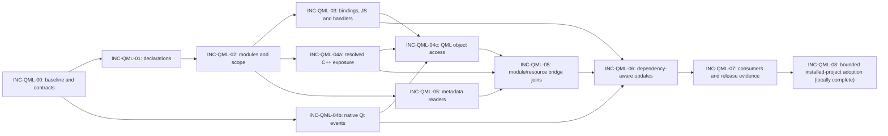

# Qt and QML feature increment plan

Use `INC-QML-` for delivery increments and `REQ-QML-` for requirements/criteria.
The [identifier catalog](IDENTIFIERS.md) retains every prior ID as a permanent alias.

Shared installer, shell-fixture, filesystem-profile and Terraform verification
continues separately under [INC-CORE-01–03](../COMPATIBILITY.md). These contribution
gate corrections do not expand the Qt/QML language profile or advance its counter.

Status: **INC-QML-11, INC-QML-15 and INC-QML-08a/b/c are implemented and locally
complete for the bounded Windows x64/Python 3.12 profile**. INC-QML-28–38 close
additional reproduced defects discovered during that development. The final
reviewed installed wheel passes 3,024 selected tests with 36 existing skips;
actual CMake/qmake whole-root and safe-subroot CLI profiles pass initial and repeat
updates. All seven REQ-QML-018 criteria have individual local acceptance evidence.
See [final validation](VALIDATION.md#final-adoption-delivery) and
[traceability](../../tests/TRACEABILITY.md#final-adoption-delivery).

The earlier full source run has 8,630 passes, 59 failures and 178 skips. Its exact failure
identities equal the pre-work baseline; no new failures were added. Full typing
also retains baseline errors with no added diagnostic identities. These are
failed contribution gates, not passing release evidence. At that checkpoint,
changes had not been published or run through the twelve hosted OS/Python lanes. Local
completion does not fill those cells or establish native browser/device, live
database or Qt runtime proof.

The later [Windows dependency follow-up](VALIDATION.md#windows-shell-and-optional-dependency-follow-up--2026-10-04)
installs portable Bash and locked optional packages without product changes.
Its selective rerun clears 40 of the original 59 failures, retains 19, and exposes
two previously skipped hook path assertions. No full-suite gate is inferred.

The current [native compatibility evidence](../../tests/TRACEABILITY.md#current-native-source-and-artifact-evidence--2026-10-05)
at `463ca322` has 8,818 passes and no pytest failures, with separate setup replays.
[Draft PR 6](https://github.com/SlinkyRamey/graphify/pull/6) publishes the adoption
branch against the reviewed INC-QML-07 base. Its first hosted revision passes
four Ubuntu wheel lanes but rejects CI configuration before job admission and
fails eight Windows/macOS installed-smoke lanes. INC-CORE-06 corrects workflow
admission; INC-QML-39 corrects the reproduced canonical input-alias mismatch.
These failures remain unmet current hosted gates until corrected evidence exists.

At hosted head `f95366d`, all twelve isolated QML/core wheel smoke profiles pass,
and the four macOS QML source profiles pass. Ubuntu source jobs expose two
discovered-symlink provenance failures; Windows QML source jobs expose seven
nearby-alias fixture setup errors, and the native compatibility job rejects its
duplicate Node application selection before pytest. INC-CORE-07 and INC-QML-42/43
have passing local source/installed checkpoint evidence for those corrections.
Plan exit review reproduces shared-content watch invalidation and actual Windows
short-leaf identity gaps, assigned to INC-QML-44/45. The next normal PR revision
owns corrected hosted proof; no current full hosted pass is claimed.

INC-QML-00–07 hosted results remain evidence for their recorded original profile.
INC-QML-09/13/16 implement community presentation and middle mouse navigation;
emitted-script/installed contracts pass, with native interaction still unverified.
INC-QML-10/12/14 and INC-QML-17–27 correction records retain their original
revision boundaries. The [API mechanism matrix](QT_API_COVERAGE.md) identifies
supported forms, conservative exclusions and generic-only extraction. It does
not promise individual whole-SDK semantics.

Sections below preserve planning contracts and chronological checkpoint reviews.
Earlier pending statements and epochs describe those checkpoints; the current
delivery state is this summary and the final exit review. Commands marked
proposed are suggestions, not executed evidence. Increment identities remain
distinct from requirements and their acceptance criteria.

This plan extends Graphify's existing Python pipeline and contribution workflow.
It does not propose a Qt application rewrite. Read [REQUIREMENTS.md](../REQUIREMENTS.md),
[ARCHITECTURE.md](ARCHITECTURE.md), [DESIGN.md](DESIGN.md), [AUDIT.md](AUDIT.md),
and the upstream [contribution guide](../../CONTRIBUTING.md) before
implementation. The approved baseline is the imported upstream `v8` state recorded
by the foundation audit; recheck upstream changes before starting each PR.

Upstream already tracks this feature in [issue #1716](https://github.com/Graphify-Labs/graphify/issues/1716)
and [PR #1748](https://github.com/Graphify-Labs/graphify/pull/1748). The PR was open
when inspected for this foundation and includes QML extraction and a C++ bridge.
Its page contains older dependency notes superseded by later commits. INC-QML-00
must review its current head, tests, dependencies, maintainer feedback and overlap
before deciding what to reuse, supplement or replace. Do not create a duplicate
issue or assume unmerged code is present in the imported baseline.

## Sequence and working contract

| Increment | Outcome | Prerequisites | Requirement references |
| --- | --- | --- | --- |
| INC-QML-00 | Existing-PR review, reproducible baseline and accepted parser decision | Foundation review | REQ-QML-001, REQ-QML-010, REQ-QML-012, REQ-QML-014, REQ-QML-015 |
| INC-QML-01 | Discover `.qml` and extract minimal source-backed declarations | INC-QML-00 | REQ-QML-001, REQ-QML-002, REQ-QML-003, REQ-QML-010, REQ-QML-011, REQ-QML-012, REQ-QML-013, REQ-QML-014, REQ-QML-015 |
| INC-QML-02 | Resolve explicit QML modules, local components and scoped names | INC-QML-01 | REQ-QML-002, REQ-QML-004, REQ-QML-005, REQ-QML-010, REQ-QML-012, REQ-QML-014, REQ-QML-015 |
| INC-QML-03 | Model bindings, aliases, JavaScript and signal relationships | INC-QML-02 | REQ-QML-006, REQ-QML-007, REQ-QML-010, REQ-QML-012, REQ-QML-014, REQ-QML-015 |
| INC-QML-04 | C++ exposure into QML, Qt signal connections and C++ access to QML APIs | INC-QML-04b after INC-QML-00; resolved INC-QML-04a joins after INC-QML-02; INC-QML-04c after INC-QML-03, INC-QML-04a and INC-QML-04b; metadata joins finish with INC-QML-05 | REQ-QML-008, REQ-QML-016, REQ-QML-017, REQ-QML-010, REQ-QML-012, REQ-QML-014, REQ-QML-015 |
| INC-QML-05 | Enrich modules and resources from static Qt project metadata | INC-QML-02; enrich INC-QML-04 when available | REQ-QML-002, REQ-QML-004, REQ-QML-008, REQ-QML-009, REQ-QML-017, REQ-QML-010, REQ-QML-012, REQ-QML-014, REQ-QML-015 |
| INC-QML-06 | Guarantee dependency-aware update/watch/cache parity | INC-QML-03, INC-QML-04, INC-QML-05 | REQ-QML-002, REQ-QML-011, REQ-QML-016, REQ-QML-017, REQ-QML-010, REQ-QML-012, REQ-QML-014, REQ-QML-015 |
| INC-QML-07 | Verify consumers, publish support matrix and prepare upstream release | INC-QML-00 through INC-QML-06 | REQ-QML-013, REQ-QML-014, REQ-QML-015; regression of initial REQ-QML-001–REQ-QML-017 |
| INC-QML-08 | Harden installed-project adoption with evidenced source forms and typed context chains | INC-QML-07; public reproductions and bounded contract review | REQ-QML-018; reverify affected REQ-QML-004/REQ-QML-007/REQ-QML-008/REQ-QML-009/REQ-QML-011/REQ-QML-012/REQ-QML-013/REQ-QML-014/REQ-QML-015/REQ-QML-017 |

Keep the existing increment numbers as stable scope identifiers; they do not
require independent work to wait for every lower number. The QML lane follows
INC-QML-00, INC-QML-01, INC-QML-02 and INC-QML-03. Native Qt C++ events in INC-QML-04b can proceed
after INC-QML-00 establishes C++ identity and event-site projection contracts, without
waiting for QML parsing or JavaScript integration. Raw C++ exposure/access facts
can also be developed early against those agreed interfaces; resolved joins have
the prerequisites in the table.

After INC-QML-02 establishes the module-index contract, INC-QML-05's independent metadata
readers may proceed alongside INC-QML-03 and the C++ work. Their bridge integration
waits for INC-QML-04a/INC-QML-04c facts. Minimal `qmldir` discovery belongs to INC-QML-02. Simple
literal-file access in INC-QML-04c can precede INC-QML-05; module-loaded components and qrc
aliases finish with INC-QML-05's index. This separates reader readiness from completed
bridge integration and avoids a circular prerequisite.



## Reviewable work packages

These are slices within existing increments, not new requirement or increment IDs.
Each slice has one owner and a focused diff. Internal adapters/facts may land before
admission, but public dispatch is enabled only with its complete extraction,
packaging, diagnostics, persistence and safe-update gate. Combine slices when a
separate PR would expose a broken path or have no independently useful outcome.

| Increment | Work packages | Demonstrable result |
| --- | --- | --- |
| INC-QML-00 | Baseline/upstream overlap review; parser and syntax probe; fact/graph/update contracts | Reproducible parser choice and hand-checked corpus; no production admission |
| INC-QML-01 | Parser adapter and declarations; discovery/dispatch/packaging integration | A small QML file yields exact scoped declarations and spans, with safe failures and updates |
| INC-QML-02 | `qmldir` facts; URI/version/alias lookup; component/member scope | Equal names in different modules/components resolve correctly or remain ambiguous |
| INC-QML-03 | Bindings/aliases; embedded/imported JS; handlers and `Connections` | Property, call and signal dependencies preserve scope, source evidence and mechanism |
| INC-QML-04a | Meta-object/member overlay; literal procedural registration; declarative exports | QML references reach evidenced C++ APIs; build-derived module joins finish in INC-QML-05 |
| INC-QML-04b | Declarations/emissions; typed/overloaded/lambda connections; legacy signatures/private slots/disconnect | Native C++ events remain distinct from direct calls, including ordinary compatible receivers |
| INC-QML-04c | Loader/root provenance; objectName/member access; context/initial providers and signal joins | C++ accesses the evidenced QML object/member; unknown or duplicate targets remain unresolved |
| INC-QML-05 | CMake/qmake module readers; `.qmltypes`; `.qrc`; bridge integration | Equivalent Qt 6 project forms resolve modules/resources and both bridge directions without execution |
| INC-QML-06 | Invalidation/reconstruction; watch integration; mutation/parity corpus | Updates equal clean rebuilds after QML, C++, resource and metadata changes |
| INC-QML-07 | Query/affected; export/MCP/callflow; install/release evidence and generated guidance | Users can inspect the verified dependency graph through advertised consumers |
| INC-QML-08 | Public adoption reproductions; project/native source compatibility; typed context chains; installed/update safety | Newly accepted ordinary project forms work through the installed CLI with accurate uncertainty and preserved prior data |

One integration owner controls shared discovery, dispatch, registry, graph,
cache/watch and resolver contracts. Parser, metadata, event and access contributors
own disjoint modules and fixture/test files against agreed interfaces. Give the
C++ overlay one owner; event/access slices supply focused modules rather than
concurrently editing its central integration file. Record ownership before work,
review commits at handoff, and coordinate every Git mutation.

The first useful QML slice is INC-QML-01. Native Qt event analysis is a separate useful
slice in INC-QML-04b. Project-level mixed-language analysis needs INC-QML-02/INC-QML-03/INC-QML-04/INC-QML-05;
the release candidate also needs INC-QML-06/INC-QML-07. Estimate elapsed effort after INC-QML-00
resolves parser packaging and reuse uncertainty, using those measured findings.

## Increment readiness and completion

An increment is ready when its reviewed source base, prerequisites, owner, affected
acceptance IDs, proposed fact/interface changes, hand-checked fixture expectations,
failure cases and verification commands are recorded. Inspect overlapping upstream
work before committing to a production approach. Tests/fixtures named below are
proposed and must exist before running their acceptance command.

An increment is complete only when its implemented subset passes the common gate,
each due criterion has exact evidence, new failures have faithful regressions,
safe update/persistence behavior is exercised, and requirements/design/diagnostics/
comments/traceability match the delivered result. Record modularity ceilings or
justified exceptions for touched source files. Partial implementation is a valid
checkpoint, not a completed criterion. Baseline failures, skips and missing lanes
remain explicit limitations rather than passing evidence.

At each handoff, the integration owner reviews a versioned record of exact base,
head and tested SHAs, affected acceptance IDs with partial/passed/gap evidence,
interface/schema decisions, commands/results/platforms, file ownership, outstanding
risks, and the next owner. A future work package must not infer completion from a
previous contributor's summary alone.

When publication is authorized, use one focused branch and one PR validation run
for the reviewed revision; preserve separate required post-merge checks. Record
source, tested integration and resulting SHAs with workflow results. Follow
[AGENTS.md](../../AGENTS.md) for guarded merging, retries and any future protected
proof. Upstream acceptance depends on maintainer review; it is not an automatic
result of finishing local implementation.

## Acceptance completion ownership

Every acceptance criterion has one planned completion increment in
[tests/TRACEABILITY.md](../../tests/TRACEABILITY.md). Earlier increments provide
partial evidence and later ones reverify affected contracts. This is a delivery
assignment, not a change to the criterion or a claim that it passed. Cross-cutting
criteria remain obligations in every affected PR, even when their complete
mixed-language evidence is assigned to INC-QML-06 or INC-QML-07.

| Requirement | Planned criterion completion |
| --- | --- |
| REQ-QML-001 | AC01/AC03/AC04: INC-QML-01; AC02 complete supported-source corpus: INC-QML-03 |
| REQ-QML-002 | AC02/AC03 metadata/corpus boundaries: INC-QML-05; AC01/AC04 entry-point parity: INC-QML-06 |
| REQ-QML-003 | AC01–AC04: INC-QML-01 |
| REQ-QML-004 | AC01–AC04: INC-QML-02 |
| REQ-QML-005 | AC01–AC04: INC-QML-02; reverify added metadata visibility in INC-QML-05 |
| REQ-QML-006 | AC01–AC04: INC-QML-03 |
| REQ-QML-007 | AC01–AC04: INC-QML-03; reverify C++ signal joins in INC-QML-04/INC-QML-05 |
| REQ-QML-008 | AC01–AC04: INC-QML-05, following INC-QML-04a source exposure |
| REQ-QML-009 | AC01–AC04: INC-QML-05 |
| REQ-QML-010 | AC01–AC04: INC-QML-07; graph correctness gates apply when each fact lands |
| REQ-QML-011 | AC01–AC04: INC-QML-06 |
| REQ-QML-012 | AC01–AC04: INC-QML-06; safe failure/persistence gates apply from INC-QML-01 |
| REQ-QML-013 | AC01–AC04: INC-QML-07 |
| REQ-QML-014 | AC01–AC04: INC-QML-07; install/platform evidence starts in INC-QML-00/INC-QML-01 |
| REQ-QML-015 | AC01–AC04: INC-QML-07; documentation/evidence gates apply in every PR |
| REQ-QML-016 | AC01–AC03: INC-QML-04b; AC04 full parity/consumer evidence: INC-QML-07 |
| REQ-QML-017 | AC01–AC03: INC-QML-05 after INC-QML-04c; AC04 full parity/consumer evidence: INC-QML-07 |
| REQ-QML-018 | AC01/AC02/AC07: INC-QML-08a; AC03/AC04: INC-QML-08b; AC05/AC06: INC-QML-08c; safety gates apply to every slice |

The parser spike informs REQ-QML-001; production install/failure acceptance closes in
INC-QML-01 and the complete supported syntax/declaration corpus in INC-QML-03. Parsing
success alone cannot replace those production-boundary assertions.
All named metadata and their corpus boundaries close in INC-QML-05. Exposure and
resource/module-backed access close in INC-QML-05 after the INC-QML-04 source slices.
Native event syntax closes in INC-QML-04b, while REQ-QML-016-AC04 and REQ-QML-017-AC04 need
incremental and consumer evidence before closing in INC-QML-07. The final release gate
rechecks all sixty-eight initial-profile criteria for the advertised matrix.
INC-QML-08 now has seven separately assigned criteria and reverifies affected original
contracts; existing passes do not establish the expanded adoption profile.

The primary acceptance profiles are ordinary Qt 6.5 and Qt 6.8 source/metadata,
as specified in ARCHITECTURE. Both CMake and qmake project forms are required for
the first Qt 6 target. Literal procedural registration is also part of Qt 6 bridge
support; neither qmake nor procedural registration is restricted to legacy Qt.
Qt 5.15 is a separate legacy compatibility profile with separately reviewed PRs
within INC-QML-02, INC-QML-04 and INC-QML-05. Parsing common versioned-import syntax earlier
does not establish that profile's semantic support. Record module import versions
separately from the Qt release used to define a fixture.

Each increment is a cohesive feature branch and one or more small PRs. A PR may
merge independently only when it delivers a truthful subset, preserves existing
behavior, and satisfies its exit gate. Broad schema migrations, graph-class
changes, unrelated refactoring, and new runtime integrations require separate
review. An upstream-ready PR is not an upstream-accepted PR; approval and merge
remain separate recorded events.

Use existing `file_type="code"`, required source provenance, confidence values,
canonical ID helpers, ignore rules, and graph consumers. New QML detail belongs in
versioned metadata and focused resolver facts, with meanings defined in DESIGN.
Do not globally group QML/JavaScript with C++ to defeat cross-language call guards.
Do not activate a MultiDiGraph migration as an incidental language-support change.
Represent distinct bindings or handlers with their own source-backed nodes where
needed so the current simple graph does not silently overwrite relationships.

## Common verification gate

All paths below are relative to the repository root. Proposed new test files and
fixture directories are deliberately named so work can start without inventing
the test layout. Adapt names to an upstream-reviewed convention while retaining
the acceptance-criterion mapping. Every requirement has individually assigned
criterion IDs in REQUIREMENTS, such as `REQ-QML-003-AC01` through `REQ-QML-003-AC04`.
Before starting an increment, list all affected criterion IDs and map each one to
a concrete fixture/action/observable result and an exact automated test, or to an
explicit manual/system verification gap. Dedicated tests should use criterion
metadata or names such as `test_QML_003_AC01`; existing tests may map through
`tests/TRACEABILITY.md` without renaming unrelated tests.

Every increment's exit gate requires criterion-level evidence in traceability:
test identity, command, result, supported profile/platform, and remaining gap.
Record applicability explicitly. All applicable assigned criteria must pass
individually before a requirement becomes `Verified`. A skipped test, unexecuted
manual check, aggregate test count, or one passing happy-path test does not verify
the other criteria. Retain `Planned`, `Implemented` or partial/unverified status
until the criterion-level evidence supports promotion; document any criterion
scope change in the requirement rather than silently treating it as a pass.

Establish a pinned development environment with `uv sync --frozen`. If a PR changes
dependencies, deliberately regenerate and review `uv.lock` first; a frozen command
must not be used to pretend that an old lock covers a new dependency. Use the
selected QML extra after INC-QML-00 accepts its packaging contract. Do not substitute
live Qt execution or model calls for deterministic offline parser tests.

Before handoff, execute the increment's focused tests and the following applicable
upstream checks. Capture failures, skips and unavailable optional dependencies.
The proposed pytest commands use Python's module runner and UTF-8 mode because
this project is developed on Windows. Existing POSIX CI may retain its equivalent
pytest entrypoint. The foundation's two remaining Windows-invalid deleted-working-
directory fixture failures are documented in VALIDATION; reproduce and classify
baseline failures instead of treating them as new Qt/QML regressions or claiming
the complete baseline is green.

```text
uv run --frozen python -X utf8 -m pytest tests/ -q --tb=short
uv run --frozen ruff check .
uv run --frozen pyright
uv run --frozen python -m tools.skillgen --check
```

When optional dependencies are involved, reproduce the upstream CI environment
with `uv sync --all-extras --frozen` in a suitable clean job, or use an explicitly
documented extra selection for the focused job. A platform-specific dependency
failure is a finding to resolve or report, not permission to claim full coverage.
When code changes, follow the repository's instruction to run `graphify update .`
and check its result. Generated local graph/build outputs remain uncommitted.

For every increment, review the full diff, canonical documents, test quality,
dependency provenance, and safe diagnostics. Record the actual commands and
results in `tests/TRACEABILITY.md`. Demonstrate regression tests fail against the
old behavior where applicable. Full-suite or cross-platform failures must be
explained before completion; unchanged aggregate coverage does not settle them.

Every new fact shape must pass extraction, graph-build and JSON reload assertions
when introduced. Event/access packages also demonstrate their minimal query and
affected behavior before claiming usability. INC-QML-07 expands that coverage to the
complete advertised consumer matrix; it does not defer basic graph correctness.

Before enabling an update/watch path, implement and test its conservative full-
project resolution/rebuild fallback or reject the unsupported operation before
mutating graph/cache state. Test deletion, failed extraction and stale-edge removal
at each newly enabled boundary. A warning or support note cannot justify leaving
an enabled path known to produce stale results. INC-QML-06 improves invalidation and
establishes full parity after this safety baseline.

<a name="qml-00--baseline-and-parser-decision"></a>

## INC-QML-00 — Baseline and parser decision

**Status: complete for optional parser selection (3 October 2026).** See the
[parser decision and executed evidence](PARSER_DECISION.md). Linux/macOS lanes
remain unverified; this does not authorize default-installed parser promotion.
INC-QML-01 includes **INC-QML-01a** (write/cache safety) and **INC-QML-01b** (declarations,
admission and installation) as required INC-QML-01 work packages. A dedicated semantic
qmldir parser and nonlossy, immutable fact transport are mandatory in INC-QML-02.
Production acceptance criteria remain open until exercised through production.

**Scope and code paths.** First inspect the current exact head of PR #1748 without
changing this workspace to its branch. Review its extractor, C++ modifications,
dependency metadata, tests, graph-family policy and mergeability against the
current upstream base. Map its existing coverage to the requirements in this plan.
Record a reuse/supplement decision and preserve attribution and license notices
for any later adopted code. Read-only inspection does not authorize posting review
comments or messages to other contributors.

The source audit identifies review cases around flat scope/name tables, discarded
import alias/version context, partial-parse reporting, C++-only resolver activation,
and compatibility of C++ changes with current upstream normalization. Reproduce
these against the recorded candidate head rather than assuming its tests exclude
them. Include the valid identifier form `QML_NAMED_ELEMENT(Backend)`;
[Qt 6.8's macro documentation](https://doc.qt.io/qt-6.8/qqmlintegration-h.html#QML_NAMED_ELEMENT)
shows an identifier argument. A test built only around quoted macro syntax does
not validate the real contract. Also test macro-like text in comments/literals.

Create public, synthetic fixtures under
`tests/fixtures/qml/parser_probe/` and a focused `tests/test_qml_parser_probe.py`
or equivalent nonshipping probe. Record the baseline commit, environment, current
language behavior, and parser ADR in the Qt/QML architecture/design documents.
Inspect `pyproject.toml`, `uv.lock`, `.github/workflows/ci.yml`,
`graphify/extractors/models.py`, `graphify/extractors/engine.py`, `graphify/ids.py`,
and `graphify/validate.py`. Keep experimental adapters out of production dispatch.

Evaluate the direct QML grammar binding and the pinned language-pack option
identified by the architecture audit. Do not choose a package from its name or
advertised grammar list alone. Verify its license, grammar revision, Tree-sitter
API/ABI compatibility, actual installed parser availability, source ranges,
error recovery, distribution size, and offline behavior. A required dynamic
grammar download fails the offline installation/extraction gate.

Start the comparison with the audited `tree-sitter-language-pack==0.11.0` candidate,
already optional upstream, and verify its actual installed `qmljs`/`qmldir`
entry points against the locked runtime. Treat the standalone
`tree-sitter-qmljs==0.3.1` as an alternative with explicit source-build and older-
binding risks. Record selection or rejection in existing decision D2. Prefer an
optional `qml` extra for initial adoption unless evidence supports a different
reviewed packaging decision; a package name/range intersection is not API proof.

**Acceptance cases.** Parse imports with and without versions and aliases, objects,
nested objects, properties and modifiers, aliases, signals, methods, inline
components, JavaScript expressions, handlers, and deliberately incomplete files.
Probe `qmldir` independently; a small dedicated metadata parser is an acceptable
decision if its syntax and failure behavior are explicit. Unicode identifiers,
CRLF, comments containing braces, strings containing punctuation, and malformed
input must preserve useful ranges without a crash. The probe must never execute
QML or JavaScript. Missing grammar must yield a safe explicit limitation.

Verify installation and parser invocation on Python 3.10, 3.12, 3.13, and 3.14,
matching upstream's current Python CI matrix; include Windows x64, Linux, and
macOS compatibility evidence or record each unsupported/unverified combination.
Build a syntax matrix using version-tagged source fixtures rather than claiming
runtime support for all Qt releases. Pin the supported syntax subset before INC-QML-01.

Use focused packaging/probe jobs for additional platforms; the audited workflow
currently covers Ubuntu and does not prove Windows/macOS support. Advertise only
tested lanes and record architecture where relevant. Keep source/grammar/license
fingerprints and an explicit reused-file/test ledger at the reviewed PR head.
Retain the known Windows deleted-cwd fixture failures and type-check baseline as
separate findings; any portability correction is a focused change, not a weakened
parser gate or an unrelated bulk rewrite.

**Proposed commands.** The probe test is introduced by this increment; it must not
be entirely skipped in the job used to accept the parser.

```text
uv run --frozen python -X utf8 -m pytest tests/test_qml_parser_probe.py -q --tb=short
uv run --frozen python -X utf8 -m pytest tests/test_languages.py tests/test_multilang.py tests/test_extractors_registry.py tests/test_id_normalization_contract.py tests/test_validate.py -q --tb=short
```

**Exit gate and PR boundary.** Accepted parser ADR, dependency/license decision,
install matrix, synthetic corpus, meaningful recovery tests, baseline evidence,
and the existing-PR reuse/overlap decision. Accept the C++ declaration identity,
source-fact ownership, nonlossy event-site projection and safe-update fallback
design contracts required by the first production slices. Runtime implementation
of that fallback belongs to the first enabled update path, not to the probe.
No release language-support claim. Keep the parser choice/fixture PR separate from
production extraction if that makes review clearer. A missing cross-platform
wheel or incompatible ABI blocks promotion to default-installed support; document
an optional extra or defer instead of silently adding a compiler requirement.

<a name="qml-01--discovery-and-minimal-declarations"></a>

## INC-QML-01 — Discovery and minimal declarations

**Status: INC-QML-01a/INC-QML-01b complete for the declared Windows optional profile.** See
[implementation evidence](IMPLEMENTATION.md). INC-QML-02/INC-QML-03 require semantic
validation, immutable context and independent use sites. No new top-level
increment is needed; INC-QML-06 still owns cache optimization.

**Scope and code paths.** Add `graphify/extractors/qml.py` with an isolated parser
adapter and QML facts as necessary. Integrate `graphify/detect.py`, the public
facade and `_DISPATCH` in `graphify/extract.py`, and
`graphify/extractors/__init__.py`; registry entry alone is insufficient. Add the
accepted dependency/extra to `pyproject.toml` and `uv.lock`. Use
`graphify/ids.py`, `graphify/cache.py`, and `graphify/diagnostics.py` through their
existing contracts. Add `tests/test_qml_extract.py` and
`tests/fixtures/qml/declarations/`; update upstream language and detection tests.

Extract file/component declarations, nested object scopes, `id` declarations,
properties, signal declarations, and method declarations with source ranges.
Record imports as raw facts or import records without guessing a target. Method
bodies and bindings remain opaque source facts until INC-QML-03. A declared property
alias may be recognized here while its target relationship remains unsupported.
Keep QML semantic information in `metadata.qml` and the versioned fact contract
specified in DESIGN. Represent `id` as component-local identity, not an ordinary
globally exported property. Preserve the full filename and component/symbol scope
when deriving canonical IDs; prove exact-case/punctuation collision handling.

**Acceptance cases.** Directory and single-file scans discover `.qml` and
`.ui.qml`, obey `.gitignore`/`.graphifyignore`, and leave existing classifications
unchanged. Valid declarations retain source-backed fields and correct ranges;
two files with the same stem, `.qml`/`.js` stem collisions, case-distinct names,
nested identical IDs, and relocation to a different absolute checkout do not merge
unrelated declarations. Malformed or unsupported input yields bounded diagnostics
and a partial/failed status that cannot replace valid persisted state. Missing
optional grammar does not make an unrelated Python/C++ scan fail. Repeated scans
preserve IDs, confidence and order after canonical comparison.

**Proposed focused commands.**

```text
uv run --frozen python -X utf8 -m pytest tests/test_qml_extract.py tests/test_detect.py tests/test_extractors_registry.py tests/test_languages.py tests/test_extract_cli.py tests/test_extract_code_only_cli.py tests/test_validate.py tests/test_node_id_canonical.py tests/test_partial_extraction_warning.py tests/test_zero_node_no_cache.py -q --tb=short
```

**Exit gate and PR boundary.** One PR delivers discovery plus a minimal extractor,
public fixtures, dependency packaging, extraction validation, a cold/warm smoke
test, and an honest declarations-only support note. Do not ship discovery alone
that routes QML into an unusable extractor. Existing zero-node/shrink/cache guards
must apply. Until INC-QML-06, resolver-changing input must use a tested safe full
project resolution/rebuild path or be rejected before writes. Include admission,
edit, deletion and forced parser/write failure evidence for the enabled update and
watch paths; a known stale-graph path must not remain enabled with only a warning.

REQ-QML-001-AC01 also requires a clean built-wheel installation with the selected QML
extra and production parser invocation on every declared lane. Extend the existing
wheel-packaging coverage and use isolated install/probe jobs; source-tree imports
or INC-QML-00's experimental adapter are insufficient. Test a core-only installation
without that extra. REQ-QML-001-AC02 stays open until INC-QML-03's production adapter passes
the complete declared syntax/declaration/span corpus, including embedded JS forms.

<a name="qml-02--modules-and-component-scope"></a>

## INC-QML-02 — Modules and component scope

**Status: complete for the documented static profile.** Work packages cover **INC-QML-02a** semantic
qmldir, **INC-QML-02b** immutable module/member indexes and **INC-QML-02c** transport,
producer provenance and provider-only refresh parity. These follow the existing
letter-suffix numbering; all must pass to close INC-QML-02. No new top-level increment.

**Scope and code paths.** Add `graphify/qml_resolution.py` and focused
`graphify/extractors/qml_metadata.py`, with registry integration through
`graphify/resolver_registry.py` and `graphify/extract.py`. Introduce shared
named-file discovery for `qmldir` in the existing corpus-boundary path; update
`collect_files()` and watcher recognition without creating a separate ignore
policy. Add `tests/test_qml_resolution.py`, `tests/test_qml_metadata.py`, and
`tests/fixtures/qml/modules/`. Use a per-project module/scope index with explicit
inputs and lifetime; retain raw facts separately from resolved graph edges.

Resolve directory imports, module URI imports, aliases, local QML components,
version declarations, `qmldir` type entries, inline-component scopes, and singleton
metadata according to the accepted static policy. Record unresolved or conflicting
imports rather than searching every basename in the repository. Preserve scope
boundaries for IDs, component members, and inline components; do not infer dynamic
delegate/context objects from lexical proximity alone.

**Acceptance cases.** Two modules both export `Button`; an aliased import resolves
only the intended module, while an ambiguous unqualified use has no guessed
concrete target. Imported versions, versionless imports, relative directory imports,
missing components, missing/duplicate module metadata, singleton declarations and
inline components have documented positive and rejection cases. Identical IDs in
separate component scopes stay distinct. An ignored or out-of-corpus `qmldir` does
not grant access to its files. Metadata-only changes trigger the conservative
resolution path even when QML text is unchanged. Synthetic Qt built-in references
remain external/unresolved unless a source-backed type inventory is supplied.

**Proposed focused commands.**

```text
uv run --frozen python -X utf8 -m pytest tests/test_qml_resolution.py tests/test_qml_metadata.py tests/test_qml_extract.py tests/test_language_resolvers.py tests/test_case_sensitive_resolution.py tests/test_import_self_loops.py tests/test_phantom_cross_package_call.py -q --tb=short
```

**Exit gate and PR boundary.** Module lookup/scope rules and ambiguity evidence are
documented and exercised through full extraction. A small named-file discovery
PR may precede the resolver when independently useful and tested. Module resolution
is a separate PR from later binding/call semantics. Keep the module-index contract
small enough for C++ and project metadata enrichment without a generic resolver
rewrite. No global same-name fallback or implicit Qt SDK scan.

<a name="qml-03--bindings-aliases-javascript-and-signals"></a>

## INC-QML-03 — Bindings, aliases, JavaScript and signals

**Status: complete for the documented static profile.** REQ-QML-001-AC02 and all
REQ-QML-006/REQ-QML-007 criteria pass production fixtures. Actual tests are in
test_qml_syntax_profile.py, test_qml_expressions.py, test_qml_handlers.py,
test_qml_scripts.py, test_qml_adversarial.py and the graph/persistence suites.
See [implementation evidence](IMPLEMENTATION.md); proposed names below describe
the initial planning contract and are superseded by those actual owners.

INC-QML-03 comprises **INC-QML-03a** held-object/array/template declarations, **INC-QML-03b**
lexical expressions/aliases/handlers and **INC-QML-03c** accepted-script overlays,
generic-JS isolation, typed cross-family proof and durable edge direction. All
three work packages are delivered. Regression discoveries include lexical-list
truncation, duplicate anonymous Connections, inherited signal parameters,
mixed Connections handler styles, alias cycles, module export roles and missing
script-file endpoint proof. Separate source sites retain repeated relationships.

No new top-level increment is needed. Add **INC-QML-06a** source/metadata/script/C++
mutation parity and **INC-QML-06b** bounded parser/config/import-root cache contracts;
add **INC-QML-07a** direction/evidence across every advertised consumer and **INC-QML-07b**
hosted installation/profile evidence and upstream review. These refine existing
increments, preserving INC-QML-00 through INC-QML-07 and INC-QML-04a/INC-QML-04b/INC-QML-04c numbering.
Runtime contexts, framework members, reexports and name-based template barriers
remain documented conservative limits. Native C++ work advances in INC-QML-04 next;
build/resource/type-description enrichment remains INC-QML-05.

**Scope and code paths.** Extend focused QML extraction/resolution modules, reusing
existing JavaScript AST helpers only through a narrow adapter that preserves QML
lexical scope and original source offsets. Add
`tests/test_qml_bindings.py`, `tests/test_qml_javascript.py`,
`tests/test_qml_signals.py`, and `tests/fixtures/qml/interactions/`. Map relations
through existing `references`, `uses`, and validated `calls` semantics with QML
context metadata. Binding and handler nodes retain distinct source evidence and
avoid same-endpoint relation loss in the current simple graph.

**Acceptance cases.** Property binding reads link to the correct local ID/member;
property aliases retain the target and alias distinction; scoped local variables
shadow component members; inline-component and imported-JavaScript scopes do not
leak. Test expressions, blocks, functions, closures, `.js` imports, `.pragma
library` where accepted by the syntax matrix, signal declarations/emissions,
`onSignal` handlers and `Connections`. A handler's reference to a signal is not
proof of a runtime call. Dynamic `Connections.target`, computed property names,
runtime object creation and unresolved context values stay visibly unresolved or
qualified as inference. Two relationships between the same logical objects must
retain distinct evidence after build/merge/JSON round trip.

**Proposed focused commands.**

```text
uv run --frozen python -X utf8 -m pytest tests/test_qml_bindings.py tests/test_qml_javascript.py tests/test_qml_signals.py tests/test_js_import_resolution.py tests/test_js_callback_calls.py tests/test_indirect_call_block_scoped_shadow.py tests/test_build_merge_hyperedges_and_prune.py tests/test_relation_collapse_precedence.py -q --tb=short
```

**Exit gate and PR boundary.** Split bindings/aliases and JS/signals into separately
reviewable PRs if necessary. Each PR must preserve source ranges, scope, uncertainty,
and relation meaning, with cold/warm output parity. Update diagnostics and the
support matrix for dynamic limitations. No execution of user expressions, no
wholesale reuse of JavaScript resolution without QML scope context, and no claim
of complete runtime signal tracing.

<a name="qml-04--qtc-exposure-signals-and-access-to-qml"></a>

## INC-QML-04 — Qt/C++ exposure, signals and access to QML

**Scope and code paths.** Add a source-overlay module such as
`graphify/extractors/qt_cpp.py`, enriching existing C++ declarations rather than
replacing the C++ extractor. Extend QML project resolution with explicit type
registration and member evidence. Inspect `graphify/extractors/engine.py`, C++
preprocessing, `graphify/build.py` cross-family call guards, and canonical IDs.
Add `tests/test_qt_cpp_bridge.py`, `tests/test_qt_signals_slots.py`,
`tests/test_qml_cpp_access.py`, and synthetic fixtures under
`tests/fixtures/qml/cpp_bridge/`, `qt_connections/`, and `cpp_access/`.

Keep three focused PR boundaries without renumbering the surrounding increments:

- **INC-QML-04a:** C++ types/members exposed into QML, advancing REQ-QML-008 with
  registration/member evidence; complete module-derived acceptance in INC-QML-05.
- **INC-QML-04b:** Qt C++ signal declarations, emissions and explicit connections,
  completing `REQ-QML-016-AC01` through `REQ-QML-016-AC03` and the source/graph part of
  `REQ-QML-016-AC04`; its full incremental/consumer criterion closes in INC-QML-07.
- **INC-QML-04c:** C++ consumers of QML objects, functions, properties and signals,
  advancing all REQ-QML-017 criteria; complete module/resource-backed AC01–AC03 in
  INC-QML-05 and full incremental/consumer AC04 in INC-QML-07.

Each sub-PR must map every affected criterion to its own observable assertions and
traceability evidence. Later INC-QML-06 verifies invalidation of these facts, and
INC-QML-07 verifies their query/export/MCP projection. Criterion-level status remains
unverified for those later obligations until their evidence exists.

Begin with statically identifiable `Q_OBJECT`, `Q_PROPERTY`, signals/slots,
`Q_INVOKABLE`, QML registration macros, and literal `qmlRegisterType`/singleton
registration calls supported by the accepted design. Treat literal
`setContextProperty` names and known instance types as evidence with their engine
and scope limits; uncertain ownership must remain inferred/unresolved. Use
`uses`/`references` and `qml_cpp_member` context first. Concrete cross-language
`calls` require narrowly validated registration/member evidence and dedicated
negative tests before extending a guard. QML_ELEMENT module URI enrichment that
requires build metadata remains pending until INC-QML-05.

**Acceptance cases.** A QML property or method reference links only to the registered
class/member in the correct URI/version/registration scope. Test declaration and
implementation separation, getters/setters/NOTIFY evidence, overloaded members,
namespace-qualified C++ types, header/source duplicates, nonliteral registration,
conflicting registrations and unknown context-property types. A same-named member
in an unrelated C++ module must not acquire an edge. Macros inside comments or
strings are not registrations. Valid identifier-based `QML_NAMED_ELEMENT(Backend)`
must work; malformed or quoted forms must not substitute for that positive case.
Missing generated metadata or plugin binaries does
not trigger execution, an SDK scan or a guessed linkage. Removing or renaming a
registration on a C++-only change must reach the safe rebuild path.

**Qt signal/connect/slot acceptance cases (REQ-QML-016).** Retain signal and slot
declarations/signatures and distinguish an emission from an ordinary method call.
Cover `signals`, `Q_SIGNALS`, `Q_SIGNAL`, slot access sections, `Q_SLOTS`, `Q_SLOT`,
and both `emit` and `Q_EMIT` forms with original source spans.
Extract source-backed `QObject::connect` sites for member-pointer syntax, legacy
`SIGNAL`/`SLOT` signatures, signal-to-signal connections and lambda/functor receivers.
Typed connections may target a compatible ordinary member; do not require a slot
annotation when the typed connection form supplies sufficient member evidence.
Resolve explicitly selected
overloads, including supported `qOverload` or cast forms, only when the declaring
type and signature identify a unique member. Lambda connections retain the lambda
body's ordinary direct calls separately from the signal-to-lambda relationship.
Preserve sender, signal, receiver/context, slot/lambda, source span, conditional
registration evidence and a declared connection type/flags where present.
Record `Qt::AutoConnection`, direct, queued or
blocking declarations as configuration facts without predicting runtime scheduling,
delivery order, thread affinity or whether a connection is successfully established.
In particular, retaining `Qt::UniqueConnection` on a lambda/functor connection
does not establish effective uniqueness or deduplication; test that the graph
preserves the declared flag without asserting that runtime effect.

Test header/implementation pairs, namespaced classes, inherited members, duplicate
method names in unrelated classes, overload disambiguation, unavailable receiver
types, malformed legacy signatures, macro-like text in comments/literals, dynamic
targets and anonymous-lambda scope. Include supported private-slot meta-object
connections without confusing ordinary C++ call visibility with the meta-object
connection contract. A typed callable remains distinct from a same-named global
function; validate the actual endpoint/signature rather than its label.
Unresolved endpoints yield bounded diagnostic
evidence instead of guessed links. Connection sites and emissions retain their own
identity/context through graph construction; they must not become an ordinary
`calls` edge implying execution of the connected slot. Preserve supported
`QObject::disconnect` source statements as separate facts; a disconnect declaration
does not prove execution or justify erasing a prior connection from the source
graph. Ordinary direct slot calls, emit sites, connect sites and disconnect sites
must remain distinguishable after build/export/query/affected and incremental
updates.

INC-QML-04b must also pass on a Qt C++-only corpus with no `.qml` files and no optional
QML parser installed. Activation cannot depend on a QML suffix or parser presence.
Unrelated APIs named `connect` or `emit` must not acquire Qt event relationships.
This independent acceptance case enables useful native Qt support in parallel
with the QML lane.

**C++ access to QML acceptance cases (REQ-QML-017).** Collect literal `load` and
`loadFromModule` requests and `QQmlComponent` creation as access/creation facts with
the owning engine/component. Include the common Qt Quick `QQuickView::setSource`
and `rootObject` loader/access profile with its owning view. Track bounded
source-backed object flow from creation, `rootObjects()` or `rootObject()` to a
known QML root without assuming every engine/view uses the first same-named file.
Resolve literal `objectName`/`findChild` lookups only against the
identified object tree; a QML `id` alone does not establish the runtime lookup name.
Model `QMetaObject::invokeMethod` against declared QML function/signature evidence,
property reads/writes against the declared member, and C++ connections to declared
QML signals separately from ordinary direct calls. Also preserve exposed C++ signal
to QML-handler relationships in the appropriate receiver scope. Supported literal
`setContextProperty`, `setContextObject` and initial-property exposure carry their
provider, engine/component and provenance facts; reuse INC-QML-04a's exposure model
instead of creating competing definitions. Conditional or dynamic exposure remains
visibly uncertain. Annotate static access intent
without claiming object creation, lookup, mutation, invocation or signal delivery
occurred successfully at runtime.

Test separate engines loading equal component names, multiple/unknown root objects,
module-loaded and URL-loaded components, separate QQuickView instances and their
setSource/rootObject provenance, objectName versus id, nested objects,
duplicate/dynamic object names, literal and computed method/property names,
overloads, read-only/unknown members, and QML signal-to-C++ slot connections.
Include C++ signal-to-QML handler cases and literal/dynamic context-property,
context-object and initial-property exposure variants.
Uncertain loader paths or receiver provenance remain unresolved. Resource aliases
and module URI/export mappings consume INC-QML-05's index instead of a global basename
search. Never instantiate an engine, create a component or load a plugin to resolve
these source relationships.
Qt Quick Widgets loaders remain an explicitly deferred, separately reviewed
extension; the QQuickView source profile does not imply widget integration support.

Use the established `uses`/`references` projection plus namespaced connection,
emission, loading and member-access context defined in DESIGN. Dedicated site nodes
preserve distinct evidence when the simple graph would collapse endpoint pairs.
Use proposed contexts `qt_signal_emit`, `qt_connect_signal`,
`qt_connect_receiver`, `qt_disconnect`, `qt_cpp_qml_load`,
`qt_cpp_qml_find_child`, `qt_cpp_qml_property_read`,
`qt_cpp_qml_property_write`, `qt_cpp_qml_invoke`, `qt_context_exposure` and
`qt_initial_property`, with `metadata.qt.bridge_direction` and scoped
engine/component/root provenance. These are planned metadata contracts, not
already implemented graph fields. Reserve ordinary `calls` for evidenced direct
C++/JavaScript calls, including direct slot calls. A reflective QML invocation site
records access intent and its member evidence without implying an ordinary direct
call or runtime execution. Connecting a signal, emitting it and invoking a method
remain different source actions even when they mention the same member name.

**Proposed focused commands.**

```text
uv run --frozen python -X utf8 -m pytest tests/test_qt_cpp_bridge.py tests/test_qt_signals_slots.py tests/test_qml_cpp_access.py tests/test_qml_resolution.py tests/test_cpp_preprocess.py tests/test_cpp_method_declarations.py tests/test_cpp_objc_cross_file_calls.py tests/test_cross_language_call_resolution.py tests/test_cross_repo_external_call_guards.py -q --tb=short
```

**Exit gate and PR boundary.** Ship a narrow metadata overlay/registration PR before
broader bridge behavior if appropriate. Preserve existing C++ extraction and guards.
Every concrete exposure bridge edge has source-backed registration and member
evidence; connection/access edges have source-backed endpoint and object-flow
evidence. Confidence matches the actual claim. Review REQ-QML-016/REQ-QML-017 criteria
individually, including negative paths and distinct relation preservation. No
unrestricted name-based bridge or runtime event scheduling inference. Runtime
contexts, plugins and dynamic registrations remain documented gaps. Metadata-only
or C++-only changes use the conservative safe rebuild path until INC-QML-06 proves
targeted invalidation; metadata-backed access cases finish with INC-QML-05 integration.

<a name="qml-05--build-module-and-resource-metadata"></a>

## INC-QML-05 — Build, module and resource metadata

**Scope and code paths.** Extend `qml_metadata.py` or separate focused Qt project
readers for `CMakeLists.txt`/`.cmake`, `.pro`/`.pri`, `.qrc`, `qmldir` and
`.qmltypes`. Reuse discovery and ignore boundaries from INC-QML-02; inspect existing
`graphify/manifest.py`, `graphify/manifest_ingest.py`, `graphify/detect.py`,
`graphify/extract.py`, and watch recognition. Add
`tests/test_qt_project_metadata.py`, `tests/test_qt_resource_resolution.py`, and
`tests/fixtures/qml/project_metadata/`. Generated files remain distinguishable from
authoritative handwritten sources and do not silently override stronger evidence.

Parse a declared static subset of `qt_add_qml_module`, module URI/version,
`QML_FILES`, related C++ source lists, supported qmake statements, and resource
prefix/alias/file mappings. Use `.qmltypes` only within its documented evidence
limits. Resolve resource URLs through `.qrc` mappings; preserve both logical URL
and canonical source path. Do not run CMake, qmake, Qt tooling or project scripts.
Unsupported expansion, conditionals, generators or binary plugin metadata must
remain explicit limitations rather than evaluated code.

**Acceptance cases.** A literal resource alias maps to the intended in-corpus QML
file, including case-sensitive filenames and portable separators. Compare CMake
and qmake fixtures declaring the same simple module in both initial Qt 6 profiles;
both build forms are required for the first target. Test conflicting URIs,
overlapping qrc aliases, missing files, duplicate entries, relative paths, malformed
XML/metadata, conditional build statements, unknown variable expansion, and
resource paths escaping the approved corpus. XML readers must not resolve external
entities. A project with no Qt commands must not gain fabricated Qt modules.
Generated `.qmltypes` cannot overwrite real source provenance. `.qrc` or build
metadata-only changes trigger safe resolution before optimized invalidation exists.
Loader/access facts from INC-QML-04c must resolve the same intended component through
literal file/resource URLs and accepted `loadFromModule` URI/type mappings; missing
or conflicting metadata must not select an unrelated equal-name component.

**Proposed focused commands.**

```text
uv run --frozen python -X utf8 -m pytest tests/test_qt_project_metadata.py tests/test_qt_resource_resolution.py tests/test_qml_metadata.py tests/test_qt_cpp_bridge.py tests/test_qml_cpp_access.py tests/test_detect.py tests/test_manifest_ingest.py tests/test_non_regular_files.py tests/test_security.py -q --tb=short
```

**Exit gate and PR boundary.** Prefer one PR for static CMake/qmake module records
and one for qrc/resource resolution. Named-file discovery is shared and tested.
Every supported construct has an explicit static policy and unresolved fallback.
No implicit build execution, external traversal or unconditional generated-source
indexing. Metadata enriches QML/C++ indexes without redefining Graphify's build.

<a name="qml-06--incremental-updates-watch-and-caches"></a>

## INC-QML-06 — Incremental updates, watch and caches

**Scope and code paths.** Integrate accepted fact/index contracts with
`graphify/cache.py`, `graphify/manifest.py`, `graphify/watch.py`, the CLI's incremental
extraction path, `graphify/resolver_registry.py`, and the language resolver. Add
`tests/test_qml_incremental.py`, `tests/test_qt_watch_metadata.py`, and
`tests/fixtures/qml/incremental/`. Keep per-file syntax caching distinct from
project-dependent resolution; parser/fact-contract changes invalidate compatible
namespaces, while module/resource/registration changes invalidate their dependents.

Record explicit dependencies from a file's raw imports/references to relevant
module, registration, resource and build metadata. Re-resolve the dependent closure
for changed, added, moved and deleted inputs. If the closure is uncertain, fall back
to a safe full project resolution. Avoid reparsing unchanged source solely because
resolved facts changed, while preserving correctness ahead of optimization.
Resolver activation cannot depend solely on changed `.qml` suffixes. Named metadata
files and C++-only changes must update unchanged QML consumers.
The reverse direction also applies: QML declaration/objectName/signal edits must
re-resolve unchanged C++ loader, lookup, property, invocation and connection sites.
Keep context/initial-property providers and connection/disconnect site ownership
in the dependency index instead of treating them as anonymous global name facts.

**Acceptance cases.** Cold extraction, warm cached extraction, forced rebuild and
incremental update produce equivalent canonical nodes/edges/provenance for the
same final corpus. Test QML-only edits, imported-component deletion, qmldir-only
version/export changes, C++ registration-only edits, qrc alias renames, CMake/qmake
membership changes, same-mtime content changes, parser/fact schema upgrades,
checkout relocation and custom output directories. Watch batches recognize named
files and preserve existing debounce/locking/retry rules. Unsupported or partial
re-extraction cannot erase valid prior graph state or poison caches. Edge removal
and repointing are verified even when total node count remains unchanged.
For `REQ-QML-016-AC04` and `REQ-QML-017-AC04`, mutate a signal/slot signature, connection or
disconnect declaration, QML `objectName`/function/property, loader URL/module,
resource mapping and C++ context/initial-property provider. Verify both integration
directions equal a clean rebuild, while preserving distinct direct-call, emission,
connection and access facts and removing only source-backed stale results.

**Proposed focused commands.**

```text
uv run --frozen python -X utf8 -m pytest tests/test_qml_incremental.py tests/test_qt_watch_metadata.py tests/test_qt_signals_slots.py tests/test_qml_cpp_access.py tests/test_incremental.py tests/test_incremental_mtime_collision.py tests/test_watch.py tests/test_watch_manifest_location.py tests/test_cache.py tests/test_partial_cache.py tests/test_stale_prune.py tests/test_incomplete_build_guard.py tests/test_stat_index_portability.py -q --tb=short
```

**Exit gate and PR boundary.** A dependency-invalidation PR and a watcher integration
PR are acceptable when each has faithful parity tests and a safe fallback. Preserve
atomic writes, shrink guards, retained semantic layers and unresolved pending work.
Record invalidation cost and cache-hit/reparse evidence on the public fixture
corpus; do not invent a performance target before measuring the baseline. Remove
the earlier conservative full-rebuild limitation only after these cases pass.

<a name="qml-07--consumers-support-matrix-and-upstream-delivery"></a>

## INC-QML-07 — Consumers, support matrix and upstream delivery

**Scope and code paths.** Audit and extend only the consumers that need explicit
Qt/QML behavior: `graphify/cli.py`, `graphify/affected.py`, `graphify/analyze.py`,
`graphify/export.py`, `graphify/exporters/`, `graphify/callflow_html.py`,
`graphify/serve.py`, and `graphify/report.py`. Use source fragments under
`tools/skillgen/fragments/` for generated assistant guidance; never hand-edit the
generated skill bodies. Delivered consumer tests are the focused
`tests/test_qt_*consumers.py`, `test_qt_graph_html_payload.py`,
`test_qt_export_matrix.py`, `test_qt_source_coverage_report.py` and
`test_qt_qml_search.py` suites, with actual HTTP/stdio MCP tests and real
incremental regression fixtures. Their exact assignments are in TRACEABILITY.md.

**Acceptance cases.** A public mixed Qt/C++/QML/JavaScript fixture can be indexed,
queried, traversed by affected/path tools, exported and served via the offline MCP
test transport. Source locations, scope, ambiguity, relation direction and QML
context survive supported format round trips. Binding dependencies appear in
affected analysis under the declared policy; signal relationships are not mislabeled
as runtime calls in callflow. Existing non-QML queries and exports stay equivalent.
Test JSON, HTML and supported knowledge/document exports; test optional graph-DB
serialization with isolated transports, not production services. Queries and
generated guidance describe the feature subset actually present.
Include questions about a C++ signal's declared receivers and emission sites,
QML signal-to-C++ slot paths, C++ signal-to-QML handlers, and C++ lookup/invocation
of QML members. Query/affected, JSON/export reload and MCP must preserve source
direction, `metadata.qt.bridge_direction` and scoped object provenance, and
distinguish direct calls from emitted signals, declared connections,
disconnect statements and property access. Explicitly exercise the consumer parts
of `REQ-QML-016-AC04` and `REQ-QML-017-AC04`; diagram visibility alone is insufficient.

Publish a matrix with syntax/version fixtures, module forms, build/resource forms,
bridge evidence, incremental behavior, consumer formats and installation platforms.
Mark each cell verified, partial, unsupported or unverified with its exact test
evidence. Dynamic runtime lookup, plugin loading, uncertain context objects and Qt SDK types
remain explicit limitations unless separately implemented and verified. Document
CLI examples, dependency installation, diagnostic meanings and update migration.

**Proposed focused and artifact commands.** MCP coverage must execute in a job with
the optional MCP dependency, not pass solely through skipped tests.

```text
uv run --frozen python -X utf8 -m pytest tests/test_qml_consumers.py tests/test_qml_end_to_end.py tests/test_qt_signals_slots.py tests/test_qml_cpp_access.py tests/test_query_cli.py tests/test_query_mcp_direction.py tests/test_affected_cli.py tests/test_export.py tests/test_cli_export.py tests/test_callflow_html.py tests/test_serve.py tests/test_serve_http.py tests/test_wheel_packaging.py -q --tb=short
uv run --frozen python -m tools.skillgen --bless
uv run --frozen python -m tools.skillgen --check
uv run --frozen python -m tools.skillgen --audit-coverage
uv run --frozen python -m tools.skillgen --schema-singleton
uv run --frozen python -m tools.skillgen --monolith-roundtrip
uv run --frozen python -m tools.skillgen --always-on-roundtrip
```

**Exit gate and PR boundary.** Split consumer corrections from docs/generated
guidance when useful; each fixes a proven gap with regression evidence. Run the
complete upstream suite and relevant install/platform jobs on the final reviewed
SHA. Prepare small upstream PRs with the problem, supported subset, invariants,
test results and remaining gaps. Rebase or merge current upstream under repository
policy, rerun affected verification, and obtain maintainer review. Release only
with truthful capability and dependency notes; do not equate this plan's completion
with unrestricted QML runtime understanding or accepted upstream integration.

## First executable task and rollout

Start with INC-QML-00 on a focused branch from an agreed base containing the reviewed
foundation documents and current upstream `v8` changes. Preserve predecessor work
and record both the foundation revision and upstream source SHA. Keep foundation
policy/documentation changes distinct from parser production changes when preparing
review diffs; do not silently lose the instructions by branching only from a base
that lacks them. Its ready specification is:

1. Review PR #1748 at its current recorded head and decide which portions can be
   reused or supplemented without duplicating upstream work. Record gaps and
   license/attribution implications; an open PR's own success claims are inputs to
   verification, not local proof. If it merges meanwhile, refresh the upstream
   baseline and turn later increments into focused gap PRs.
2. Reproduce the recorded baseline and inventory the existing extraction/ID/cache
   contracts. Record the actual source SHA and environment instead of relying on
   a floating version name.
3. Add a public synthetic parser corpus with a `Main.qml` containing a root object,
   `id`, one property, signal and method, plus a nested object. Separate fixtures
   cover aliases, inline components, import forms, JS scopes, CRLF/Unicode,
   unfinished braces, and metadata. Keep expected facts and limitations explicit;
   no private project sources.
4. Probe candidate parsers in isolated environments and record AST node/range and
   recovery evidence. Test installed/offline invocation and unavailable-parser
   behavior. Document the selected parser version, license, optional/default
   dependency policy, API/ABI compatibility and supported platform evidence.
   Accept source-fact ownership, stable identity, nonlossy event-site projection,
   and the safe-update fallback design before production slices consume them.
   These are reviewed design contracts; the fallback itself must be implemented
   and tested with the first enabled update path.
5. Commit the parser ADR, fixture coverage and requirement/traceability updates as
   a reviewable PR. No production dispatch changes are required to accept the
   spike. Failed packaging or syntax gates return to the decision; they do not
   become undocumented extraction heuristics.
6. After review, implement INC-QML-01 as the next PR with minimal declaration extraction
   and an explicitly bounded support claim. Expand the subset one increment at a
   time. Keep each later capability disabled, unresolved or accurately documented
   until its acceptance cases and consumer behavior are verified.

For every release candidate, validate a fresh install and an existing graph/cache
upgrade. An incompatible fact or parser contract requires a reviewed cache
invalidation/migration note. Keep prior valid graphs recoverable and preserve the
upstream semantic layer. A feature is ready for wider rollout when its advertised
matrix has evidence; remaining unsupported runtime behavior is part of the public
contract, not a reason to fabricate relationships.

INC-QML-00 through INC-QML-07 are complete within the accepted static profile.
Implementation and validation evidence are recorded in IMPLEMENTATION.md and
VALIDATION.md. Upstream submission/maintainer acceptance is a separate action.


<a name="qml-04-review-and-continuation"></a>

## INC-QML-04 review and continuation

Retain INC-QML-00..INC-QML-07 and all existing acceptance IDs. INC-QML-04a includes original-byte
annotation normalization and final canonical ID lookup, after a production fixture
exposed an omitted invokable. INC-QML-04c includes exact loader/owner scope and supplied
provider evidence; QML id/objectName, dynamic URLs, duplicate providers, revised
members and unsupported foreign mappings remain explicit boundaries. Reader/index
foundations may ship internally in INC-QML-04; public admission is still INC-QML-05.

Within the initial profile, INC-QML-05 activates
literal metadata and bridge joins; INC-QML-06a proves mutation parity and INC-QML-06b proves
parser/configuration/ignore compatibility. INC-QML-07a covers consumer proof and
INC-QML-07b covers hosted packaging/documentation evidence.
INC-QML-07 is the intended completion of this documented static scope. If a promised
criterion cannot close there, record its gap and a required follow-on increment;
dynamic runtime/plugin/widget extensions are separate future scope.


<a name="qml-05-review"></a>

## INC-QML-05 review

Public discovery, dispatch and root forwarding now admit exact CMakeLists.txt,
.cmake, .pro/.pri, .qrc and .qmltypes. Module membership joins declarative native
providers; source/generated conflict diagnostics retain both origins. Public
facade regressions exposed generic namespace canonicalization merging independent
metadata declarations and resource occurrences; versioned Qt/QML source facts now
retain their original identities. Duplicate providers/aliases remain ambiguous.

INC-QML-06 retains ignore/configuration refresh and last-provider cleanup obligations.
No extra top-level increment is needed. INC-QML-07 remains the final documented static
scope gate, with runtime behavior explicitly outside the supported profile.


<a name="qml-06-review"></a>

## INC-QML-06 review

Accepted Qt source/provider/configuration changes conservatively refresh the live
accepted code corpus. Ordered import roots reach both production QML resolver
passes; parser/fact/policy and ignore configuration stamps commit only after
successful graph and manifest publication. Last-provider deletion clears stale
facts and checkpoints the remaining non-Qt corpus. Watch reloads ignore rules
and schedules their changes. Explicit native worker cache policy avoids obsolete
Qt canonical declarations without changing ordinary C++ portable caching. Native
Qt subfolder updates reject unsafe scope-ID rebasing before publication.

All remaining consumer/export/MCP, guidance and fresh hosted proof obligations
fit INC-QML-07a/INC-QML-07b. No additional top-level increment is currently required. A bounded
static analysis profile is the completion claim; runtime-generated behavior stays
explicitly unsupported rather than acquiring guessed links.


<a name="qml-07-implementation-review"></a>

## INC-QML-07 implementation review

INC-QML-07a propagates affected
Qt occurrence dependencies to their proven owners (including canonical C++ header/
implementation pairs), retains source/event evidence in HTML and path output, and
keeps decoded semantic search bounded and identical through CLI and optional MCP.
Database transports retain exact metadata and logical endpoints; reserved field
collisions reject before file publication or driver creation. Export omissions
and report source-coverage limits are explicit in EXPORT_MATRIX.md.

INC-QML-07b updates the authoritative assistant fragments and all generated artifacts,
executes real rendered publication safety/configuration examples, and adds installed
native CMake/resource bridge smoke. Production regression coverage includes
normal-QML-edit/manual/watch parity and no-change preservation evidence for the
existing REQ-QML-011 criteria. All work fits the existing INC-QML-07a/INC-QML-07b packages.

INC-QML-07 is the completion gate for the initial static profile; each applicable
gate must pass before closure. Runtime-created registrations/objects, computed lookup,
framework/plugin internals, arbitrary build execution, legacy Qt profiles and
additional platform architectures would require separate agreed increments.
Completion here prepares reviewable fork PRs; upstream maintainer acceptance and
an actual upstream merge remain separate delivery actions.


<a name="final-qml-07-acceptance-review"></a>

## Final INC-QML-07 acceptance review

All68 existing acceptance criteria have executed evidence for the declared bounded
profile. Real manual/watch edits cover native event changes/removal and reverse
QML member/objectName changes used by unchanged C++; no-change updates retain
accepted facts. Clean installed optional/core wheel smoke and the twelve hosted
OS/Python artifact lanes pass, alongside four full Ubuntu source lanes. Source
policy checks retain their frozen Git history and all generated guidance guards.

No additional increment was required to close the agreed initial Qt6/QML scope.
INC-QML-07 completes the fork implementation and reviewable delivery preparation.
Runtime-generated registrations/objects, computed targets, arbitrary build/plugin
execution, additional Qt/platform profiles and live database systems remain
explicit limits or separately agreed future work. Upstream Graphify acquires this
implementation when its maintainers accept and merge the change; no upstream
merge, package publication or Qt application execution is claimed here.

<a name="qml-08--installed-project-adoption-hardening"></a>

## INC-QML-08 — Installed-project adoption hardening

**Status: Implemented; locally complete for the bounded Windows source and
installed profile.** Owner: Qt/QML integration maintainer. All three work packages
have passing local acceptance evidence. Wider hosted-platform delivery remains
unverified; baseline full-suite/type exceptions are recorded separately.
Disjoint source ownership and one integration owner govern concurrent work.
Prerequisite: the saved INC-QML-07 implementation and its revision-specific proof.
Adoption trials found source forms not represented by the accepted public corpus:
project-relative qmake expansion and conditional/irrelevant build statements,
native declaration/macro parse failures, typed factory/member context providers,
and context-provider signal/child-service chains. A passing installed synthetic
fixture does not establish whole-project compatibility. Record only generic public
reproductions and redacted conclusions; retain project evidence outside the public
repository. Local syntax proof does not establish the full adoption profile.

| Package | Scope and acceptance | Dependency and exit |
| --- | --- | --- |
| INC-QML-08a | Minimize source/build failures; support agreed valid declaration/macro forms and bounded qmake path facts; REQ-QML-018-AC01/AC02, safety portions of AC06 | After INC-QML-07. Exit with public hand-checked success/malformed/uncertain fixtures, original-byte spans and agreed diagnostic/publication policy |
| INC-QML-08b | Resolve statically typed factory/member context providers and typed child-service API/signal chains; REQ-QML-018-AC03/AC04, safety portions of AC06 | Reproductions may proceed alongside 08a; resolved joins depend on its accepted declaration/type contracts. Exit with canonical scoped endpoints and persisted consumer evidence, including negative controls |
| INC-QML-08c | Exercise the combined profile through a clean installed optional wheel and production updates; REQ-QML-018-AC05/AC06 | After 08a/08b. Exit with whole-project/safe-subroot source/artifact parity, failure retention/recovery, mutation/idempotency and affected platform/consumer evidence |

INC-QML-08a's qmake/header checkpoint used AST schema 11 / Qt policy 16.
The final combined profile uses AST schema 12 / Qt policy 18. INC-QML-08b and
INC-QML-29–38 complete declared-provider, consumer and publication corrections;
INC-QML-08c verifies the frozen source payload in a fresh installed wheel and
through the actual CLI. Exact evidence and platform limits belong to
[final validation](VALIDATION.md#final-adoption-delivery). REQ-QML-018 is locally
verified for this profile; it is not Verified across the full declared matrix.

Before code changes, make each suspected product failure a public minimal
reproduction at its lowest faithful parser, reader or resolver boundary. Separate
valid syntax unsupported by the adapter from malformed input and unresolved
relationships. Do not bypass syntax or publication guards to obtain a graph.
For native failures record the smallest declaration/macro shape, parser version,
expected AST/facts and original byte ranges; do not presume file size is the cause.
Initial focused cases are empty-brace parameter defaults and `Q_UNUSED` use without
a caller semicolon. Those cases and numeric digit separators now retain original
byte spans and later signal ownership through the source parser/facade, with
malformed controls rejected. The focused local run has 63 passed. Same-package
cache/schema and analysis-epoch upgrade regressions pass, and the reviewed optional
wheel retains the bounded native source facts through installed consumers; exact
commands and artifact identity are in [validation](VALIDATION.md#inc-qml-08a-native-source-compatibility). Other
adoption patterns retain their own planned or unverified status.
Add regression coverage before the correction, then exercise the actual facade,
installed CLI and persistence boundary. Root/import and scope ownership remain
explicit; scanning a subfolder cannot invent missing project context or rebase
canonical identities unsafely.

Native-header classification is implemented under REQ-QML-018-AC07 within
INC-QML-08a. The following discovery contract guided its characterization. A header selected as C can omit valid C++ references or declarations
even when direct C++ parsing succeeds. Before changing admission, define a stable
requirement and a bounded classifier contract with public C++ header positives,
plain-C and ambiguous-header controls, original-byte spans, actual facade and
installed-update evidence, and diagnostic/failure preservation. This assessment
does not enlarge the locally verified syntax criterion or claim a classifier fix.

The qmake extension is bounded path interpretation, not a qmake interpreter.
For example, `QML_IMPORT_PATH += $$PWD/ui/qml` is a generic source shape to cover.
Use the current parsed file's directory for an accepted `$$PWD` prefix, preserve
ordered literal entries and accepted-root/ignore limits, and never expand arbitrary
variables, conditions, functions or includes by running qmake. Classify statements
by whether they can affect required analysis facts: recognized unrelated build
options can retain a coverage note; an unknown branch changing module, source or
provider facts stays uncertain/incomplete under the reviewed publication policy.

Qt 6.8 distinguishes [Qt Creator `QML_IMPORT_PATH` hints from build-time `QMLPATHS`](https://doc.qt.io/qt-6.8/qmake-variable-reference.html#qml-import-path);
neither automatically establishes an application's runtime search path. Preserve
those roles and [current-file `PWD` provenance](https://doc.qt.io/qt-6.8/qmake-variable-reference.html#pwd).
Before enabling lookup, document precedence and the explicit accepted analysis-root
policy; do not silently promote a tool hint into engine evidence or expand the corpus.

Context-provider support follows declared API types and accepted canonical owners.
Generic cases include `setContextProperty("backend", factory.makeBackend())`,
`backend.service.refresh()` and `backend.service.ready.connect(handler)`.
Accept a factory/member chain only with bounded unambiguous return/property type,
context and source evidence. Type evidence identifies a declared API; it does not
prove a runtime allocation, concrete subclass, getter result or delivery order.
Test duplicate providers, unresolved returns, conditional setup, shadowing, cycles
and chain limits; all retain uncertainty rather than acquiring guessed links.
Preserve distinct source sites for calls, subscriptions and handlers through
serialization, search, path and affected consumers. Fact/API/cache policy changes
need the architecture/design/error/assistant documentation impact review before
public admission, with original INC-QML-00–INC-QML-07 contracts preserved.

The proposed verification matrix comprises direct extractor/reader/resolver tests,
facade build/JSON reload and consumers, installed optional/core behavior, whole
project and configured application subroot, metadata/provider/child-member/signal
mutation and removal, cold/warm/manual/watch parity, and actual failure at each
changed persistence boundary. Include a corrected retry and no-change repetition.
Record exact commands and new head/base/tested-checkout evidence when executed;
no proposed test path or previous hosted lane counts as new acceptance evidence.
Reverify the declared OS/Python installation lanes and affected generic C++/JS
regressions proportionately to changed parser/package/shared contracts.

REQ-QML-018 has seven individually assigned locally verified criteria in
[traceability](../../tests/TRACEABILITY.md#planned-adoption-criteria). INC-QML-08 is
complete only after each independently passes and public support limits match the
expanded installed profile. It does not authorize project execution, arbitrary
runtime dataflow, an unrestricted build interpreter, upstream merging or package
publication. Newly observed cases require the same review and a versioned plan
update rather than a silent widening of verified support.

A qualified application-subroot result may establish only its explicitly accepted
facts while whole-project build forms or factory/service relationships remain
unsupported. Record that scope and its remaining coverage; do not close REQ-QML-018 or
claim completed adoption from the successful subset or the focused native fix.

The native correction preserves source authority through parser-only compatibility
normalization. AST cache schema 6 retires pre-correction syntax records even when
the package version is unchanged; Qt policy epoch 2 refreshes unchanged native
inputs under the updated analysis contract. Executed upgrade regressions prove
stale syntax/epoch retirement, failure retention and ordinary-C++ warm-cache
preservation for this native slice. The combined adoption safety gates still need
their metadata/provider/service and installed-update evidence.
The remaining qmake/provider/service and combined installed-profile work belongs
to INC-QML-08a/INC-QML-08b/INC-QML-08c. INC-QML-09 independently corrects HTML view
preparation; it does not expand or close the adoption scope.

## INC-QML-09 — Readable large-graph HTML export

**Status: Locally verified; reviewed installed artifact checked.** Owner: HTML export
maintainer, coordinated with the Qt/QML integration maintainer. Acceptance:
REQ-QML-019-AC01–AC04. Prerequisite: the accepted canonical graph and existing
HTML/community/export contracts; this increment does not depend on unfinished
INC-QML-08 metadata or provider work.

The reported artifact can render successfully while presenting an unreadable
full graph. The default large-graph aggregate path also cannot construct a useful
view from missing communities, and an incomplete partition can discard members.
Missing labels leave the legend empty. Correct the owning view-preparation path
rather than increasing the node limit to force a full graph into the browser.

Keep the correction HTML-specific. Validate that a supplied large-graph partition
covers every accepted graph node once with no foreign/duplicate members. For a
missing or invalid partition, invoke the existing local clustering interface on
a view copy; preserve the canonical graph and analysis files. Preserve applicable
supplied labels, fill absent labels through the existing hub-based labeling, and
discard labels attached to a replaced partition. The aggregate artifact must
show consistent group labels/counts and state which source details it omits.
No API, build hook or corpus code runs during this preparation.

Select All starts checked. Construct visualization datasets with all exported
view nodes and edges active before network layout. For large source graphs,
these are the complete labeled aggregate communities within the supported cap,
not a forced full-source view. INC-QML-16 removes the former optional top-ten
Overview selection. Community labels describe inferred graph structure without
asserting authoritative architectural modules. Keep the complete exported metadata in
RAW and retain community filters, search, Select All and Select None. View choices
remain temporary; saved camera/filter persistence is outside this increment.

The CLI honors actual written/skipped/failed results and selects analysis metadata
next to an explicitly chosen graph. Unrecoverable grouping reports
`HTML_GROUPING_INVALID`, a skipped/unusable aggregate reports
`HTML_VIEW_UNAVAILABLE`, and publication failure reports `HTML_VIEW_FAILED`.
Each returns a nonzero outcome, retains prior valid files and omits the
written-file success message. Many isolated groups can still exceed the supported
aggregate limit; retain a bounded failure with focused-graph guidance rather than
inventing group membership or bypassing the cap. Corrected retry and
unchanged-input repetition are acceptance gates.

Use public minimal graphs to cover above-limit exports with missing/empty,
partial, duplicate and foreign-node partitions; supplied/missing/stale labels;
direct exporter and actual CLI entry points; graph immutability; many isolated
groups; and forced clustering/publication/skip failure. Exercise emitted HTML payload and script with
the existing DOM-harness style and preserve unrelated-language, escaping and
Qt/QML source-detail regressions. Initial-view tests must verify a checked Select
All and complete exported-view datasets before layout, community filters,
search/all/none controls and preservation of
the complete RAW payload. Record executed harness coverage accurately;
it does not establish a browser visit. A browser inspection that cannot run is
an explicit gap rather than inferred from static payload or screenshot context.

Exit only when every REQ-QML-019 criterion has exact production regression
evidence, the complete diff preserves graph/persistence contracts, affected
documentation and traceability agree, and modularity/compatibility checks pass.
New installed-artifact or hosted evidence must identify the reviewed source,
artifact and checkout revisions; previous INC-QML-07 lanes do not verify this
consumer correction. No speculative dependency-loader or unrelated renderer
enhancement is part of this increment.

REQ-QML-019 retains its first three acceptance IDs and adds AC04, bringing the
canonical catalog to nineteen requirements and seventy-eight criteria. The
current selection policy updates the existing AC04 without adding an ID.
INC-QML-16 owns the later Overview removal and camera interaction. The unfinished
qmake, provider and header-classification work remains
within the separately recorded INC-QML-08 adoption scope.

The INC-QML-09 review retains the remaining INC-QML-08 source/metadata/provider
work. No additional top-level increment is needed for the bounded HTML grouping
contract at its recorded revision. Personal saved views are separate future work; current
camera, filters and search remain temporary. Executed exporter/script evidence
belongs to traceability and validation, with new browser/platform runs explicit.

## INC-QML-10 — Native Qt source ownership correction

**Status: Locally verified source/context correction and reviewed installed artifact.** Owner: Qt native
integration maintainer. This focused source
correction is separate from INC-QML-09's HTML grouping and selection policy.
Affected acceptance: REQ-QML-008-AC02, REQ-QML-016-AC01/AC04 and, where the same
source-owner boundary applies, REQ-QML-017-AC02/AC04. Existing identifiers remain
authoritative; this correction does not introduce a competing requirement scheme.

An accepted canonical method can carry its declaration in a header and its
definition-file/location in an implementation. Native Qt mapping must consume
that exact provenance and accepted class ownership rather than leaving the
implementation's member/emission facts disconnected or choosing a class by name.
The corrected lookup separates forward class declarations from distinct complete
class definitions. Retain forward facts and IDs, but authorize
binding only from a uniquely evidenced complete definition. Add the bounded
`is_definition` class field from AST body presence; duplicate complete definitions
remain ambiguous, and missing authority does not become a guessed endpoint.
Public paired-source regressions must reproduce the missing ownership and check
ambiguous, wrong-file/line and unsupported-owner controls. Graph construction,
serialization/reload and aggregation retain established source-owned edges;
genuinely unresolved endpoints retain their uncertainty.

Disjoint owners are canonical mapping in `qt_cpp_mapping.py`, class transport
and enrichment in `qt_cpp_exposure.py`, and complete-class endpoint eligibility in
`qt_event_index.py`. Scratch orchestration, source facts and graph/cache writers
retain their existing ownership; no generic IDs are replaced or borrowed nodes
mutated. Exact `definition_file`/`definition_location`, callable identity and
accepted class containment jointly authorize cross-file method binding. A name
match or a complete-class flag alone is insufficient.

Accepted unchanged contexts preserve the class producer's exact source file and
original span alongside ID/name/definition authority. Dropping those fields gave
a borrowed representation a different deduplication key from a fresh record of
the same complete body, falsely creating competing definitions. Preserve the
body identity through borrowing and count identical accepted bodies once without
mutating context inputs. Distinct bodies and unsupported provenance retain their
ambiguity/unavailable status. The current direct/pipeline/build/reload context
regressions, final broad suite and reviewed installed-wheel proof pass locally.

The correction requires same-version Qt policy epoch 3 invalidation while AST
cache schema 6 remains unchanged. Prove cold/warm and full/incremental parity,
stale-fact removal and prior-graph retention on failure. Include actual member,
emission, reverse-access and affected/serialized ownership paths; controls cover
forward-only classes, duplicate complete definitions, wrong definition file/line,
namespace/signature collisions and missing canonical evidence. Preserve generic
C++ and unchanged plain-C++ cache behavior. A successful fix does not imply that
all isolated Qt nodes can or should be connected.
Earlier proof includes 78 focused ownership/upgrade cases, 944 broad cases and
an intermediate same-version installed artifact. Current focused context/
ownership/upgrade proof passes 88 cases; the final broad suite passes 954 cases,
with seven skips and one existing warning. Exact commands, skips, source tree
and wheel identity are in [validation](VALIDATION.md#inc-qml-10-native-source-ownership).
The bounded ordinary-method and accepted-context correction is locally complete;
remaining INC-QML-08 metadata/provider/header-admission gaps remain separate.
Review the plan after the source audit and record any additional independently
owned defect before adding implementation scope.

## INC-QML-11 — Inherited Qt signal endpoint lookup

**Status: Implemented; locally complete for the bounded source/update and reviewed installed profile.** Owner: Qt native event
maintainer. Acceptance: existing REQ-QML-016-AC01/AC04. Dependency: INC-QML-10's
complete-class authority and canonical member ownership. No requirement or
acceptance ID is added.

Before INC-QML-11, `QtEventIndex.inherits()` traversed declared ancestors recursively,
while `member()` searched only the immediate bases when a class lacked its own member.
A source-established grandparent signal could pass type compatibility
without supplying its declared endpoint. That endpoint lookup defect was
separate from canonical method ownership and from genuinely dynamic or
unsupported types.

First reproduce a public three-level class fixture at the actual event resolver
and facade/build/reload boundary. Then extend ancestor member lookup through
accepted complete-class evidence with bounded, cycle-safe traversal, preserving
canonical declaration IDs and existing role, signature, visibility and ambiguity
rules. Check direct-base regressions, missing/ambiguous complete classes,
conflicting ancestor signals and repeated paths to the same declaration. Do not
infer compiler conversions, unknown inheritance, runtime delivery or links merely
because nodes are isolated.

Exit requires the declared grandparent endpoint and source emission/connection
mechanisms to survive export/reload/query/affected, with no invented direct
receiver call. Verify base/signal edits and removal across cold/full/incremental
results, stale-edge cleanup, retained prior products on failure and corrected
retry. Review compatibility-fingerprint impact before admission and use a
reviewed installed artifact for production proof. Keep exact unresolved cases
and broader runtime/platform limitations visible. The new inherited suites supply
their own endpoint and lifecycle evidence; INC-QML-10 counts do not verify this
expanded profile. Source-owned base access also gates external member-pointer
lookup. Legacy meta-object lookup and emission retain their own access mechanism;
compiler conversions or friend/protected context are not inferred. Qt policy 13
invalidates prior derived facts.

Exit review found the distinct explicit-emission admission gap now assigned to
INC-QML-28. Its correction follows without enlarging this endpoint traversal scope.

## INC-QML-12 — Out-of-line constructor canonical ownership

**Status: Locally complete for the bounded singleton profile.** Owner: generic C++ extraction/
canonicalization maintainer, coordinated with the Qt native integration
maintainer. Acceptance: existing REQ-QML-008-AC02, REQ-QML-016-AC01/AC04 and
REQ-QML-017-AC02/AC04. Dependency: INC-QML-10's exact native ownership guard.
INC-QML-11's inherited endpoint lookup remains independently owned.

A public source shape such as `Backend::Backend(QObject *parent) : QObject(parent)
{ emit changed(); }` retains an accepted generic callable ID and definition
file/line, but its containment can point to an implicit generic placeholder class
instead of the accepted complete header class. The strict Qt mapper therefore
leaves emission/access ownership unresolved. This is a generic constructor
canonicalization gap, not permission for native mapping to invent a class owner
or a regression of the proven ordinary-method correction.

Characterize the actual generic producer and canonicalization boundary before
changing it. Establish the correct constructor-to-complete-class containment
using accepted source/provenance and preserve callable IDs, original spans and
unrelated generic relationships. Then exercise the existing strict native mapper
against the corrected evidence. Scope public fixtures to ordinary and
parameterized out-of-line constructors, with unsupported delegation/overload controls and paired namespace,
duplicate-class, conflicting-parent and missing/foreign-proof controls. A
constructor name, initializer expression or matching label alone is insufficient.

Exit requires source-owned emission and supported QML-access sites to retain the
canonical constructor/class through actual facade, publication/reload, query and
affected paths, without inferred runtime delivery. Test constructor/parameter/
base/ownership edits and removal, cold/full/incremental parity, stale-edge cleanup,
failure preservation and corrected retry. Review generic C++ compatibility and
analysis-epoch/cache impact before admission, then record a reviewed installed
artifact and exact commands. AST schema 7 and Qt policy 5 retire stale same-version
producer and derived facts. Preserve genuinely unsupported
constructors and dynamic QML targets as explicit unresolved cases.
Final related verification passes 1,044 cases with seven documented skips;
reviewed installed source/artifact and failure/recovery proof are recorded in
[validation](VALIDATION.md). Exact generic overload identity remains INC-QML-15;
browser appearance, other-platform and new hosted evidence remain separate gaps.

## INC-QML-13 — Source-site links and community edge counts

Status: **Locally complete for the recorded source and emitted-script boundaries**. Acceptance: REQ-QML-008-AC02,
REQ-QML-010-AC02/AC04, REQ-QML-011-AC03/AC04, REQ-QML-012-AC02 and
REQ-QML-019-AC02. Dependency: INC-QML-10 canonical source-provenance mapping.
INC-QML-12 independently corrects constructor containment; INC-QML-11 remains
planned. No new requirement or criterion identity is introduced.

A Qt-admitted implementation can belong to an ordinary utility class whose
header has no Qt markers. Its accepted canonical callable already identifies
the member occurrence, while absent Qt class authority leaves the overlay
without containment. Preserve a source-site link to that unique callable
without admitting unrelated headers, establishing QObject roles, guessing a
class or inventing runtime calls. Missing, conflicting and foreign callable
evidence remains unlinked. Canonical class containment remains preferred.
When a callable owner is unavailable, retain actual file-to-occurrence containment
only from a unique accepted in-corpus source file. Do not populate a callable or
class owner from that file link. Explicit fresh AST identities and persisted
context provenance authorize the file role; conflicting, foreign or incorrectly
typed candidates cannot create an edge.

Community aggregation omits internal source edges from its plotted meta-graph.
A community can therefore show zero neighboring communities while its members
have many internal links. Publish internal and external source-edge counts and
label neighboring-community degree explicitly. Distinguish that closed group
from a truly unlinked source group; never fabricate inter-community edges.

Ownership: the integration maintainer owns native member/source ownership, policy invalidation,
requirements, documentation and installed proof; the viewer owner changes only
aggregate projection and inspector regression tests; the constructor owner
changes generic canonicalization and its tests independently.

Acceptance matrix: exact canonical utility-method mapping and reload; absent
class authority without exposure; wrong/ambiguous callable rejection; unchanged
unresolved metadata with truthful file context; actual file IDs, fresh/context
provenance, missing/foreign/ambiguous/non-file rejection; unchanged
borrowed inputs; source spans and stable unrelated identities; cold/warm and
manual-update parity with stale-link removal; failed refresh retaining graph,
manifest and analysis state. Viewer fixtures cover closed connected groups,
true isolates, external weighted links and internal self-loops, full payload
counts, emitted inspector behavior, escaping and source-graph immutability.
Successful analysis adds no new diagnostic; unresolved semantic targets retain
the existing status/reason. Parser/transport/publication failures use existing
rejection and retention contracts; there is no new persistence boundary.

Exit: focused production regressions fail before and pass after correction,
required related compatibility checks pass, a reviewed wheel reproduces the
source behavior, and the installed code-only consumer retains truthful counts
and links. Record commands, skipped lanes and remaining source-adoption gaps
without publishing private corpus content. Review the plan after completion.
The six focused production suites pass 90 cases; the final related suite passes
1,044 cases. The reviewed installed artifact reproduces file containment,
zero isolated Qt facts in the accepted adoption scope, truthful aggregate counts,
malformed-input retention and corrected retry. These facts do not establish
native runtime targets or close INC-QML-08/11/14/15. See
[validation](VALIDATION.md) for exact artifact identity, commands and exclusions.

## INC-QML-14 — Explicit project membership relationships

Status: **Locally complete; Verified within the bounded static source profile**.
Acceptance: REQ-QML-020-AC01–AC03,
with compatibility checks under REQ-QML-009-AC01/AC03, REQ-QML-010-AC02/AC03 and
REQ-QML-013-AC01/AC03. Dependencies: accepted QtProjectIndex module/resource lookup
and source endpoint identities. The current source-ownership correction does
not depend on this projection enhancement.

Plan review identifies a separate display boundary: metadata source/resource
facts can resolve their targets in the per-run index while their only published
relationship is containment by the metadata file. A closed metadata community
therefore has true internal links but no displayed route to the declared source
files. Project accepted membership evidence through a focused resolver seam,
retaining literal scope, canonical identity and uncertainty. This is static source
membership; a source package declaration does not establish a runtime import,
architectural dependency or an evaluated build branch.

**Scope and ownership.** `graphify/qt_project_membership.py` owns
`resolve_project_memberships(results, nodes, edges, *, root, project_index,
fresh_ast_ids=())` and
`tests/test_qt_project_membership.py` owns its public production regressions.
Keep each new handwritten file below 300 physical lines. The integration owner
owns the narrow hook in `qt_qml_pipeline.py`, policy-epoch/lifecycle handling and
actual CLI/watch/artifact checks. Existing parsers, indexes and persistence owners
retain their responsibilities. Comments explain accepted endpoint authority,
read-only borrowed input and uncertainty; they do not infer Qt execution.

**Projection contract.** Each accepted declaration gets an independent
`membership_resolution` site with its original source/span, declaration identity,
source kind, module/alias context, bounded evidence/candidates and status/reason.
Declaration-to-site `contains` uses `qt_membership_site`. A uniquely resolved site
uses `references`, confidence `EXTRACTED`, and context `qt_project_source` for build
source membership or `qt_resource_membership` for a resource alias. The endpoint
is the actual accepted canonical file/component, never a reconstructed filename
ID. Separate sites retain repeated declarations and parallel mechanisms. No
target edge is emitted for missing, competing, conditional, generated or unsafe
targets. Raw declarations, borrowed dictionaries and existing lookup results stay
unchanged. Qt policy 6 refreshes prior same-version analysis; AST schema 7 and the
graph/manifest/checkpoint publication sequence stay unchanged.

**Acceptance matrix; each criterion is locally verified in its bounded profile.**
Exact test assignments and executed outcomes are in
[traceability](../../tests/TRACEABILITY.md#project-membership-projection) and
[validation](VALIDATION.md#inc-qml-14-membership-projection).

| Criterion | Success and boundary evidence | Rejection, state and failure evidence |
| --- | --- | --- |
| REQ-QML-020-AC01 | Actual CMake/qmake literals and qrc aliases reach unique canonical file/component targets through independent sites; direction, context, spans and confidence survive build/JSON/query; existing module/loader results agree | Same-name accepted paths and repeated declarations stay distinct; source/context inputs remain immutable and lookup results are not changed by projection |
| REQ-QML-020-AC02 | Explicit site status/reason and bounded evidence expose unavailable membership | Missing, duplicate, conditional, generated and out-of-root targets add no target edge or read; malformed transport/metadata and forced join failures reach existing diagnostics/publication guards and retain prior products |
| REQ-QML-020-AC03 | Actual cold/warm, manual update and watch match clean builds after source/resource edit, rename, deletion and ambiguity; no-change repeat is idempotent | Stale edges retire, unrelated accepted identities remain stable, HTML reflects persisted memberships, policy-6 upgrade refreshes unchanged prior inputs, and failed refresh/repair/repeat preserve the normal lifecycle |

Use public CMake, qmake and qrc fixtures with duplicate names, conditional paths,
generated/out-of-root targets, root relocation, parser/transport failure and
metadata-only/source removal updates. Verify actual build/JSON reload/query/HTML
output, cold/warm/manual parity, stale-edge cleanup and prior-output retention.
No corpus expansion, engine/build execution, synthetic architectural grouping
or guessed endpoint is permitted. Ordinary unresolved sites use existing
`QML-RESOLVE-001` coverage semantics without becoming parser errors. Unexpected
join/transport failures reach the existing `QML_RESOLUTION_FAILED` guard; no new
parser or graph writer is introduced. Policy 6 and unchanged AST schema 7 have
current source and reviewed installed-artifact evidence.

The completed exit gate has exact production evidence for all three criteria,
related metadata/loader/native and unrelated-language regressions, and reviewed
installed-artifact confirmation. The final reviewed-wheel selection passes
1081 cases with seven documented skips and one existing warning in 135.53 seconds;
its 37 new membership cases include 26 source and 11 lifecycle/consumer cases.
The later focused direction expansion passes 39 cases in 9.50 seconds; its two
additional variants do not retroactively change that broad-run count.
The installed public CMake/qmake/qrc fixture has six resolved memberships, preserves
four durable products after forced malformed metadata, then repairs and repeats
successfully. These outcomes are scoped to the local static profile; no browser,
new hosted, other-platform or Qt runtime proof is claimed. No additional increment
was required by this review. INC-QML-08 remains partial and INC-QML-11/15 planned.

## INC-QML-15 — Exact constructor-overload identity and location parity

Status: **Implemented; locally complete for the bounded source/update and reviewed installed profile**. Acceptance: existing
REQ-QML-008-AC02/AC03 and REQ-QML-011-AC01/AC04. Owner: generic C++ producer and
canonicalization maintainer. Dependency: characterized baseline overload IDs,
source locations, relationships and compatibility rules. No new requirement ID.

Multiple constructor overloads can share one generic name-based ID. Baseline
node deduplication retains the first definition while ordinary containment edges
can retain different occurrence locations in cold and watch graphs. Added header
prototypes can invoke existing collision remapping; neither path proves exact
overload identity. Conservative native guards reject contradictory proof and
source-file links remain truthful. This limitation is separate from singleton
constructor ownership and the INC-QML-13 correction.

Characterize overload declarations/definitions, inline and out-of-line forms,
delegation, signature changes and same-named namespace classes through production
facade/build/reload/manual/watch. Define stable identity, declaration merge,
original-span authority, dependency queries and existing-graph compatibility before
changing the producer. Preserve ambiguity when type/alias evidence is insufficient.
Do not assign one overload's callable or class to another source occurrence.

Exit requires exact accepted overloads and their locations to agree across
cold/warm/full/incremental graphs, stale-edge removal, failure retention and
corrected retry, with generic call and unrelated-language regressions. Record
schema/policy migration, reviewed artifact proof and remaining unsupported forms.
The producer now assigns signature IDs before graph collapse. Supported builtin,
self and evidenced QObject signatures keep their identity when overload neighbors,
parameter names or defaults change. Unsupported type forms keep occurrence IDs;
they cannot authorize declaration/body joins. Source-size and containing-class
proof reject corrupted ranges. AST schema 10 and Qt policy 14 retire earlier IDs;
[D20](ARCHITECTURE.md#d20--constructor-signatures-authorize-identity-and-joins)
defines migration and recovery. Local exact-owner, lifecycle and peer regression
results are recorded in validation. Final reviewed installed proof passes for the bounded Windows profile.

The exit review found a separate generic function-name omission for reference
returns. INC-QML-29 owns that producer correction; constructor signature admission
does not silently widen to arbitrary C++ type equivalence.

## INC-QML-16 — Middle mouse navigation and Overview removal

Status: **Locally complete for the emitted/installed HTML consumer profile**.
Native browser/device/platform interaction remains unverified. Acceptance: revised REQ-QML-019-AC04 and
REQ-QML-021-AC01–AC03. Dependency: the existing HTML viewer, its source-community
projection and pinned vis-network camera API. Owner: HTML exporter maintainer.

The viewer starts with every exported community selected. The Overview button,
top-ten selection calculation and reset function are removed. Community filters,
Select All/None, search and inspector behavior remain available. Select All reflects the
actual loaded dataset, including nodes without community metadata; a partially
visible dataset is indeterminate even when every named community is checked.

`graphify/exporters/html_navigation.py` owns a private middle mouse gesture
injected after network construction. Holding the middle button and dragging pans
the camera in both axes using each movement's current zoom scale. Native wheel
zoom remains available. Pointer capture and window listeners keep outside moves
and release safe; release, cancellation, capture loss, blur and page exit restore
prior cursor/selection styles. Invalid input or camera failure ends the gesture
without publishing an invalid camera position. No graph, node position, filter,
selection, cache or persistent view state belongs to this controller.

| Criterion | Success and boundary evidence | Rejection, state and failure evidence |
| --- | --- | --- |
| REQ-QML-019-AC04 | Full initial dataset; filters, Select All/None and hidden-result search; no Overview control or reset path | Partial and ungrouped selections report accurate checkbox state; graph and raw payload retain their identities |
| REQ-QML-021-AC01 | Actual emitted source/community script pans horizontally, vertically and diagonally at multiple scales; repeated/outside moves and visible instructions | Middle autoscroll and selection are suppressed; camera movement changes no nodes, edges or zoom |
| REQ-QML-021-AC02 | Release/cancel/capture loss/blur/page exit restore style and permit retry | Unrelated pointers, missing/failed capture, invalid coordinates/camera, overflow and API errors cannot leave an active or invalid gesture |
| REQ-QML-021-AC03 | Left/right/touch and native wheel paths, community filters, search and inspection remain available | Camera-only changes preserve raw/source graph bytes and filter/selection state; unavailable browser/platform proof stays explicit |

Production-interface JavaScript regressions use a DOM/network boundary harness;
the production controller supplies the coordinate calculation. Run related
exporter/CLI regressions, lint/type checks, a reviewed wheel installation and the
installed HTML export. Bind proof to the exact source tree and wheel digest.
Regenerate the existing application HTML without re-extracting its unchanged
source graph. Browser appearance and other-platform interaction remain separate
system gaps unless actually executed.

Diagnostic impact is ephemeral camera cleanup or a no-op on rejected input; no
new parser, writer, persistence boundary or diagnostic code is introduced. The
existing HTML publication failure policy continues to apply. The new module and
tests retain the 300-line ceiling; the existing HTML template's documented
810-line exception allows its narrow injection and removal. Plan review must
record any evidenced new follow-up without treating pending INC-QML-08/11/15 as
completed by this consumer increment.

The exit review finds no additional increment necessary for this control change.
Sixty focused selection/navigation cases pass; the final exporter/CLI/membership
selection passes 231 cases, and seven additional consumer/reviewed-wheel cases
pass. Exact outcomes, reviewed source tree, wheel identity and installed-view
proof belong to [validation](VALIDATION.md#inc-qml-16-middle-mouse-navigation-and-overview-removal)
and traceability. No source schema or analysis policy changes. INC-QML-08 remains
partial and INC-QML-11/15 planned; camera persistence is outside this contract.

## INC-QML-17 — Receiver-owned reflection and child lookup

Status: **Implemented; bounded local source/artifact evidence, baseline contribution-gate failures retained**. Acceptance:
REQ-QML-017-AC02/AC04. Owner: reverse-access resolver maintainer. Dependency:
the current access index and public A10/A11 probes in the follow-up audit.

Separate C++ QObject member lookup from QML lexical name lookup. Resolve reads,
writes and reflective calls only against the evidenced receiving object and
accepted type/inherited members. Restrict findChild to accepted receiver-relative
QObject parenting evidence, honoring recursive/direct-only options. Unknown
parenting, dynamic names/options and ambiguous trees remain unresolved.

The acceptance matrix includes own/inherited/root members, absent child members,
sibling rejection, recursive grandchildren, direct-only rejection, duplicate names,
unsupported/reparented trees and original spans. Promote A10/A11 probes into normal
regressions. Verify directed/undirected reload, query/affected, cold/warm/manual/watch
parity and stale-edge removal after receiver/member/tree changes. Force a real
analysis/publication failure, preserve prior products and prove repair/retry.

Exit requires all affected cases passing through production and reviewed installed
artifacts, existing QML lexical-expression behavior preserved, unrelated-language
regressions and current full contribution gates. Record diagnostic reasons and any
schema/policy invalidation before retaining old overlays. Review the plan again
after implementation; this increment does not close INC-QML-08/11/15/18/19.

The implementation separates receiver member lookup from lexical lookup and
retains source construction evidence independently of visual-parent semantics.
Known QtQml/QtQuick QObject types and accepted source/native QObject base chains
authorize the bounded tree; unknown/custom parenting and templates do not.
Recursive/direct-only options, duplicate names, source proof corruption and
readonly writes have ordinary collected regressions. Real manual/watch member
and tree edits, policy refresh, parse/join/replacement retention and retry pass
eight lifecycle cases. Exact final source/artifact evidence remains in validation.
Exit review adds no new increment: broader API, provider, ancestor and overload
gaps already have separate recorded scope. INC-QML-18 follows without a pause.

## INC-QML-18 — Lexical engine and provider identity

Status: **Implemented; bounded local source/artifact evidence, baseline contribution-gate failures retained**. Acceptance:
REQ-QML-017-AC03/AC04, with REQ-QML-008 provider regressions. Owner: context-provider
integration maintainer. Dependency: characterize existing source-local declaration,
handle and assignment facts before changing transport or lookup ownership.

Bind loads and context/initial-property providers to the exact engine/component
declaration and supported lexical lifetime. Same spelling in disjoint/nested blocks
must not merge engines. Preserve assignment, conditional and unknown-provider
uncertainty; do not execute source to determine runtime identity.

The matrix includes one-engine success, disjoint/reused names, nested shadowing,
reassignment, conditional exposure, context aliases, multiple loads and unknown
ownership. Promote the A12 probe into ordinary regression collection. Verify
provider/load edits and deletion through cold/warm/full/manual/watch, JSON reload,
query and affected, with stale-edge removal, forced failure retention and retry.

Exit includes exact spans and stable identities, compatibility/cache migration
where needed, diagnostic ownership, reviewed installed-wheel proof and full
contribution gates. Factory/member provider admission remains INC-QML-08; this
correction must not guess a provider merely to increase coverage. Review and update
the plan at exit; INC-QML-17 and INC-QML-19 have independent owners.

The declaration index now owns engine, component, provider and handle identity.
Exact source declarations and bounded lexical lifetime replace function/name keys;
event endpoints transport the selected handle declaration independently. Missing,
reassigned, conditional or ambiguous identities cannot supply a binding. Provider
expiry and mixed initial-property rejection have collected source regressions.
Policy 8 invalidates prior derived Qt results at the same package version.

Exit review assigns a further INC-QML-17 construction guard to INC-QML-19
integration, where canonical native base identities become available: registered
native types require a proven non-widget QObject ancestry. Qt widget creation has a
different parent policy, so a Q_OBJECT marker alone cannot prove a child tree.
This remains the existing receiver acceptance scope. Included-header alias shadows
extend INC-QML-19's matrix; no new increment is required by these corrections.
Factory/member identity, inherited endpoints and generic overloads remain in
INC-QML-08/11/15. Exact artifact and lifecycle outcomes belong to validation.

## INC-QML-19 — Native endpoint type and alias scope

Status: **Implemented; bounded local source/artifact evidence, baseline contribution-gate failures retained**. Acceptance:
REQ-QML-008-AC01/AC03 and REQ-QML-016-AC01–AC04. Owners: native type/registration
integration and endpoint maintainers. Dependency: accepted
canonical declaration/type spelling and lexical alias characterization.

Resolve member-pointer/emission endpoints and QML registrations using evidenced
type/alias declaration identity.
A local alias cannot select the shadowed global class. Support only proved alias
forms; rejected, cyclic, conditional, conflicting or unsupported aliases remain
unresolved. Characterize same-namespace unqualified types alongside qualified
controls without conflating conservative misses with false-positive targets.

The matrix includes direct class and native-to-QML controls, local and namespace aliases, nested
shadowing, conflicting/cyclic aliases, ordinary functions, overloaded signals and
receiver compatibility. Promote A13 into normal regression collection. Preserve
emission/connect/disconnect distinctions, original spans and canonical endpoints
through build/reload/query/affected and cold/warm/manual/watch edits/removal.

Exit requires failure retention/retry, policy/cache compatibility as applicable,
reviewed installed artifact and current full-suite/lint/type gates. Keep inherited
ancestor lookup in INC-QML-11 and overload identity in INC-QML-15. Review the plan
after completion; passing an alias fixture alone does not establish complete C++
type analysis or Qt runtime equivalence.

Source-local simple using/typedef and namespace aliases now bind to canonical
accepted classes in lexical scope. Comma-separated typedefs retain every shadow.
Explicit accepted-header include closure blocks an unavailable alias target from
falling back to a global class; it does not preprocess or resolve header targets.
Alias-only accepted headers participate in shared Qt invalidation. Conditional,
cyclic, conflicting, corrupted and unsupported forms keep no guessed endpoint.

Canonical base names also complete the continuing INC-QML-17 construction guard:
only proven non-widget QObject ancestry can authorize a native child tree.
Source-defined QObject shadows and unknown/widget bases remain unavailable.
The bounded findChild QObject* filter likewise rejects lexical/native shadows.
Policy 9 refreshes derived facts; AST schema 7 and graph relationships remain
compatible. Exit review adds INC-QML-21 for reproduced same-file qualified class
identity collisions. Accepted-header positive type resolution
is explicitly excluded, and broader inheritance/overload/adoption scope remains
INC-QML-08/11/15. INC-QML-20 follows without a pause.

## INC-QML-20 — Literal loader provenance coverage

Status: **Implemented; bounded local source/artifact evidence, baseline contribution-gate failures retained**. Acceptance:
REQ-QML-017-AC01/AC04. Owner: native loader collector/integration maintainer.
Dependency: lexical engine identity contract from INC-QML-18 and current loader,
resource/module and root-handle interfaces. Characterization may proceed earlier.

Admit literal QQmlApplicationEngine URL construction and QQmlComponent::loadUrl
followed by create through the same evidenced component/root provenance as the
existing engine.load and literal component-constructor paths. Preserve constructor
overload distinctions; nonliteral/unsupported URL/base arguments, conditional
loads, multiple/reassigned engines and unresolved creation remain uncertain.

The matrix pairs both accepted routes with engine.load controls, computed URLs,
conflicting sources, ignored/out-of-root paths, malformed input and constructor/
load argument boundaries. Promote the public loader probe into ordinary test
collection. Verify source spans, source/class/engine ownership and distinct loader
facts through build/reload/query/affected and cold/warm/manual/watch edits/removal.

Exit includes stale-edge cleanup, actual failure retention and retry, existing
loader/module/resource regressions, reviewed installed artifact and current full
contribution gates. Document policy/cache invalidation as applicable. loadData,
setData, staged creation and other omitted families in the mechanism matrix are
outside this bounded increment until explicitly accepted. Review the plan at exit;
passing these two routes does not close all Qt/QML API gaps.

Literal engine URL constructors and component loadUrl/create now retain
source-owned load facts. An engine-only component constructor supplies its exact
engine association without creating a second load. Loader/root overload, URL
wrapper, conditional and source-defined SDK-name rejection have collected tests;
context providers join only that established engine. Policy 10 refreshes derived
Qt facts; AST schema 7 and the persistence owner remain unchanged.

Exit review retains INC-QML-21 and adds INC-QML-22 for static reflection shadows,
plus INC-QML-23 for the pre-existing Windows read-only replacement defect found
by full contribution testing. Exact local/package results and unchanged baseline
gate failures are recorded in validation. No hosted or other-platform proof is
claimed, and INC-QML-08/11/15 remain open.

## INC-QML-21 — Qualified native class identities

Status: **Complete for the locally verified bounded profile; full repository/system limitations remain explicit**. Acceptance:
REQ-QML-008-AC02, REQ-QML-016-AC01/AC04 and REQ-QML-017-AC02/AC04.
Owner: generic C++ identity/canonicalization maintainer. Dependency: characterize
the existing generic producer, native mapping and sanitation/export ID contracts.

Distinct qualified classes with the same basename in one accepted source file
must retain separate canonical identities. A global Base and Public::Base
collide at the audited baseline, causing accepted class proof to become ambiguous. Preserve
forward/definition/header matching and reject actually conflicting definitions;
never reconstruct an identity in a downstream Qt resolver to bypass the producer.

The matrix includes global/namespaced/nested same-basename definitions, references
before/after definitions, repeated forward declarations, separate-file controls,
unrelated C++/language regressions and original BOM/CRLF/Unicode spans. Verify
source/native containment, aliases, registration, event endpoints and construction
through build/sanitation/export/reload/query/affected and cold/warm/manual/watch.
Require stale-node/edge removal, compatibility/migration policy, actual failed
publication retention/retry and reviewed installed artifact evidence.

At the INC-QML-20 checkpoint, colliding producer identities remained unresolved.
INC-QML-21 separates accepted qualified declarations at the producer and retains
conservative rejection for conflicting or insufficient declaration evidence.

## INC-QML-22 — Static reflection API identity

Status: **Complete for the locally verified bounded profile; full repository/system limitations remain explicit**. Acceptance:
REQ-QML-017-AC02/AC04. Owner: native access collector/type-authority maintainer.
Dependency: the source-local declaration/type authority introduced by INC-QML-18/19.

Apply SDK class identity to QMetaObject::invokeMethod, QQmlProperty::read/write
and QQmlProperty handles. A local alias, global source class or namespace class
with the SDK name creates a wrong persisted QML target at the audited baseline. Preserve the
unshadowed SDK controls and exact receiver-owned access semantics.

The original opt-in probe recorded twelve failing rejection cases and two passing
controls. The correction promotes those cases into ordinary regression collection.
Verify original spans, SDK-qualified and source-shadowed forms, handle lifetime,
directed/undirected reload, query/affected, cold/warm/manual/watch stale-edge
removal and failed publication/retry. Preserve unrelated C++ and native-event
contracts, refresh policy if necessary and prove a reviewed installed artifact.

INC-QML-17 established receiver ownership. INC-QML-22 separately verifies static
API authority, including source declarations that shadow SDK spellings.

## INC-QML-23 — Failed Windows replacement retention

Status: **Complete for the locally verified bounded profile; full repository/system limitations remain explicit**. Acceptance:
REQ-QML-018-AC06, with REQ-QML-011-AC04 and REQ-QML-013-AC03 regression review.
Owner: shared atomic-write/persistence maintainer. Dependency: characterize the
existing rename/replace/cleanup ordering and caller-owned product publication.

At the audited Windows baseline, replacing an existing read-only destination could
publish new bytes and then fail while deleting the displaced file. A reported failure
must preserve the prior accepted destination and leave no leaked temporary file.
Preserve the existing public writer interface and product publication ownership.

The existing strict atomic-write test failed on the baseline and INC-QML-20
revisions. Verify this shared boundary separately, using actual OS read-only
files, supported replace/rename fallback paths, cleanup failure and permission
recovery. Exercise manual/watch graph, manifest, stamp and cache retention,
corrected retry and repeat idempotency; include unrelated writer/platform
regressions and installed-artifact evidence. Document diagnostic and rollback
ordering and any unavoidable multi-product atomicity limits.

At the INC-QML-20 checkpoint, injected loader replacement failures passed while
the real read-only OS boundary remained open. INC-QML-23 verifies individual
replacement retention; INC-QML-25 verifies coordinated product publication.

## INC-QML-24 — Loader SDK declaration authority

Status: **Complete for the locally verified bounded profile; full repository/system limitations remain explicit**.
Acceptance: REQ-QML-017-AC01/AC04. Owner: loader collector/type-authority maintainer.
Dependency: INC-QML-22's explicit external-SDK versus source-declaration lookup.

An incomplete source declaration with a Qt SDK name must not authorize loader,
engine, URL-wrapper or root semantics merely because no canonical complete class
was admitted. At the audited baseline, engine constructor/load, component
constructor/loadUrl, engine association, view and QUrl/QString wrapper cases
retained false targets. The initial reproduction recorded eight passing external
SDK controls and eight failing source-forward controls at persisted target assertions.

Apply the shared SDK authority contract at source positions. Preserve explicit
global SDK controls, accepted literal source provenance and conservative alias/
forward uncertainty. Verify original spans, build/reload/query/affected, real
manual/watch forward-declaration edits/restoration/removal, failed publication
retention/retry and reviewed installed artifact. Refresh derived policy as needed.
Review plan at exit; source declarations are inputs, not automatically SDK proof.

Included-header forward declarations are part of the same SDK-authority boundary.
Literal accepted include/provenance evidence must retain their shadows separately
from complete native target identity. Header-only edits require the same update
invalidation and restoration/removal tests; imported target support is not implied.

## INC-QML-25 — Product publication completion and rollback

Status: **Complete for the locally verified bounded profile; full repository/system limitations remain explicit**.
Acceptance: REQ-QML-018-AC06, REQ-QML-012-AC02 and REQ-QML-011-AC04.
Owner: CLI/watch publication integration maintainer. Dependency: INC-QML-23
individual atomic replacement retention and existing product persistence owners.

At the audited baseline, real read-only manifest or Qt analysis-stamp writes could
fail after graph bytes advanced while watch returned success. A successful update must complete every
required publication product. A rejected/failed publication must retain the prior
accepted graph and state, report failure, and permit corrected retry. Distinguish
successful source-cache facts from accepted published graph/state and document
that boundary precisely.

Characterize manual/watch graph, manifest, root and Qt stamp ordering. Use actual
read-only destinations and injected staged-write, replacement, cleanup and rollback
failures; assert durable bytes, explicit caller results, diagnostics and owned
temporary cleanup. Preserve safe-root/symlink behavior and unrelated consumers.
Require repaired retry, repeat idempotency, cold rebuild agreement and reviewed
installed artifact. Define recovery evidence for a second OS failure during
rollback without hiding the integrity failure. Coordinate shared watch ownership
with INC-QML-26 and review the plan at exit.

## INC-QML-26 — Watch removal of orphan reference nodes

Status: **Complete for the locally verified bounded profile; full repository/system limitations remain explicit**.
Acceptance: REQ-QML-011-AC02/AC04 and REQ-QML-017-AC04.
Owner: incremental graph cleanup maintainer. Dependency: accepted source-node,
derived-edge and synthetic-reference ownership; publication integration INC-QML-25.

At the audited baseline, changing SDK reflection to a source alias and restoring
it left an orphan generic QObject reference after watch that a clean graph lacked.
The accepted Qt targets agreed; full graph parity must also remove stale synthetic nodes.
Keep exact node identity/provenance and preserve references owned by unchanged
sources or other graph origins.

Retain the strict SDK→alias→SDK lifecycle assertion. Characterize multiple source
owners, remaining live references, source deletion and generic-language controls
at the smallest faithful production boundary. Verify no stale node/edge after
manual/watch edits/restoration/removal, JSON reload, query/affected and normalized
cold/warm parity. Force publication failure/retry through the shared guards,
document migration if needed and prove a reviewed installed artifact. Review the
plan after correction; do not weaken parity to ignore unattributed nodes.

## INC-QML-27 — Native property notification handlers

Status: **Complete for the locally verified bounded profile; full repository/system limitations remain explicit**.
Acceptance: REQ-QML-007-AC01/AC03, REQ-QML-008-AC02/AC03 and
REQ-QML-017-AC03/AC04. Owner: QML/native member and expression-binding maintainers.
Dependency: accepted property/provider/accessor identity and existing signal joins.

A registered native property must connect `on<Property>Changed` to its actual
accepted NOTIFY signal even when that signal has a different name. Bind only an
established property provider and unique accepted signal; absent, CONSTANT,
non-signal, conflicting or unavailable notification evidence supplies no target.
Retain original source spans, canonical native IDs and subscription direction.

Explicit function/arrow handlers bind only their declared parameters. Legacy
block handlers retain their implicit signal-parameter behavior. An omitted formal
parameter must not hide a visible native property merely because it shares a
NOTIFY signal parameter's name. This adjacent binding correction belongs to the
same notification/parameter scope; it is not an unrelated refactoring.

Characterize direct and Connections handlers, conventional/custom/shared NOTIFY,
multiple providers, parameter shadowing, unavailable modules and invalid accessor
evidence. Verify actual facade/build/JSON/query/affected behavior, cold/warm/manual/
watch edits/restoration/removal, publication failure/retry and installed artifact.
Invalidate cached QML handler facts when their parameter-authority contract changes.
The [chapter review](EXPOSURE_CHAPTER_REVIEW.md) records the official semantic
checklist and conservative runtime exclusions. Review the plan at exit.

## Follow-up exit review (INC-QML-21–27)

All seven correction sources have local passing production regressions. Peer
review corrected capped namespace ambiguity, included SDK-name forwards,
non-OS rollback loss and unguarded publication setup diagnostics within their
owning increment scopes. No separate increment is needed for those corrections;
the shared acceptance obligations already cover them. No additional concrete gap
is confirmed at this checkpoint. Final reviewed wheel, contribution-gate limitations and graph
refresh results are recorded in validation; the bounded local exit is complete. INC-QML-08/11/15 retain their
separate broader adoption, inherited-signal and overload scope; runtime SDK
behavior, other-platform/native-device and new hosted proof remain unverified.

## Remaining adoption delivery

This delivery matrix was established before implementation. INC-QML-11 and
INC-QML-15 were reviewed and committed first, then INC-QML-08a. The accepted
provider/consumer corrections and INC-QML-08c evidence now complete the local
profile. Each reproduced defect generated a distinct correction increment;
INC-QML-28–38 are included in the final reviewed source and installed validation.

| Scope / acceptance | Success and boundary matrix | Failure and recovery matrix | Ownership |
| --- | --- | --- | --- |
| INC-QML-11; REQ-QML-016-AC01/AC04 | Three-level and diamond signal inheritance, exact declaring member, shadowing, conflicting ancestors, cycles, unavailable classes, original spans; export/query/affected and full/update parity | Real publication failure preserves accepted products; signal/base edits, removal, repaired retry and repeat update | Native event agent: event index/resolution and new inherited-signal tests; integration owner: docs, epochs and publication integration |
| INC-QML-15; REQ-QML-008-AC02/AC03, REQ-QML-011-AC01/AC04 | Distinct constructor signatures; declaration/definition merge, inline/out-of-line/delegating and namespaced forms; exact original locations, rejected ambiguous type evidence and generic language controls | Signature edit/removal, cold/warm/manual/watch parity, failed publication and repaired retry; explicit identity migration | Generic C++ agent: constructor/producer identity and new overload tests; integration owner: shared cache/graph hooks and docs |
| INC-QML-08a; REQ-QML-018-AC01/AC02/AC06/AC07 | Current-file literal PWD prefixes, relevant versus unrelated qmake statements, separate import-hint/build/analysis roles; header classification assessment; source spans and no project execution | Conditional required facts, unsupported expansion, missing/corrupt metadata, root escape, retained products and retry | Metadata agent: qmake reader and new metadata tests; integration owner: discovery classification, admission and docs |
| INC-QML-08b; REQ-QML-018-AC03/AC04/AC06 | Declared factory return/member types, context providers and bounded child-service calls/subscriptions; exact scoped endpoints, lexical shadows, duplicate/conditional/unresolved/cyclic evidence | Metadata-only, C++-only and QML-only invalidation, transport rejection, failed resolution/publication and corrected retry | Integration owner: provider/member join scope until assigned disjoint modules |
| INC-QML-08c; REQ-QML-018-AC05/AC06 | Public combined Qt 6 CMake/qmake corpus through source and reviewed installed wheel, whole root and configured safe subroot, cold/warm/manual/watch consumers | Actual parser/resolver/publication failures; prior graph/checkpoint/cache retention, missing optional parser, bounded safe diagnostics, recovery and idempotency | Integration owner: installed acceptance, shared state, graph refresh, documentation, staging and commits |
| INC-QML-28; REQ-QML-016-AC01/AC04 | Explicit emit/Q_EMIT source occurrences survive a missing, renamed or removed declaration; only proven declarations supply signal endpoints | Header-only removal/restoration, full/watch equality, failed publication and retry; no fabricated delivery call | Native event agent after INC-QML-11 freezes: emission collector and new admission tests; integration owner: epochs and docs |

Scoped Graphify queries locate owners and callers. Source bytes, production
interfaces and durable outputs establish correctness. No corpus code, Qt engine,
project build hook or plugin executes during analysis. New handwritten helpers
and tests retain the 300-line ceiling; touched legacy growth needs a measured
ownership and extraction rationale. Each exit reviews this plan and records any
confirmed additional gap without silently widening verified support.

## INC-QML-28 — Explicit emission source admission

Status: **Implemented; locally complete for the bounded source/update and reviewed installed profile**.
Acceptance: REQ-QML-016-AC01/AC04. Owner: native event collector maintainer.
Dependency: accepted source-site ownership and INC-QML-11 inherited endpoint lookup.

An explicit `emit` or `Q_EMIT` occurrence remains a source-backed event site when
its declared signal is unavailable. Renaming or removing the declaration removes
the prior endpoint edge and retains an unresolved reason at the occurrence. The
collector cannot use the current declaration inventory as permission to observe
the explicit source syntax. Ordinary bare calls still require existing signal
evidence; comments and strings cannot create event sites.

The initial header-rename reproduction loses the unchanged emission occurrence
while connections become unavailable. Verify direct collector/facade/build/reload,
exact original bytes and canonical callable ownership, positive inherited signals,
missing/private/ambiguous targets, and both emission spellings. Exercise C++-only
and header-only edits, removal/restoration, cold/warm/manual/watch parity, failed
publication and corrected retry through installed consumers. Preserve ordinary
call behavior and do not infer immediate receiver delivery. Review the plan at exit.

The final scanner uses accepted standalone executable AST call ranges, masked
original bytes and annotation override order. Annotation authority precedes a
same-spelled connect/disconnect API; rejected tokens cannot regain authority from
a textual prefix. Computed receivers retain the full annotated outer occurrence
and an unavailable endpoint, without misclassifying their nested factory calls.
Local regressions exclude each reproduced failure. Qt policy 15 refreshes derived
facts with AST schema 10 unchanged. Exit review adds no further scanner increment;
INC-QML-29 and the adoption consumer corrections remain separately assigned.

## INC-QML-29 — Reference-return callable admission

Status: **Implemented; locally complete for the bounded source/update and reviewed installed profile**.
Acceptance: REQ-QML-008-AC02/AC03, REQ-QML-018-AC02/AC03/AC06 and
REQ-QML-011-AC01/AC04. Owner: generic C++ declarator producer maintainer.
Dependency: accepted C++ grammar, original source spans and canonical member join.

A valid reference-return callable retains its generic declaration or definition
identity. The grammar's reference declarator contains a function declarator without
a named `declarator` field; the current name walker omits that callable. Qt member
facts then lack a canonical generic endpoint and correctly remain unresolved.
Follow the actual declarator structure with a bounded fallback; do not infer names
from unrelated children or broaden unsupported pointer, alias or runtime forms.

Promote the public opt-in reproduction into ordinary regression coverage with the
correction. Verify lvalue/rvalue and qualified reference returns, ordinary value
and pointer controls, malformed/name-ambiguous rejection, exact BOM/CRLF/Unicode
spans, direct producer/facade/JSON/query/affected and typed-provider consumers.
Exercise C++-only edits, cold/warm/manual/watch parity, stale-edge removal, real
publication failure, retained products and repaired retry. Refresh producer and
derived cache epochs and prove the reviewed installed artifact. Review the plan
at exit and retain conservative unsupported API shapes.

The eight-line producer fallback admits only a sole actual function declarator
beneath the reference wrapper. Ordinary value/pointer and qualified names remain
compatible; rvalue references remain generic callables but unsupported provider
shapes. Original const lvalue-reference spelling remains static API evidence,
without runtime conversion or invocation proof. Its new source tests and the
08b typed-provider tests are integrated together because their positive reference
profile shares the canonical endpoint boundary. AST schema 12 / Qt policy 17
invalidate both new producer contracts in that same change. Exit review found the
independent affected-query omission assigned to INC-QML-30; no additional generic
callable increment is confirmed.

## INC-QML-30 — Affected-query logical edge direction

Status: **Implemented; locally complete for the bounded source/update and reviewed installed profile**.
Acceptance: REQ-QML-018-AC04/AC06, REQ-QML-017-AC04 and REQ-QML-011-AC01/AC04.
Owner: dependency consumer maintainer. Dependency: persisted canonical source
occurrences and direction attributes, with existing Qt source-owner promotion.

Affected queries follow accepted logical dependency direction in both directed and
undirected graphs. An undirected NetworkX tuple may place the callee first merely
because it was inserted first; valid `_src`/`_tgt` evidence governs the reverse
walk and outward member seeding. Missing direction retains documented legacy
orientation. Partial, foreign or contradictory direction grants no guessed link,
including through source-owner promotion. No new dependency edge is invented.

The original pointer-factory and direct-provider production probes each missed an
accepted context access after JSON reload. Promote those failures into ordinary
regressions. Verify insertion-order reversal, relation/depth/site provenance,
class/member seeding, corrupt transport, default/directed reload and actual CLI
queries. Preserve legacy generic results and graph bytes. Source/update parity
and existing publication failure/retry remain applicable because this is a read-only
consumer correction. Record measured legacy growth and reviewed artifact proof;
no AST or Qt policy change is required. Review the plan at exit.

## INC-QML-31 — JSON direction integrity before publication

Status: **Implemented; locally complete for the bounded source/update and reviewed installed profile**.
Acceptance: REQ-QML-013-AC01/AC03, REQ-QML-018-AC04/AC06 and REQ-QML-011-AC04.
Owner: serialization/persistence boundary maintainer. Dependency: INC-QML-30's
shared logical pair validator and existing publication completion contract.

JSON serialization must not convert corrupted direction markers into new graph
endpoints. At the reproduced baseline, a source-backed Qt edge with a foreign
`_src` publishes that foreign source; reload then presents a valid-looking pair.
Partial markers are silently removed. Reject invalid pairs before writing under
the existing QT_EXPORT_DIRECTION contract, preserving previous output and reporting
failure. Force cannot authorize corrupt direction. Valid full pairs and unmarked
legacy graphs retain their supported serialization behavior.

Promote a real production graph/export/reload/affected reproduction. Cover partial,
foreign, wrong-type, contradictory directed and valid undirected pairs, parallel
mechanisms, exact retained graph/edge metadata, existing-file bytes and repaired
repeat output. Exercise actual manual/watch publication failure/recovery at this
serialization seam and unrelated export regressions. Use the shared validator
without duplicating direction ownership or changing source facts/runtime ordering.
Record any affected database preflight implication, measured legacy size and
installed artifact proof. No AST/Qt epoch is needed; review the plan at exit.

## Adoption integration scope

INC-QML-08b and INC-QML-29 supply one accepted declared API path. INC-QML-30–38
correct its persisted consumers, source-role compatibility, comparison guards,
cleanup authority, mechanism proof, per-occurrence transport and first-publication
origin. Their source changes and ordinary regressions form one reviewed adoption
integration change set so those contracts remain coherent at the saved revision.
Each correction retains its distinct scope, acceptance IDs and exit review.
INC-QML-08c closes bounded installed acceptance for that exact source payload.
Producer schema 12 and derived Qt policy 18 are the final epochs; consumer and
publication-only corrections do not add separate schema epochs.

## INC-QML-32 — First-update repeat stability

Status: **Implemented; locally complete for the bounded source/update and reviewed installed profile**.
Acceptance: REQ-QML-011-AC01/AC04 and REQ-QML-018-AC05/AC06.
Owner: update comparison maintainer. Dependency: actual cold extraction and the
existing raw no-cluster publication contract; no producer or policy change.

An unchanged second update preserves accepted source graph bytes and modification
time. Cold extraction's transient extracted-source list and absent-versus-empty
diagnostic/failure/hyperedge lists cannot alone trigger a graph rewrite. Nonempty
diagnostics, wrong-type transport, unknown graph metadata and changed source facts
still affect the comparison. The stored first output remains intact; normalization
belongs only to the read-only comparison, without changing writers or discarding
meaningful metadata. Clustered topology comparison retains its existing contract.

Promote real manual/watch first-cold and repeat cases for both CMake/qmake,
whole-root/safe-subroot and generic Python controls. Verify bytes and mtime,
actual source edits, replacement failure retention, repaired retry and repeated
output. Update installed external CLI proof, full compatibility evidence and
measured legacy ceiling; review the plan at exit.

## INC-QML-33 — C++ file provenance compatibility

Status: **Implemented; locally complete for the bounded source/update and reviewed installed profile**.
Acceptance: REQ-QML-008-AC02/AC03, REQ-QML-020-AC01–AC03,
REQ-QML-011-AC01/AC04 and REQ-QML-018-AC05/AC06.
Owner: canonical source-file projection maintainer. Dependency: INC-QML-15's
accepted source-size/include/shadow provenance; no new producer schema.

Canonical C++ file nodes remain valid project-membership/source-containment
endpoints when their exact bounded constructor-type provenance is present.
That file role grants neither constructor nor Qt SDK type authority. Callable,
class, foreign, duplicate, non-AST, malformed or unrelated semantic metadata
cannot borrow file identity. One shared accepted-file role owns both projections.

The original positive membership cases fail because the old guard requires all
metadata to be absent. Source-containment fixtures also assumed valid constructor
overloads lose ownership; exact overload admission supersedes that assumption.
Equivalent duplicate bodies preserve real ambiguity for those unchanged
containment/rejection assertions. Retain their source/edge corruption controls,
add exact producer-transport rejection cases, and verify production reload,
manual/watch membership edits/removal, failures and corrected retry. Rebuild the
reviewed installed wheel and rerun affected contribution gates before closure.
Record responsibility boundaries and review the plan at exit.

## INC-QML-34 — Integrity before unchanged-topology acceptance

Status: **Implemented; locally complete for the bounded source/update and reviewed installed profile**.
Acceptance: REQ-QML-013-AC03, REQ-QML-011-AC04 and REQ-QML-018-AC06.
Owner: update publication maintainer. Dependency: the accepted-pair validator and
INC-QML-31's rejection contract; no source producer or epoch change.

Candidate direction must pass integrity checks before an unchanged-topology
shortcut accepts its checkpoint. Removing one marker from a real containment edge
can leave the old topology comparison equal and skip the serializer entirely;
the reproduced run returns success without QT_EXPORT_DIRECTION. Retained old
graph bytes do not make that accepted candidate valid. Raw no-cluster publication
must uphold the same pair contract independently of JSON export.

Validate complete candidate pairs using the existing shared validator before
comparison/publication, with native directed identity and safe bounded rejection.
Force cannot bypass integrity. Keep valid legacy/default/directed graphs,
topology semantics, accepted state and writer ownership unchanged. Promote actual
build/extraction-seam manual/watch raw/clustered regressions, meaningful corruption
and valid controls, prior cohort/cache retention, corrected retry and repeated
completion. Reverify serializer/query/first-repeat compatibility and the installed
artifact; record measured legacy growth and review the plan at exit.

## INC-QML-35 — Deleted C++ include stub retention

Status: **Implemented; locally complete for the bounded source/update and reviewed installed profile**.
Acceptance: REQ-QML-011-AC01/AC04 and REQ-QML-018-AC05/AC06.
Owner: incremental node-retention maintainer. Dependency: accepted source ownership
and existing orphan-reference cleanup; no producer schema change.

Deleting the final C++ source that imports an unavailable quoted header removes
its unreferenced generic include stub. A clean extraction omits that node; manual
and watch updates must produce the same result. Source-backed definitions,
still-referenced external nodes and unrelated semantic data retain their existing
ownership and preservation contracts. Text labels cannot authorize broad removal.

The production fixture leaves an isolated `missing` node after deleting
`backend.cpp`, while membership correctly becomes unavailable and loses its file
endpoint. Promote that regression into ordinary manual/watch deletion, restoration
and repeated-update parity checks. Characterize shared references and unrelated
source controls before correction, retain publication failure/recovery protection,
and reverify the reviewed installed wheel. Record cleanup responsibility and
measured legacy size, then review the plan for further reproduced gaps.

## INC-QML-36 — Source-backed bridge mechanism integrity

Status: **Implemented; locally complete for the bounded source/update and reviewed installed profile**.
Acceptance: REQ-QML-018-AC04/AC06, with affected original bridge/provenance
criteria reverified. Owner: Qt/QML graph projection maintainer. Dependency:
accepted occurrence, endpoint and callback proofs; no producer schema change.

Changing a property-read edge to `calls` cannot borrow otherwise-valid context
proof. Source kind, scope, span and endpoint role authorize each projected
relationship and context. Preserve accepted calls, property reads, imports,
loads, access, handlers and signal subscriptions as separate mechanisms. A
resolved endpoint alone cannot authorize a different source occurrence or edge
mechanism, and no runtime delivery or ordering is inferred.

Promote actual raw/build/JSON-reload counterexamples into ordinary regressions.
Cover relation/context substitution and original owner, kind, span, status and
lexical authority, plus valid property/call/NOTIFY/subscription and unrelated
language controls. Exercise affected persisted consumers and retain graph/fact
payloads. Validate the focused owner and reviewed installed wheel, update
acceptance/traceability and review the plan at exit.

## INC-QML-37 — Per-occurrence cross-language event transport

Status: **Implemented; locally complete for the bounded source/update and reviewed installed profile**.
Acceptance: REQ-QML-016-AC02/AC04, REQ-QML-017-AC02/AC04,
REQ-QML-011-AC03/AC04 and REQ-QML-018-AC06.
Owner: cross-language event resolver maintainer. Dependency: source-owned native
event roles and established literal QML handles.

Each accepted connect/disconnect occurrence annotates its own endpoint nodes and
edges once. Repeated source sites cannot re-encode earlier literal transport,
rewrite their operation or replace their QML/C++ direction. Existing partial
native role facts retain canonical identity and receive the final accepted bridge
annotation. Their same-occurrence edge context is upgraded before raw pair
deduplication; distinct occurrences and relationship mechanisms remain separate.

The production reproduction fails metadata decoding for two sites and extraction
for three or more. Ordinary raw/facade/build/JSON/reload tests cover 1–16 sites,
both directions and mixed connect/disconnect operations, exact spans and bounded
literal transport. Manual/watch C++/QML edits, stale endpoint retirement,
restoration, unrelated Python preservation, policy-only refresh and actual Windows
publication rejection/repaired repeat pass. Qt policy 18 retires derived event
facts with AST schema 12 unchanged. Review final installed evidence and the plan
at exit; runtime delivery and ordering remain unproven.

## INC-QML-38 — External stub provenance at first raw publication

Status: **Implemented; locally complete for the bounded source/update and reviewed installed profile**.
Acceptance: REQ-QML-011-AC01/AC04 and REQ-QML-018-AC05/AC06.
Owner: raw publication maintainer. Dependency: the canonical external-stub mint
boundary and accepted node-origin compatibility; no producer schema change.

An external placeholder receives its established publication origin when first
minted. The second unchanged update cannot rewrite accepted bytes merely to
backfill that origin. Only newly appended builder-created nodes are stamped;
existing AST, source-backed, manual and semantic nodes retain their provenance.
Do not strip node origins from comparison or broaden deletion authority.

The C++ missing-include fixture first published no origin and gained semantic
origin on repeat. Promote exact cold/manual/watch first-repeat bytes/mtime,
generic import controls, genuine edits/deletion/restoration and actual publication
failure/repaired retry. Reverify the INC-QML-35 ownership matrix and installed
external CLI. Record measured legacy size and review the plan at exit.

## Final adoption exit review

INC-QML-11/15/08 and INC-QML-28–38 have implemented contracts, ordinary regression
coverage, reviewed source and installed proof for the documented Windows profile.
The reviewed index tree is `9f0ae4ea75f47539df8ec8a66f1493b9e7f52b2f`; all 179 Python
modules match the wheel and installation exactly. Final documentation closure
changes only documentation. The full source comparison adds no failure identity;
the retained baseline failures and unexecuted hosted lanes prevent an all-green
release claim. Source/installed commands and artifact digest are recorded in
[validation](VALIDATION.md#final-adoption-delivery).

At the recorded local adoption checkpoint, no further reproduced implementation
defect remained open. The subsequent hosted run reproduces the path-alias gap
allocated to INC-QML-39 below. Publication must recheck upstream/PR overlap,
run the affected hosted matrix and retain or resolve documented contribution-gate
exceptions. Native interaction, live service proof and excluded dynamic Qt forms
remain explicit evidence or scope limitations, not silently completed increments.

## INC-QML-39 — Canonical accepted-input identity

Status: **Verified for the recorded source, installed and hosted input-alias profiles**.

Acceptance: REQ-QML-020-AC01–AC03, with existing corpus/failure guards
REQ-QML-004-AC04 and REQ-QML-012-AC01/AC02. Dependency: the implemented project
membership projection and reviewed installed-wheel profile.

Accepted input paths can name the same file through a Windows short path or a
parent-directory alias. Membership admission must compare canonical contained
input identity against its source declaration while retaining the existing
lexical provenance and literal lookup contracts. No file-content reader, corpus
discovery, facade/cache/persistence owner or second runtime changes. Existing
conflict/outside-root rejection and publication diagnostics remain authoritative.

The first hosted installed-module smoke fails on Windows and macOS. A real
Windows short-path reproduction fails
the unchanged installed smoke assertion; canonical spelling succeeds. Correct
the owning comparison, then retain real alias/canonical success, foreign/conflict
rejection, cold/warm/full/update equality, stale membership removal and prior-
product retention evidence. A real parent-directory symlink supplies the portable
alias fixture where the platform permits it; unavailable capability remains an
explicit exclusion with hosted platform proof still required.
The same alias mechanism is a hypothesis for macOS until corrected hosted proof
confirms it. Focused source tests pass 48 cases with seven symlink-capability
skips; the broader frozen Qt/QML source selection passes 2,259 with nine skips.
A fresh source-identical wheel passes ordinary QML/core smoke, but a near-root
Windows temporary-directory alias exposes the separate facade provenance gap
assigned to INC-QML-40. Complete installed/hosted alias acceptance remains open.

Exit: ordinary regressions reject the original defect and pass the correction;
fresh installed smoke passes without relaxed assertions or fixture normalization;
the affected Qt/QML and unrelated-language boundaries pass; all applicable hosted
lanes execute and retain current revision, source/dependency and cleanup evidence.
Preserve Qt policy 18 and AST schema 12 because accepted fact/graph contracts and
refresh ownership are unchanged. The installed proof and failure review reproduce
the separate INC-QML-40/41 gaps below; no speculative increment is allocated.

## INC-QML-40 — Canonical facade source provenance

Status: **Verified for the recorded source, installed and hosted facade-alias profiles**.

Acceptance: REQ-QML-020-AC01/AC03 and REQ-QML-004-AC04. Dependency: INC-QML-39.
Owner: existing extractor-facade source-file normalization boundary.

The facade compares an absolute source path lexically against its canonical
root before applying the external-file policy. A real near-root short alias
therefore publishes traversal provenance for contained C++ sources; the native
type validator correctly rejects it. Canonicalize input identity before the
containment decision, keeping true external-file policy, endpoint remapping,
source spans, lexical facts and native provenance rejection intact. Reuse the
existing per-source resolution cache; add no corpus reader or alternate owner.

Cover a real near-root Windows short path and portable parent symlink, canonical
versus alias generic/Python/C++/QML IDs, edges and source ranges, unchanged native
smoke, actual cold/warm and update parity, and true external controls. Do not
relax traversal guards or depend on the external helper's basename fallback.
The facade is oversized legacy code (8,993 physical lines before this correction,
8,997 after), within its documented 9,010-line ceiling. Preserve facade ownership
and the separate characterized migration playbook.
Compatibility decision D23 uses policy 19 to refresh older policy-18 native/Qt
products at unchanged package/source versions; AST schema 12 remains because
cached facts precede normalization. Cover actual no-change upgrade, failed-refresh
retention, repaired retry and repeat. Generic-only prior API outputs require an
explicit forced rebuild for repair.

Exit: focused shared-boundary and alias regressions, fresh installed consumption
and applicable hosted lanes pass without fixture normalization. Record artifact
identity and review the plan again. Policy 19/schema 12 preserve existing
cache/product owners under the documented compatibility decision.

Local evidence: nearby-alias/definition-file, policy-upgrade, existing membership
and six unrelated source-remapping/portability modules pass 65 cases with fourteen
symlink-capability skips. Fresh installed QML/core and real near-root short-alias
smoke pass without changing their assertions. The original facade selection fails
four cases before correction; four mixed/C++-only writer upgrade cases fail under
policy 18 and pass under 19. INC-QML-41 below closes the separately reproduced
diagnostic gap; no further reproduced gap is allocated at this checkpoint.

## INC-QML-41 — Failure-safe join diagnostics

Status: **Verified for the recorded source, installed and hosted join-failure profiles**.

Acceptance: REQ-QML-012-AC01/AC02 and REQ-QML-020-AC02. Dependency: the existing
Qt/QML join/publication guards. Owner: `qt_qml_pipeline` diagnostic construction.

If an accepted input's filesystem identity fails persistently, membership rejects
it, but diagnostic construction resolves it again and can rethrow the raw backend
exception. Direct joins stop with partial diagnostics; manual/watch reject and
retain durable products but print that exception body. Diagnostic construction
must remain bounded, annotate all affected sources with `QML_RESOLUTION_FAILED`,
retain safe relative context where available, and use an explicit unavailable
context when necessary. No new diagnostic code, lookup authority, graph-write
ordering or persistence owner is introduced.

Cover OSError and alias-loop RuntimeError at the real accepted input after facts
and index exist, through direct joins and manual/watch writers. Assert bounded
diagnostics, no raw body, complete failure annotation, unchanged prior graph,
manifest, analysis stamp and root marker, corrected retry and repeat. Include
normal contained context and alias/outside-root fallback without private paths.

Exit: ordinary regressions fail before and pass after the correction; source,
installed and current hosted boundaries retain accurate failure/cleanup evidence.
Review the plan and allocate further work only for another reproduced gap.

Local evidence: nineteen failing diagnostic cases before the correction become
22 passes with three symlink-capability exclusions. Existing failure/membership/
update compatibility passes 136 cases with ten symlink skips. The changed helper's
seven statements and two measured branches are covered; legacy uncovered paths
remain unchanged. Complete diagnostics, four prior products, repair and byte-stable
repeat pass through direct/manual/watch boundaries. Fresh source-identical wheel
smoke and real Windows near-root alias pass. The installed alias, policy-upgrade
and diagnostic selection passes 33 cases with ten symlink-capability exclusions;
all loaded production modules originate in that artifact. The plan review finds no further
reproduced implementation gap at this checkpoint; INC-QML-42 is unallocated.
Current hosted execution and the pre-existing whole-project typing failure remain
open evidence/gate limitations, not passing acceptance.

## INC-QML-42 — Distinct discovered symlink provenance

Status: **Verified for the recorded source, installed and hosted discovered-source profiles**.
Owner: extractor-facade source normalization. Acceptance: REQ-QML-020-AC01/AC02/AC03
and the existing unrelated-language provenance contract. Dependency: INC-QML-40.

Physical containment distinguishes accepted inputs from external sources. It
must not erase distinct walked source identities inside that accepted corpus.
The first corrected hosted head collapses a target and its leaf symlink into
one source label, and changes a followed-directory watch rename from its lexical
source path to the physical target. Keep both existing upstream regressions and
restore their observed contract while retaining contained parent/short aliases.

Preserve source_file/definition_file, stable IDs, topology, cold/warm cache groups,
full/manual/watch rename/deletion/repeat and real failure retention. External
targets must retain their existing policy and grant no native authority. Bound
per-run root-alias work, document ownership and any required derived-policy
refresh, and preserve the existing facade ceiling. Generic-only old outputs need
an explicit repair procedure if the existing refresh owner does not admit them.

Exit: original Linux regressions and ordinary new shared-boundary coverage pass;
fresh installed aliases, native rejection, cache/update and current hosted profiles
retain individual passing evidence. Review the plan after the correction.

Local correction evidence: nine ordinary cases pass, one actual file-symlink
capability case is skipped. Real Windows junctions exercise double aliases,
disjoint file/symbol/call identities and writer transitions; the unchanged shared
compatibility selection passes 405 cases with 31 capability exclusions. The helper
covers all fifteen measured statements and four branches. The fresh 181-module
artifact checkpoint passes 43 installed cases with eleven symlink skips across
overlapping alias/upgrade/diagnostic/fixture selections. Original Linux failures
remain assigned to corrected hosted execution. The plan review adds INC-QML-44
for a separately reproduced single-alias watch notification and INC-QML-45 for
actual NTFS short-leaf spelling; those contracts are not closed by this checkpoint.

## INC-QML-43 — Nearby Windows alias fixture portability

Status: **Verified for the recorded local, installed and hosted native fixture profiles**.
Owner: facade-alias acceptance fixture. Acceptance: REQ-QML-020-AC01/AC02/AC03.
Dependency: INC-QML-40. No Graphify runtime or analysis epoch change.

GetShortPathNameW can shorten multiple Windows temporary-directory ancestors.
Its full returned spelling then violates the fixture's deliberate nearby-path
precondition before any product assertion runs. Use the real returned short
basename with its canonical existing parent. Preserve distinct real filesystem
identity, canonical-target equality and the three-ancestor maximum; do not weaken
or skip these checks. Full short-path input remains separately tested.

Exit: a real multi-ancestor short-path setup fails before and passes after the
fixture correction; all existing production/source/definition/native/update
assertions remain intact and the Windows hosted profile executes them. Review
the plan again and allocate further work only for another reproduced gap.

The real five-long-ancestor fixture fails its original precondition with ten
ancestor hops before correction; the corrected real short basename uses one hop
and passes production cold/warm source/edge checks. Existing/new facade selection
passes eight cases with seven actual file-symlink capability skips. The same new
case passes in the reviewed installed artifact. All original production assertions
are retained; full-path short-input and unchanged installed smoke remain separate
coverage. INC-QML-44/45 capture the adjacent gaps discovered in the exit review.

## INC-QML-44 — Shared physical-source watch invalidation

Status: **Verified for the recorded source, installed and hosted co-owner profiles**.
Owner: watch accepted-input invalidation. Acceptance: REQ-QML-011-AC01/AC03/AC04,
REQ-QML-020-AC03 and relevant REQ-QML-012 diagnostic/retention criteria.

Two accepted walked paths can share physical content. The earlier selector
refreshes only the notified owner and retains stale functions under the other.
Expand invalidation only over already
accepted nonsemantic regular-file owners with verified contained physical
identity, including supported real hardlinks. Preserve distinct walked names,
ordinary rename/deletion, unrelated inputs and full/incremental topology.

Keep per-call identity grouping separate from discovery, durable state and cohort
publication. Unexpected identity failure must reject boundedly, retain prior
products/cache and omit backend bodies; repair and no-change repeat must succeed.
Document derived refresh and generic-only full-rebuild recovery. Exit with real
alias/hardlink notifications, metadata/native controls, stale removal, actual
failure/retention and source/installed/hosted evidence. Review the plan again.

## INC-QML-45 — Canonical NTFS short-leaf input spelling

Status: **Verified for the recorded source, installed and hosted native spelling profiles**.
Owner: extractor input spelling. Acceptance: REQ-QML-020-AC01/AC02/AC03 and
relevant REQ-QML-011/012 update/diagnostic criteria.

An actual NTFS 8.3 short header spelling identifies the same directory entry as
its long name. The earlier input conversion changes native member identities
and silently loses its accepted CMake membership. This is distinct from separately
discovered symbolic/junction aliases, whose walked identities must remain separate.

Normalize supported alternate file spelling without resolving discovered reparse
aliases into their targets or expanding the corpus. Preserve parser dispatch,
original bytes/spans, literal metadata, cache ownership, source/definition roles,
native external/traversal rejection and cold/warm/full/incremental parity. SDK
execution and new runtime dependencies are excluded. Cover real short files and
failure/absence handling, version refresh and retained-product recovery before
source/installed/hosted acceptance. Review the plan after the correction.

Three ordinary INC-QML-45 modules pass 38 cases without skips in the native
Windows source profile. Actual short header/build metadata, both discovered
junction owners, foreign-root rejection and supplementary Unicode retain exact
facts/IDs/spans and cold/warm/reload. Native API zero/oversized/empty/wrong-length/
changed-target/backend failures reject before work and retain actual manual/watch
products and cache bytes; repair/full parity/repeat pass. Canonical-first/last
absolute/relative inputs preserve primary source ownership; ambiguous import
forms retain ordinary non-authoritative builder stubs without choosing an alias.
Source helper/facade measure 125/9,005 within their 300/9,010 limits. Combined
policy 21 retains AST schema 12.

### Combined exit review — INC-QML-44/45

The final fifteen-module source profile passes **640 cases, zero failures,
21 capability/profile skips**; all 59 new cases pass without skips. The reviewed
182-module wheel passes unchanged QML/core/full-TEMP short-alias smoke and
**102 installed cases, eleven file-symlink skips, zero failures/errors/warnings**.
All loaded Graphify code originates in that source-identical artifact. Failure
checks preserve actual cache/cohort bytes, and owned temporary fixtures are removed.
Helper statement/branch coverage is complete; Ruff and 134 generated-artifact
checks pass. Full typing retains 604 exact baseline errors, with zero added or
removed, and remains a failed gate.

The source/installed exit review finds no further reproduced gap in this scope;
INC-QML-46 was unallocated at this local checkpoint. The corrected normal PR run owns real POSIX,
hosted Windows and optional-wheel matrix proof. New runner failures create a
focused regression/correction obligation; local completion does not pass an
unexecuted hosted check, typing gate or native device/system procedure.

## INC-QML-46 — Explicit followed-directory upgrade fixture profile

Status: **Verified for the recorded source, installed and hosted discovery profiles**.
Owner: manual discovery option and Qt policy-upgrade acceptance fixture.
Acceptance: REQ-QML-020-AC03 and REQ-QML-011-AC01/AC03/AC04.
Dependency: INC-QML-42/44/45.

Hosted Linux source `38bf8cc` fails both manual/watch policy-upgrade cases because
their directory alias is a POSIX symlink, but their shared runner and cold/full
comparison use default discovery, which excludes followed directory symlinks.
The native Windows junction fixture is traversed under that default and concealed
the mismatched profile. The manual update parser additionally rejects the
discovery option supported by the watch rebuild API. Add the explicit manual
option and align the fixture; default discovery continues to exclude links.

Acceptance matrix: the real CLI, watch update, initial older-policy publication,
failed staging, repaired retry, full/cold comparison and repeat must use the same
explicit followed-directory profile through `graphify update --follow-symlinks`
and the existing watch API. Preserve exact alias source and
topology assertions, prior stamp/cache/product retention and recovery. Default
discovery still excludes a POSIX directory symlink; no fixture can broaden the
analyzed corpus by changing a production default. Windows junction and real
POSIX profiles retain their distinct capability evidence.

Keep shared helper options default-compatible. The CLI owns option admission
and forwards discovery to the existing rebuild owner; no source parser, Qt
policy/schema, dependency or durable-product format changes. Unknown flags and
multiple roots still reject before publication. Diagnostics are unchanged: forced
publication failure retains its existing owner and recovery assertions. Exit
with focused unchanged assertions, default-exclusion controls and corrected
hosted Linux execution. Review the plan after the run and allocate another
increment only for a separately reproduced gap.

## INC-QML-47 — Native entry-spelling fixture expectation

Status: **Verified for the recorded source, installed and hosted native fixture profiles**.
Owner: membership alias warm-cache fixture. Acceptance: REQ-QML-020-AC01/AC02/AC03.
Dependency: INC-QML-45.

Hosted Windows optional-wheel source checks fail the warm-parser input spy for
the real short-parent fixture. INC-QML-45 expands alternate NTFS entry spellings
before parser dispatch. The spy still expects the unexpanded short parent even
though smoke, cold/warm facts and membership identity pass. Require the exact
long spelling for this native fixture and keep exact lexical spelling for a
distinct symlink owner. Do not replace the assertion with physical equivalence
that could hide a collapsed discovered owner.

Retain all cached-Python exclusion, fresh native/QML/metadata input, source/ID,
graph/membership parity, foreign/conflicting input, publication retention and
recovery assertions. Production and diagnostic contracts do not change. Exit
with the old expectation failing the unchanged accepted normalization, the
corrected exact-path contract passing, and corrected hosted native evidence.
Review all source lanes for another independently reproduced gap.

### Combined exit review — INC-QML-46/47 and INC-CORE-08

The source profile passes 70 cohort/discovery cases with two native capability/
profile skips; broader CLI/watch compatibility passes 253 with five such skips.
All seven new CLI cases and both corrected upgrade cases pass. Native shell
consumer selection passes 161 with eight established platform exclusions; all
eighteen helper cases pass. Membership source checks pass nine with seven actual
file-symlink capability skips, one existing Hypothesis warning. These profiles
overlap and do not form a full-suite total.

The fresh 182-payload source-identical wheel passes unchanged QML/core/full-TEMP
short-alias smoke and 118 installed cases with nineteen explicit capability/
profile skips. The new CLI contracts, older-policy refresh, native short-parent
warm inputs and all 59 prior co-owner/spelling cases pass individually. Loaded
Graphify modules come from the artifact; dependencies, source and original
coverage stay unchanged. Source/installed writer failures retain cache/products
and repaired retry. Owned temporary fixtures are removed.

Ruff, workflow syntax and actual Python shell/consumer admission pass. Current
Pyright retains 604 exact baseline errors with zero added or removed; this is a
failed gate. AST-only graph refresh completes. No further reproduced gap appears
in the local exit review; INC-QML-48 remains unallocated. The next normal PR event
owns corrected four-lane Linux, native Windows and twelve-lane optional-wheel
proof. Existing physical device/system and advisory security limits remain
explicit; no merge is performed by this increment.

The subsequent hosted native profile passes 836 cases with 21 explicit skips,
but omits its generated shell-consumer report from the uploaded artifact. The
shared [INC-CORE-09](../COMPATIBILITY.md#native-consumer-evidence-retention--inc-core-09)
corrects that evidence publication gap. It changes neither Qt/QML source behavior
nor Qt increment numbering. The subsequent Python 3.10 fixture correction owns
INC-QML-48 below.

At source `f699b0f`, all twelve optional Qt/QML lanes and all assigned Linux
co-owner/remap/discovery/CLI cases pass. Three full Linux suites pass, while
Python 3.10 exposes a separately reproduced cleanup-fault fixture seam. The
complete [hosted checkpoint](../../tests/TRACEABILITY.md#hosted-source-and-optional-wheel-checkpoint--f699b0f)
retains source/base/actual checkout, individual outcomes, artifact/source
identity, service cleanup, exclusions and remaining delivery limits.

## INC-QML-48 — Portable partial-setup cleanup fault injection

Status: **Verified for the recorded four-version native and hosted cleanup profiles**.
Acceptance: REQ-QML-012-AC02 and REQ-QML-018-AC06. Owner: product-publication test
maintainer. Dependency: INC-QML-25; hosted discovery follows INC-QML-46/47.

The actual Python 3.10 source job passes 9,007 cases but fails the partial-setup
cleanup scenario. Its fixture patches `os.unlink`; Python 3.10 `Path.unlink`
invokes a cached accessor that bypasses that patch. Cleanup therefore succeeds
and the original snapshot-copy rejection correctly reports
`GRAPH_PUBLICATION_FAILED`. Python 3.12 reaches the patched function and exercises
the intended second failure. This is a test injection gap, not evidence that
production failed to retain an accepted cohort.

Patch the actual `Path.unlink` method used by production, delegating the saved
method for every unrelated target. Record the injected owned target so the test
cannot pass merely because any setup error produces a cleanup code. Preserve
the exact diagnostic, redaction, original-product and durable recovery-copy
assertions. Production publication, transaction ownership, ordering, errors,
policy/schema, packaging and dependency contracts remain unchanged. Existing
architecture/error-catalog ownership therefore needs no new decision or code.

| Acceptance scenario | Executed boundary and required outcome |
| --- | --- |
| Existing fixture on Python 3.10 | Reproduce the missing second fault and mismatched code before correction |
| Partial setup then cleanup rejection | Real snapshot preparation fails; exactly the owned old graph unlink rejects; `GRAPH_PUBLICATION_CLEANUP` preserves all accepted bytes and its recovery copy |
| Unrelated cleanup and diagnostic safety | Delegate the real method for other targets; no private path/backend body in the public message; existing preparation/rollback/cleanup controls pass |
| Supported interpreter/platform regression | Ordinary collected publication tests pass on available native Python profiles; next normal four-lane Linux PR evidence includes this exact case without a skip |

Test corrections remain below the 300-line source ceiling. Verify the prior red
case, corrected native Python 3.10 and 3.12 cases, adjacent production publication
tests and unchanged source/dependency/coverage identities. Refresh the graph after
the test edit. Publish together with the prepared INC-CORE-09 correction so one
normal PR event owns their reviewed revision; prior runs are already terminal.
Exit only with exact corrected hosted outcomes and review all jobs for another
reproduced gap. INC-QML-49 remains unallocated.

Local exit review: native Python 3.10.21/3.12.14/3.13.15/3.14.7 each pass 82
publication cases with one actual file-symlink capability skip and zero failures.
The corrected ordinary cleanup case passes individually in every profile; the
byte-exact earlier fixture still fails its 3.10 replay. All original four
assertions remain, with two owning-fault assertions added. Targeted Ruff/Pyright
report zero diagnostics; whole-project typing's 604 baseline errors remain.
Production, dependencies and original coverage bytes are unchanged. Graph refresh,
requirements/links/references and 297-line test ceiling checks pass. No further
reproduced local gap appears; corrected hosted proof remains the exit condition.

Hosted exit review at source `10cb15a`: all four full Linux jobs, focused native
Windows and all twelve optional-wheel jobs pass on actual checkout `6974373`.
Every assigned co-owner/remap/discovery case plus the exact corrected cleanup
case and five live-service/wheel cases passes individually on all four Linux
versions. Native shell admission and uploaded-report retention pass, with actual
API archive integrity and unchanged source/dependency proof. Installed QML/core
smokes pass in every optional-wheel lane; that workflow's platform suites remain
source profiles without per-case JUnit or retained wheel-digest artifacts.
The [verified checkpoint](../../tests/TRACEABILITY.md#verified-hosted-runner-checkpoint--10cb15a)
owns exact identities, outcomes and limits. The configuration/runtime/test content
is unchanged by this documentation completion. Earlier pending-hosted checkpoint
descriptions are historical; their assigned corrected profiles now pass. No new
reproduced defect is found, so INC-QML-49 remains unallocated. Baseline typing,
advisory security and physical application/device procedures remain explicit
gaps; no merge or deployment is performed.
