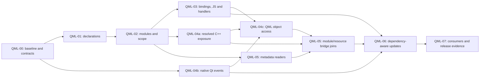

# Qt and QML feature increment plan

Status: QML-00 through QML-07 complete for the documented bounded Qt 6/QML static
source profile. All final source, consumer, update and declared hosted artifact gates pass. Executed checks are recorded in
[VALIDATION.md](VALIDATION.md) and [traceability](../../tests/TRACEABILITY.md).
Commands marked proposed are future verification suggestions, not pass claims.

This plan extends Graphify's existing Python pipeline and contribution workflow.
It does not propose a Qt application rewrite. Read [REQUIREMENTS.md](../REQUIREMENTS.md),
[ARCHITECTURE.md](ARCHITECTURE.md), [DESIGN.md](DESIGN.md), [AUDIT.md](AUDIT.md),
and the upstream [contribution guide](../../CONTRIBUTING.md) before
implementation. The approved baseline is the imported upstream `v8` state recorded
by the foundation audit; recheck upstream changes before starting each PR.

Upstream already tracks this feature in [issue #1716](https://github.com/Graphify-Labs/graphify/issues/1716)
and [PR #1748](https://github.com/Graphify-Labs/graphify/pull/1748). The PR was open
when inspected for this foundation and includes QML extraction and a C++ bridge.
Its page contains older dependency notes superseded by later commits. QML-00
must review its current head, tests, dependencies, maintainer feedback and overlap
before deciding what to reuse, supplement or replace. Do not create a duplicate
issue or assume unmerged code is present in the imported baseline.

## Sequence and working contract

| Increment | Outcome | Prerequisites | Requirement references |
| --- | --- | --- | --- |
| QML-00 | Existing-PR review, reproducible baseline and accepted parser decision | Foundation review | QML-001, QML-010, QML-012, QML-014, QML-015 |
| QML-01 | Discover `.qml` and extract minimal source-backed declarations | QML-00 | QML-001, QML-002, QML-003, QML-010, QML-011, QML-012, QML-013, QML-014, QML-015 |
| QML-02 | Resolve explicit QML modules, local components and scoped names | QML-01 | QML-002, QML-004, QML-005, QML-010, QML-012, QML-014, QML-015 |
| QML-03 | Model bindings, aliases, JavaScript and signal relationships | QML-02 | QML-006, QML-007, QML-010, QML-012, QML-014, QML-015 |
| QML-04 | C++ exposure into QML, Qt signal connections and C++ access to QML APIs | QML-04b after QML-00; resolved QML-04a joins after QML-02; QML-04c after QML-03, QML-04a and QML-04b; metadata joins finish with QML-05 | QML-008, QML-016, QML-017, QML-010, QML-012, QML-014, QML-015 |
| QML-05 | Enrich modules and resources from static Qt project metadata | QML-02; enrich QML-04 when available | QML-002, QML-004, QML-008, QML-009, QML-017, QML-010, QML-012, QML-014, QML-015 |
| QML-06 | Guarantee dependency-aware update/watch/cache parity | QML-03, QML-04, QML-05 | QML-002, QML-011, QML-016, QML-017, QML-010, QML-012, QML-014, QML-015 |
| QML-07 | Verify consumers, publish support matrix and prepare upstream release | QML-00 through QML-06 | QML-013, QML-014, QML-015; regression of all requirements |

Keep the existing increment numbers as stable scope identifiers; they do not
require independent work to wait for every lower number. The QML lane follows
QML-00, QML-01, QML-02 and QML-03. Native Qt C++ events in QML-04b can proceed
after QML-00 establishes C++ identity and event-site projection contracts, without
waiting for QML parsing or JavaScript integration. Raw C++ exposure/access facts
can also be developed early against those agreed interfaces; resolved joins have
the prerequisites in the table.

After QML-02 establishes the module-index contract, QML-05's independent metadata
readers may proceed alongside QML-03 and the C++ work. Their bridge integration
waits for QML-04a/04c facts. Minimal `qmldir` discovery belongs to QML-02. Simple
literal-file access in QML-04c can precede QML-05; module-loaded components and qrc
aliases finish with QML-05's index. This separates reader readiness from completed
bridge integration and avoids a circular prerequisite.



## Reviewable work packages

These are slices within existing increments, not new requirement or increment IDs.
Each slice has one owner and a focused diff. Internal adapters/facts may land before
admission, but public dispatch is enabled only with its complete extraction,
packaging, diagnostics, persistence and safe-update gate. Combine slices when a
separate PR would expose a broken path or have no independently useful outcome.

| Increment | Work packages | Demonstrable result |
| --- | --- | --- |
| QML-00 | Baseline/upstream overlap review; parser and syntax probe; fact/graph/update contracts | Reproducible parser choice and hand-checked corpus; no production admission |
| QML-01 | Parser adapter and declarations; discovery/dispatch/packaging integration | A small QML file yields exact scoped declarations and spans, with safe failures and updates |
| QML-02 | `qmldir` facts; URI/version/alias lookup; component/member scope | Equal names in different modules/components resolve correctly or remain ambiguous |
| QML-03 | Bindings/aliases; embedded/imported JS; handlers and `Connections` | Property, call and signal dependencies preserve scope, source evidence and mechanism |
| QML-04a | Meta-object/member overlay; literal procedural registration; declarative exports | QML references reach evidenced C++ APIs; build-derived module joins finish in QML-05 |
| QML-04b | Declarations/emissions; typed/overloaded/lambda connections; legacy signatures/private slots/disconnect | Native C++ events remain distinct from direct calls, including ordinary compatible receivers |
| QML-04c | Loader/root provenance; objectName/member access; context/initial providers and signal joins | C++ accesses the evidenced QML object/member; unknown or duplicate targets remain unresolved |
| QML-05 | CMake/qmake module readers; `.qmltypes`; `.qrc`; bridge integration | Equivalent Qt 6 project forms resolve modules/resources and both bridge directions without execution |
| QML-06 | Invalidation/reconstruction; watch integration; mutation/parity corpus | Updates equal clean rebuilds after QML, C++, resource and metadata changes |
| QML-07 | Query/affected; export/MCP/callflow; install/release evidence and generated guidance | Users can inspect the verified dependency graph through advertised consumers |

One integration owner controls shared discovery, dispatch, registry, graph,
cache/watch and resolver contracts. Parser, metadata, event and access contributors
own disjoint modules and fixture/test files against agreed interfaces. Give the
C++ overlay one owner; event/access slices supply focused modules rather than
concurrently editing its central integration file. Record ownership before work,
review commits at handoff, and coordinate every Git mutation.

The first useful QML slice is QML-01. Native Qt event analysis is a separate useful
slice in QML-04b. Project-level mixed-language analysis needs QML-02/03/04/05;
the release candidate also needs QML-06/07. Estimate elapsed effort after QML-00
resolves parser packaging and reuse uncertainty, using those measured findings.

## Increment readiness and completion

An increment is ready when its reviewed source base, prerequisites, owner, affected
acceptance IDs, proposed fact/interface changes, hand-checked fixture expectations,
failure cases and verification commands are recorded. Inspect overlapping upstream
work before committing to a production approach. Tests/fixtures named below are
proposed and must exist before running their acceptance command.

An increment is complete only when its implemented subset passes the common gate,
each due criterion has exact evidence, new failures have faithful regressions,
safe update/persistence behavior is exercised, and requirements/design/diagnostics/
comments/traceability match the delivered result. Record modularity ceilings or
justified exceptions for touched source files. Partial implementation is a valid
checkpoint, not a completed criterion. Baseline failures, skips and missing lanes
remain explicit limitations rather than passing evidence.

At each handoff, the integration owner reviews a versioned record of exact base,
head and tested SHAs, affected acceptance IDs with partial/passed/gap evidence,
interface/schema decisions, commands/results/platforms, file ownership, outstanding
risks, and the next owner. A future work package must not infer completion from a
previous contributor's summary alone.

When publication is authorized, use one focused branch and one PR validation run
for the reviewed revision; preserve separate required post-merge checks. Record
source, tested integration and resulting SHAs with workflow results. Follow
[AGENTS.md](../../AGENTS.md) for guarded merging, retries and any future protected
proof. Upstream acceptance depends on maintainer review; it is not an automatic
result of finishing local implementation.

## Acceptance completion ownership

Every acceptance criterion has one planned completion increment in
[tests/TRACEABILITY.md](../../tests/TRACEABILITY.md). Earlier increments provide
partial evidence and later ones reverify affected contracts. This is a delivery
assignment, not a change to the criterion or a claim that it passed. Cross-cutting
criteria remain obligations in every affected PR, even when their complete
mixed-language evidence is assigned to QML-06 or QML-07.

| Requirement | Planned criterion completion |
| --- | --- |
| QML-001 | AC01/AC03/AC04: QML-01; AC02 complete supported-source corpus: QML-03 |
| QML-002 | AC02/AC03 metadata/corpus boundaries: QML-05; AC01/AC04 entry-point parity: QML-06 |
| QML-003 | AC01–AC04: QML-01 |
| QML-004 | AC01–AC04: QML-02 |
| QML-005 | AC01–AC04: QML-02; reverify added metadata visibility in QML-05 |
| QML-006 | AC01–AC04: QML-03 |
| QML-007 | AC01–AC04: QML-03; reverify C++ signal joins in QML-04/05 |
| QML-008 | AC01–AC04: QML-05, following QML-04a source exposure |
| QML-009 | AC01–AC04: QML-05 |
| QML-010 | AC01–AC04: QML-07; graph correctness gates apply when each fact lands |
| QML-011 | AC01–AC04: QML-06 |
| QML-012 | AC01–AC04: QML-06; safe failure/persistence gates apply from QML-01 |
| QML-013 | AC01–AC04: QML-07 |
| QML-014 | AC01–AC04: QML-07; install/platform evidence starts in QML-00/01 |
| QML-015 | AC01–AC04: QML-07; documentation/evidence gates apply in every PR |
| QML-016 | AC01–AC03: QML-04b; AC04 full parity/consumer evidence: QML-07 |
| QML-017 | AC01–AC03: QML-05 after QML-04c; AC04 full parity/consumer evidence: QML-07 |

The parser spike informs QML-001; production install/failure acceptance closes in
QML-01 and the complete supported syntax/declaration corpus in QML-03. Parsing
success alone cannot replace those production-boundary assertions.
All named metadata and their corpus boundaries close in QML-05. Exposure and
resource/module-backed access close in QML-05 after the QML-04 source slices.
Native event syntax closes in QML-04b, while QML-016-AC04 and QML-017-AC04 need
incremental and consumer evidence before closing in QML-07. The final release gate
rechecks all sixty-eight criteria for the advertised matrix.

The primary acceptance profiles are ordinary Qt 6.5 and Qt 6.8 source/metadata,
as specified in ARCHITECTURE. Both CMake and qmake project forms are required for
the first Qt 6 target. Literal procedural registration is also part of Qt 6 bridge
support; neither qmake nor procedural registration is restricted to legacy Qt.
Qt 5.15 is a separate legacy compatibility profile with separately reviewed PRs
within QML-02, QML-04 and QML-05. Parsing common versioned-import syntax earlier
does not establish that profile's semantic support. Record module import versions
separately from the Qt release used to define a fixture.

Each increment is a cohesive feature branch and one or more small PRs. A PR may
merge independently only when it delivers a truthful subset, preserves existing
behavior, and satisfies its exit gate. Broad schema migrations, graph-class
changes, unrelated refactoring, and new runtime integrations require separate
review. An upstream-ready PR is not an upstream-accepted PR; approval and merge
remain separate recorded events.

Use existing `file_type="code"`, required source provenance, confidence values,
canonical ID helpers, ignore rules, and graph consumers. New QML detail belongs in
versioned metadata and focused resolver facts, with meanings defined in DESIGN.
Do not globally group QML/JavaScript with C++ to defeat cross-language call guards.
Do not activate a MultiDiGraph migration as an incidental language-support change.
Represent distinct bindings or handlers with their own source-backed nodes where
needed so the current simple graph does not silently overwrite relationships.

## Common verification gate

All paths below are relative to the repository root. Proposed new test files and
fixture directories are deliberately named so work can start without inventing
the test layout. Adapt names to an upstream-reviewed convention while retaining
the acceptance-criterion mapping. Every requirement has individually assigned
criterion IDs in REQUIREMENTS, such as `QML-003-AC01` through `QML-003-AC04`.
Before starting an increment, list all affected criterion IDs and map each one to
a concrete fixture/action/observable result and an exact automated test, or to an
explicit manual/system verification gap. Dedicated tests should use criterion
metadata or names such as `test_QML_003_AC01`; existing tests may map through
`tests/TRACEABILITY.md` without renaming unrelated tests.

Every increment's exit gate requires criterion-level evidence in traceability:
test identity, command, result, supported profile/platform, and remaining gap.
Record applicability explicitly. All applicable assigned criteria must pass
individually before a requirement becomes `Verified`. A skipped test, unexecuted
manual check, aggregate test count, or one passing happy-path test does not verify
the other criteria. Retain `Planned`, `Implemented` or partial/unverified status
until the criterion-level evidence supports promotion; document any criterion
scope change in the requirement rather than silently treating it as a pass.

Establish a pinned development environment with `uv sync --frozen`. If a PR changes
dependencies, deliberately regenerate and review `uv.lock` first; a frozen command
must not be used to pretend that an old lock covers a new dependency. Use the
selected QML extra after QML-00 accepts its packaging contract. Do not substitute
live Qt execution or model calls for deterministic offline parser tests.

Before handoff, execute the increment's focused tests and the following applicable
upstream checks. Capture failures, skips and unavailable optional dependencies.
The proposed pytest commands use Python's module runner and UTF-8 mode because
this project is developed on Windows. Existing POSIX CI may retain its equivalent
pytest entrypoint. The foundation's two remaining Windows-invalid deleted-working-
directory fixture failures are documented in VALIDATION; reproduce and classify
baseline failures instead of treating them as new Qt/QML regressions or claiming
the complete baseline is green.

```text
uv run --frozen python -X utf8 -m pytest tests/ -q --tb=short
uv run --frozen ruff check .
uv run --frozen pyright
uv run --frozen python -m tools.skillgen --check
```

When optional dependencies are involved, reproduce the upstream CI environment
with `uv sync --all-extras --frozen` in a suitable clean job, or use an explicitly
documented extra selection for the focused job. A platform-specific dependency
failure is a finding to resolve or report, not permission to claim full coverage.
When code changes, follow the repository's instruction to run `graphify update .`
and check its result. Generated local graph/build outputs remain uncommitted.

For every increment, review the full diff, canonical documents, test quality,
dependency provenance, and safe diagnostics. Record the actual commands and
results in `tests/TRACEABILITY.md`. Demonstrate regression tests fail against the
old behavior where applicable. Full-suite or cross-platform failures must be
explained before completion; unchanged aggregate coverage does not settle them.

Every new fact shape must pass extraction, graph-build and JSON reload assertions
when introduced. Event/access packages also demonstrate their minimal query and
affected behavior before claiming usability. QML-07 expands that coverage to the
complete advertised consumer matrix; it does not defer basic graph correctness.

Before enabling an update/watch path, implement and test its conservative full-
project resolution/rebuild fallback or reject the unsupported operation before
mutating graph/cache state. Test deletion, failed extraction and stale-edge removal
at each newly enabled boundary. A warning or support note cannot justify leaving
an enabled path known to produce stale results. QML-06 improves invalidation and
establishes full parity after this safety baseline.

## QML-00 — Baseline and parser decision

**Status: complete for optional parser selection (3 October 2026).** See the
[parser decision and executed evidence](PARSER_DECISION.md). Linux/macOS lanes
remain unverified; this does not authorize default-installed parser promotion.
The review adds **QML-01a** (write/cache safety) and **QML-01b** (declarations,
admission and installation) as required QML-01 work packages. A dedicated semantic
qmldir parser and nonlossy, immutable fact transport are mandatory in QML-02.
Production acceptance criteria remain open until exercised through production.

**Scope and code paths.** First inspect the current exact head of PR #1748 without
changing this workspace to its branch. Review its extractor, C++ modifications,
dependency metadata, tests, graph-family policy and mergeability against the
current upstream base. Map its existing coverage to the requirements in this plan.
Record a reuse/supplement decision and preserve attribution and license notices
for any later adopted code. Read-only inspection does not authorize posting review
comments or messages to other contributors.

The source audit identifies review cases around flat scope/name tables, discarded
import alias/version context, partial-parse reporting, C++-only resolver activation,
and compatibility of C++ changes with current upstream normalization. Reproduce
these against the recorded candidate head rather than assuming its tests exclude
them. Include the valid identifier form `QML_NAMED_ELEMENT(Backend)`;
[Qt 6.8's macro documentation](https://doc.qt.io/qt-6.8/qqmlintegration-h.html#QML_NAMED_ELEMENT)
shows an identifier argument. A test built only around quoted macro syntax does
not validate the real contract. Also test macro-like text in comments/literals.

Create public, synthetic fixtures under
`tests/fixtures/qml/parser_probe/` and a focused `tests/test_qml_parser_probe.py`
or equivalent nonshipping probe. Record the baseline commit, environment, current
language behavior, and parser ADR in the Qt/QML architecture/design documents.
Inspect `pyproject.toml`, `uv.lock`, `.github/workflows/ci.yml`,
`graphify/extractors/models.py`, `graphify/extractors/engine.py`, `graphify/ids.py`,
and `graphify/validate.py`. Keep experimental adapters out of production dispatch.

Evaluate the direct QML grammar binding and the pinned language-pack option
identified by the architecture audit. Do not choose a package from its name or
advertised grammar list alone. Verify its license, grammar revision, Tree-sitter
API/ABI compatibility, actual installed parser availability, source ranges,
error recovery, distribution size, and offline behavior. A required dynamic
grammar download fails the offline installation/extraction gate.

Start the comparison with the audited `tree-sitter-language-pack==0.11.0` candidate,
already optional upstream, and verify its actual installed `qmljs`/`qmldir`
entry points against the locked runtime. Treat the standalone
`tree-sitter-qmljs==0.3.1` as an alternative with explicit source-build and older-
binding risks. Record selection or rejection in existing decision D2. Prefer an
optional `qml` extra for initial adoption unless evidence supports a different
reviewed packaging decision; a package name/range intersection is not API proof.

**Acceptance cases.** Parse imports with and without versions and aliases, objects,
nested objects, properties and modifiers, aliases, signals, methods, inline
components, JavaScript expressions, handlers, and deliberately incomplete files.
Probe `qmldir` independently; a small dedicated metadata parser is an acceptable
decision if its syntax and failure behavior are explicit. Unicode identifiers,
CRLF, comments containing braces, strings containing punctuation, and malformed
input must preserve useful ranges without a crash. The probe must never execute
QML or JavaScript. Missing grammar must yield a safe explicit limitation.

Verify installation and parser invocation on Python 3.10, 3.12, 3.13, and 3.14,
matching upstream's current Python CI matrix; include Windows x64, Linux, and
macOS compatibility evidence or record each unsupported/unverified combination.
Build a syntax matrix using version-tagged source fixtures rather than claiming
runtime support for all Qt releases. Pin the supported syntax subset before QML-01.

Use focused packaging/probe jobs for additional platforms; the audited workflow
currently covers Ubuntu and does not prove Windows/macOS support. Advertise only
tested lanes and record architecture where relevant. Keep source/grammar/license
fingerprints and an explicit reused-file/test ledger at the reviewed PR head.
Retain the known Windows deleted-cwd fixture failures and type-check baseline as
separate findings; any portability correction is a focused change, not a weakened
parser gate or an unrelated bulk rewrite.

**Proposed commands.** The probe test is introduced by this increment; it must not
be entirely skipped in the job used to accept the parser.

```text
uv run --frozen python -X utf8 -m pytest tests/test_qml_parser_probe.py -q --tb=short
uv run --frozen python -X utf8 -m pytest tests/test_languages.py tests/test_multilang.py tests/test_extractors_registry.py tests/test_id_normalization_contract.py tests/test_validate.py -q --tb=short
```

**Exit gate and PR boundary.** Accepted parser ADR, dependency/license decision,
install matrix, synthetic corpus, meaningful recovery tests, baseline evidence,
and the existing-PR reuse/overlap decision. Accept the C++ declaration identity,
source-fact ownership, nonlossy event-site projection and safe-update fallback
design contracts required by the first production slices. Runtime implementation
of that fallback belongs to the first enabled update path, not to the probe.
No release language-support claim. Keep the parser choice/fixture PR separate from
production extraction if that makes review clearer. A missing cross-platform
wheel or incompatible ABI blocks promotion to default-installed support; document
an optional extra or defer instead of silently adding a compiler requirement.

## QML-01 — Discovery and minimal declarations

**Status: QML-01a/01b complete for the declared Windows optional profile.** See
[implementation evidence](IMPLEMENTATION.md). Review retains QML-02/03 semantic
validation, immutable context and independent use sites. No new top-level
increment is needed; QML-06 still owns cache optimization.

**Scope and code paths.** Add `graphify/extractors/qml.py` with an isolated parser
adapter and QML facts as necessary. Integrate `graphify/detect.py`, the public
facade and `_DISPATCH` in `graphify/extract.py`, and
`graphify/extractors/__init__.py`; registry entry alone is insufficient. Add the
accepted dependency/extra to `pyproject.toml` and `uv.lock`. Use
`graphify/ids.py`, `graphify/cache.py`, and `graphify/diagnostics.py` through their
existing contracts. Add `tests/test_qml_extract.py` and
`tests/fixtures/qml/declarations/`; update upstream language and detection tests.

Extract file/component declarations, nested object scopes, `id` declarations,
properties, signal declarations, and method declarations with source ranges.
Record imports as raw facts or import records without guessing a target. Method
bodies and bindings remain opaque source facts until QML-03. A declared property
alias may be recognized here while its target relationship remains unsupported.
Keep QML semantic information in `metadata.qml` and the versioned fact contract
specified in DESIGN. Represent `id` as component-local identity, not an ordinary
globally exported property. Preserve the full filename and component/symbol scope
when deriving canonical IDs; prove exact-case/punctuation collision handling.

**Acceptance cases.** Directory and single-file scans discover `.qml` and
`.ui.qml`, obey `.gitignore`/`.graphifyignore`, and leave existing classifications
unchanged. Valid declarations retain source-backed fields and correct ranges;
two files with the same stem, `.qml`/`.js` stem collisions, case-distinct names,
nested identical IDs, and relocation to a different absolute checkout do not merge
unrelated declarations. Malformed or unsupported input yields bounded diagnostics
and a partial/failed status that cannot replace valid persisted state. Missing
optional grammar does not make an unrelated Python/C++ scan fail. Repeated scans
preserve IDs, confidence and order after canonical comparison.

**Proposed focused commands.**

```text
uv run --frozen python -X utf8 -m pytest tests/test_qml_extract.py tests/test_detect.py tests/test_extractors_registry.py tests/test_languages.py tests/test_extract_cli.py tests/test_extract_code_only_cli.py tests/test_validate.py tests/test_node_id_canonical.py tests/test_partial_extraction_warning.py tests/test_zero_node_no_cache.py -q --tb=short
```

**Exit gate and PR boundary.** One PR delivers discovery plus a minimal extractor,
public fixtures, dependency packaging, extraction validation, a cold/warm smoke
test, and an honest declarations-only support note. Do not ship discovery alone
that routes QML into an unusable extractor. Existing zero-node/shrink/cache guards
must apply. Until QML-06, resolver-changing input must use a tested safe full
project resolution/rebuild path or be rejected before writes. Include admission,
edit, deletion and forced parser/write failure evidence for the enabled update and
watch paths; a known stale-graph path must not remain enabled with only a warning.

QML-001-AC01 also requires a clean built-wheel installation with the selected QML
extra and production parser invocation on every declared lane. Extend the existing
wheel-packaging coverage and use isolated install/probe jobs; source-tree imports
or QML-00's experimental adapter are insufficient. Test a core-only installation
without that extra. QML-001-AC02 stays open until QML-03's production adapter passes
the complete declared syntax/declaration/span corpus, including embedded JS forms.

## QML-02 — Modules and component scope

**Status: complete for the documented static profile.** Review adds **QML-02a** semantic
qmldir, **QML-02b** immutable module/member indexes and **QML-02c** transport,
producer provenance and provider-only refresh parity. These follow the existing
letter-suffix numbering; all must pass to close QML-02. No new top-level increment.

**Scope and code paths.** Add `graphify/qml_resolution.py` and focused
`graphify/extractors/qml_metadata.py`, with registry integration through
`graphify/resolver_registry.py` and `graphify/extract.py`. Introduce shared
named-file discovery for `qmldir` in the existing corpus-boundary path; update
`collect_files()` and watcher recognition without creating a separate ignore
policy. Add `tests/test_qml_resolution.py`, `tests/test_qml_metadata.py`, and
`tests/fixtures/qml/modules/`. Use a per-project module/scope index with explicit
inputs and lifetime; retain raw facts separately from resolved graph edges.

Resolve directory imports, module URI imports, aliases, local QML components,
version declarations, `qmldir` type entries, inline-component scopes, and singleton
metadata according to the accepted static policy. Record unresolved or conflicting
imports rather than searching every basename in the repository. Preserve scope
boundaries for IDs, component members, and inline components; do not infer dynamic
delegate/context objects from lexical proximity alone.

**Acceptance cases.** Two modules both export `Button`; an aliased import resolves
only the intended module, while an ambiguous unqualified use has no guessed
concrete target. Imported versions, versionless imports, relative directory imports,
missing components, missing/duplicate module metadata, singleton declarations and
inline components have documented positive and rejection cases. Identical IDs in
separate component scopes stay distinct. An ignored or out-of-corpus `qmldir` does
not grant access to its files. Metadata-only changes trigger the conservative
resolution path even when QML text is unchanged. Synthetic Qt built-in references
remain external/unresolved unless a source-backed type inventory is supplied.

**Proposed focused commands.**

```text
uv run --frozen python -X utf8 -m pytest tests/test_qml_resolution.py tests/test_qml_metadata.py tests/test_qml_extract.py tests/test_language_resolvers.py tests/test_case_sensitive_resolution.py tests/test_import_self_loops.py tests/test_phantom_cross_package_call.py -q --tb=short
```

**Exit gate and PR boundary.** Module lookup/scope rules and ambiguity evidence are
documented and exercised through full extraction. A small named-file discovery
PR may precede the resolver when independently useful and tested. Module resolution
is a separate PR from later binding/call semantics. Keep the module-index contract
small enough for C++ and project metadata enrichment without a generic resolver
rewrite. No global same-name fallback or implicit Qt SDK scan.

## QML-03 — Bindings, aliases, JavaScript and signals

**Status: complete for the documented static profile.** QML-001-AC02 and all
QML-006/007 criteria pass production fixtures. Actual tests are in
test_qml_syntax_profile.py, test_qml_expressions.py, test_qml_handlers.py,
test_qml_scripts.py, test_qml_adversarial.py and the graph/persistence suites.
See [implementation evidence](IMPLEMENTATION.md); proposed names below describe
the initial planning contract and are superseded by those actual owners.

Review added **QML-03a** held-object/array/template declarations, **QML-03b**
lexical expressions/aliases/handlers and **QML-03c** accepted-script overlays,
generic-JS isolation, typed cross-family proof and durable edge direction. All
three work packages are delivered. Regression discoveries include lexical-list
truncation, duplicate anonymous Connections, inherited signal parameters,
mixed Connections handler styles, alias cycles, module export roles and missing
script-file endpoint proof. Separate source sites retain repeated relationships.

No new top-level increment is needed. Add **QML-06a** source/metadata/script/C++
mutation parity and **QML-06b** bounded parser/config/import-root cache contracts;
add **QML-07a** direction/evidence across every advertised consumer and **QML-07b**
hosted installation/profile evidence and upstream review. These refine existing
increments, preserving QML-00 through QML-07 and QML-04a/04b/04c numbering.
Runtime contexts, framework members, reexports and name-based template barriers
remain documented conservative limits. Native C++ work advances in QML-04 next;
build/resource/type-description enrichment remains QML-05.

**Scope and code paths.** Extend focused QML extraction/resolution modules, reusing
existing JavaScript AST helpers only through a narrow adapter that preserves QML
lexical scope and original source offsets. Add
`tests/test_qml_bindings.py`, `tests/test_qml_javascript.py`,
`tests/test_qml_signals.py`, and `tests/fixtures/qml/interactions/`. Map relations
through existing `references`, `uses`, and validated `calls` semantics with QML
context metadata. Binding and handler nodes retain distinct source evidence and
avoid same-endpoint relation loss in the current simple graph.

**Acceptance cases.** Property binding reads link to the correct local ID/member;
property aliases retain the target and alias distinction; scoped local variables
shadow component members; inline-component and imported-JavaScript scopes do not
leak. Test expressions, blocks, functions, closures, `.js` imports, `.pragma
library` where accepted by the syntax matrix, signal declarations/emissions,
`onSignal` handlers and `Connections`. A handler's reference to a signal is not
proof of a runtime call. Dynamic `Connections.target`, computed property names,
runtime object creation and unresolved context values stay visibly unresolved or
qualified as inference. Two relationships between the same logical objects must
retain distinct evidence after build/merge/JSON round trip.

**Proposed focused commands.**

```text
uv run --frozen python -X utf8 -m pytest tests/test_qml_bindings.py tests/test_qml_javascript.py tests/test_qml_signals.py tests/test_js_import_resolution.py tests/test_js_callback_calls.py tests/test_indirect_call_block_scoped_shadow.py tests/test_build_merge_hyperedges_and_prune.py tests/test_relation_collapse_precedence.py -q --tb=short
```

**Exit gate and PR boundary.** Split bindings/aliases and JS/signals into separately
reviewable PRs if necessary. Each PR must preserve source ranges, scope, uncertainty,
and relation meaning, with cold/warm output parity. Update diagnostics and the
support matrix for dynamic limitations. No execution of user expressions, no
wholesale reuse of JavaScript resolution without QML scope context, and no claim
of complete runtime signal tracing.

## QML-04 — Qt/C++ exposure, signals and access to QML

**Scope and code paths.** Add a source-overlay module such as
`graphify/extractors/qt_cpp.py`, enriching existing C++ declarations rather than
replacing the C++ extractor. Extend QML project resolution with explicit type
registration and member evidence. Inspect `graphify/extractors/engine.py`, C++
preprocessing, `graphify/build.py` cross-family call guards, and canonical IDs.
Add `tests/test_qt_cpp_bridge.py`, `tests/test_qt_signals_slots.py`,
`tests/test_qml_cpp_access.py`, and synthetic fixtures under
`tests/fixtures/qml/cpp_bridge/`, `qt_connections/`, and `cpp_access/`.

Keep three focused PR boundaries without renumbering the surrounding increments:

- **QML-04a:** C++ types/members exposed into QML, advancing QML-008 with
  registration/member evidence; complete module-derived acceptance in QML-05.
- **QML-04b:** Qt C++ signal declarations, emissions and explicit connections,
  completing `QML-016-AC01` through `QML-016-AC03` and the source/graph part of
  `QML-016-AC04`; its full incremental/consumer criterion closes in QML-07.
- **QML-04c:** C++ consumers of QML objects, functions, properties and signals,
  advancing all QML-017 criteria; complete module/resource-backed AC01–AC03 in
  QML-05 and full incremental/consumer AC04 in QML-07.

Each sub-PR must map every affected criterion to its own observable assertions and
traceability evidence. Later QML-06 verifies invalidation of these facts, and
QML-07 verifies their query/export/MCP projection. Criterion-level status remains
unverified for those later obligations until their evidence exists.

Begin with statically identifiable `Q_OBJECT`, `Q_PROPERTY`, signals/slots,
`Q_INVOKABLE`, QML registration macros, and literal `qmlRegisterType`/singleton
registration calls supported by the accepted design. Treat literal
`setContextProperty` names and known instance types as evidence with their engine
and scope limits; uncertain ownership must remain inferred/unresolved. Use
`uses`/`references` and `qml_cpp_member` context first. Concrete cross-language
`calls` require narrowly validated registration/member evidence and dedicated
negative tests before extending a guard. QML_ELEMENT module URI enrichment that
requires build metadata remains pending until QML-05.

**Acceptance cases.** A QML property or method reference links only to the registered
class/member in the correct URI/version/registration scope. Test declaration and
implementation separation, getters/setters/NOTIFY evidence, overloaded members,
namespace-qualified C++ types, header/source duplicates, nonliteral registration,
conflicting registrations and unknown context-property types. A same-named member
in an unrelated C++ module must not acquire an edge. Macros inside comments or
strings are not registrations. Valid identifier-based `QML_NAMED_ELEMENT(Backend)`
must work; malformed or quoted forms must not substitute for that positive case.
Missing generated metadata or plugin binaries does
not trigger execution, an SDK scan or a guessed linkage. Removing or renaming a
registration on a C++-only change must reach the safe rebuild path.

**Qt signal/connect/slot acceptance cases (QML-016).** Retain signal and slot
declarations/signatures and distinguish an emission from an ordinary method call.
Cover `signals`, `Q_SIGNALS`, `Q_SIGNAL`, slot access sections, `Q_SLOTS`, `Q_SLOT`,
and both `emit` and `Q_EMIT` forms with original source spans.
Extract source-backed `QObject::connect` sites for member-pointer syntax, legacy
`SIGNAL`/`SLOT` signatures, signal-to-signal connections and lambda/functor receivers.
Typed connections may target a compatible ordinary member; do not require a slot
annotation when the typed connection form supplies sufficient member evidence.
Resolve explicitly selected
overloads, including supported `qOverload` or cast forms, only when the declaring
type and signature identify a unique member. Lambda connections retain the lambda
body's ordinary direct calls separately from the signal-to-lambda relationship.
Preserve sender, signal, receiver/context, slot/lambda, source span, conditional
registration evidence and a declared connection type/flags where present.
Record `Qt::AutoConnection`, direct, queued or
blocking declarations as configuration facts without predicting runtime scheduling,
delivery order, thread affinity or whether a connection is successfully established.
In particular, retaining `Qt::UniqueConnection` on a lambda/functor connection
does not establish effective uniqueness or deduplication; test that the graph
preserves the declared flag without asserting that runtime effect.

Test header/implementation pairs, namespaced classes, inherited members, duplicate
method names in unrelated classes, overload disambiguation, unavailable receiver
types, malformed legacy signatures, macro-like text in comments/literals, dynamic
targets and anonymous-lambda scope. Include supported private-slot meta-object
connections without confusing ordinary C++ call visibility with the meta-object
connection contract. A typed callable remains distinct from a same-named global
function; validate the actual endpoint/signature rather than its label.
Unresolved endpoints yield bounded diagnostic
evidence instead of guessed links. Connection sites and emissions retain their own
identity/context through graph construction; they must not become an ordinary
`calls` edge implying execution of the connected slot. Preserve supported
`QObject::disconnect` source statements as separate facts; a disconnect declaration
does not prove execution or justify erasing a prior connection from the source
graph. Ordinary direct slot calls, emit sites, connect sites and disconnect sites
must remain distinguishable after build/export/query/affected and incremental
updates.

QML-04b must also pass on a Qt C++-only corpus with no `.qml` files and no optional
QML parser installed. Activation cannot depend on a QML suffix or parser presence.
Unrelated APIs named `connect` or `emit` must not acquire Qt event relationships.
This independent acceptance case enables useful native Qt support in parallel
with the QML lane.

**C++ access to QML acceptance cases (QML-017).** Collect literal `load` and
`loadFromModule` requests and `QQmlComponent` creation as access/creation facts with
the owning engine/component. Include the common Qt Quick `QQuickView::setSource`
and `rootObject` loader/access profile with its owning view. Track bounded
source-backed object flow from creation, `rootObjects()` or `rootObject()` to a
known QML root without assuming every engine/view uses the first same-named file.
Resolve literal `objectName`/`findChild` lookups only against the
identified object tree; a QML `id` alone does not establish the runtime lookup name.
Model `QMetaObject::invokeMethod` against declared QML function/signature evidence,
property reads/writes against the declared member, and C++ connections to declared
QML signals separately from ordinary direct calls. Also preserve exposed C++ signal
to QML-handler relationships in the appropriate receiver scope. Supported literal
`setContextProperty`, `setContextObject` and initial-property exposure carry their
provider, engine/component and provenance facts; reuse QML-04a's exposure model
instead of creating competing definitions. Conditional or dynamic exposure remains
visibly uncertain. Annotate static access intent
without claiming object creation, lookup, mutation, invocation or signal delivery
occurred successfully at runtime.

Test separate engines loading equal component names, multiple/unknown root objects,
module-loaded and URL-loaded components, separate QQuickView instances and their
setSource/rootObject provenance, objectName versus id, nested objects,
duplicate/dynamic object names, literal and computed method/property names,
overloads, read-only/unknown members, and QML signal-to-C++ slot connections.
Include C++ signal-to-QML handler cases and literal/dynamic context-property,
context-object and initial-property exposure variants.
Uncertain loader paths or receiver provenance remain unresolved. Resource aliases
and module URI/export mappings consume QML-05's index instead of a global basename
search. Never instantiate an engine, create a component or load a plugin to resolve
these source relationships.
Qt Quick Widgets loaders remain an explicitly deferred, separately reviewed
extension; the QQuickView source profile does not imply widget integration support.

Use the established `uses`/`references` projection plus namespaced connection,
emission, loading and member-access context defined in DESIGN. Dedicated site nodes
preserve distinct evidence when the simple graph would collapse endpoint pairs.
Use proposed contexts `qt_signal_emit`, `qt_connect_signal`,
`qt_connect_receiver`, `qt_disconnect`, `qt_cpp_qml_load`,
`qt_cpp_qml_find_child`, `qt_cpp_qml_property_read`,
`qt_cpp_qml_property_write`, `qt_cpp_qml_invoke`, `qt_context_exposure` and
`qt_initial_property`, with `metadata.qt.bridge_direction` and scoped
engine/component/root provenance. These are planned metadata contracts, not
already implemented graph fields. Reserve ordinary `calls` for evidenced direct
C++/JavaScript calls, including direct slot calls. A reflective QML invocation site
records access intent and its member evidence without implying an ordinary direct
call or runtime execution. Connecting a signal, emitting it and invoking a method
remain different source actions even when they mention the same member name.

**Proposed focused commands.**

```text
uv run --frozen python -X utf8 -m pytest tests/test_qt_cpp_bridge.py tests/test_qt_signals_slots.py tests/test_qml_cpp_access.py tests/test_qml_resolution.py tests/test_cpp_preprocess.py tests/test_cpp_method_declarations.py tests/test_cpp_objc_cross_file_calls.py tests/test_cross_language_call_resolution.py tests/test_cross_repo_external_call_guards.py -q --tb=short
```

**Exit gate and PR boundary.** Ship a narrow metadata overlay/registration PR before
broader bridge behavior if appropriate. Preserve existing C++ extraction and guards.
Every concrete exposure bridge edge has source-backed registration and member
evidence; connection/access edges have source-backed endpoint and object-flow
evidence. Confidence matches the actual claim. Review QML-016/QML-017 criteria
individually, including negative paths and distinct relation preservation. No
unrestricted name-based bridge or runtime event scheduling inference. Runtime
contexts, plugins and dynamic registrations remain documented gaps. Metadata-only
or C++-only changes use the conservative safe rebuild path until QML-06 proves
targeted invalidation; metadata-backed access cases finish with QML-05 integration.

## QML-05 — Build, module and resource metadata

**Scope and code paths.** Extend `qml_metadata.py` or separate focused Qt project
readers for `CMakeLists.txt`/`.cmake`, `.pro`/`.pri`, `.qrc`, `qmldir` and
`.qmltypes`. Reuse discovery and ignore boundaries from QML-02; inspect existing
`graphify/manifest.py`, `graphify/manifest_ingest.py`, `graphify/detect.py`,
`graphify/extract.py`, and watch recognition. Add
`tests/test_qt_project_metadata.py`, `tests/test_qt_resource_resolution.py`, and
`tests/fixtures/qml/project_metadata/`. Generated files remain distinguishable from
authoritative handwritten sources and do not silently override stronger evidence.

Parse a declared static subset of `qt_add_qml_module`, module URI/version,
`QML_FILES`, related C++ source lists, supported qmake statements, and resource
prefix/alias/file mappings. Use `.qmltypes` only within its documented evidence
limits. Resolve resource URLs through `.qrc` mappings; preserve both logical URL
and canonical source path. Do not run CMake, qmake, Qt tooling or project scripts.
Unsupported expansion, conditionals, generators or binary plugin metadata must
remain explicit limitations rather than evaluated code.

**Acceptance cases.** A literal resource alias maps to the intended in-corpus QML
file, including case-sensitive filenames and portable separators. Compare CMake
and qmake fixtures declaring the same simple module in both initial Qt 6 profiles;
both build forms are required for the first target. Test conflicting URIs,
overlapping qrc aliases, missing files, duplicate entries, relative paths, malformed
XML/metadata, conditional build statements, unknown variable expansion, and
resource paths escaping the approved corpus. XML readers must not resolve external
entities. A project with no Qt commands must not gain fabricated Qt modules.
Generated `.qmltypes` cannot overwrite real source provenance. `.qrc` or build
metadata-only changes trigger safe resolution before optimized invalidation exists.
Loader/access facts from QML-04c must resolve the same intended component through
literal file/resource URLs and accepted `loadFromModule` URI/type mappings; missing
or conflicting metadata must not select an unrelated equal-name component.

**Proposed focused commands.**

```text
uv run --frozen python -X utf8 -m pytest tests/test_qt_project_metadata.py tests/test_qt_resource_resolution.py tests/test_qml_metadata.py tests/test_qt_cpp_bridge.py tests/test_qml_cpp_access.py tests/test_detect.py tests/test_manifest_ingest.py tests/test_non_regular_files.py tests/test_security.py -q --tb=short
```

**Exit gate and PR boundary.** Prefer one PR for static CMake/qmake module records
and one for qrc/resource resolution. Named-file discovery is shared and tested.
Every supported construct has an explicit static policy and unresolved fallback.
No implicit build execution, external traversal or unconditional generated-source
indexing. Metadata enriches QML/C++ indexes without redefining Graphify's build.

## QML-06 — Incremental updates, watch and caches

**Scope and code paths.** Integrate accepted fact/index contracts with
`graphify/cache.py`, `graphify/manifest.py`, `graphify/watch.py`, the CLI's incremental
extraction path, `graphify/resolver_registry.py`, and the language resolver. Add
`tests/test_qml_incremental.py`, `tests/test_qt_watch_metadata.py`, and
`tests/fixtures/qml/incremental/`. Keep per-file syntax caching distinct from
project-dependent resolution; parser/fact-contract changes invalidate compatible
namespaces, while module/resource/registration changes invalidate their dependents.

Record explicit dependencies from a file's raw imports/references to relevant
module, registration, resource and build metadata. Re-resolve the dependent closure
for changed, added, moved and deleted inputs. If the closure is uncertain, fall back
to a safe full project resolution. Avoid reparsing unchanged source solely because
resolved facts changed, while preserving correctness ahead of optimization.
Resolver activation cannot depend solely on changed `.qml` suffixes. Named metadata
files and C++-only changes must update unchanged QML consumers.
The reverse direction also applies: QML declaration/objectName/signal edits must
re-resolve unchanged C++ loader, lookup, property, invocation and connection sites.
Keep context/initial-property providers and connection/disconnect site ownership
in the dependency index instead of treating them as anonymous global name facts.

**Acceptance cases.** Cold extraction, warm cached extraction, forced rebuild and
incremental update produce equivalent canonical nodes/edges/provenance for the
same final corpus. Test QML-only edits, imported-component deletion, qmldir-only
version/export changes, C++ registration-only edits, qrc alias renames, CMake/qmake
membership changes, same-mtime content changes, parser/fact schema upgrades,
checkout relocation and custom output directories. Watch batches recognize named
files and preserve existing debounce/locking/retry rules. Unsupported or partial
re-extraction cannot erase valid prior graph state or poison caches. Edge removal
and repointing are verified even when total node count remains unchanged.
For `QML-016-AC04` and `QML-017-AC04`, mutate a signal/slot signature, connection or
disconnect declaration, QML `objectName`/function/property, loader URL/module,
resource mapping and C++ context/initial-property provider. Verify both integration
directions equal a clean rebuild, while preserving distinct direct-call, emission,
connection and access facts and removing only source-backed stale results.

**Proposed focused commands.**

```text
uv run --frozen python -X utf8 -m pytest tests/test_qml_incremental.py tests/test_qt_watch_metadata.py tests/test_qt_signals_slots.py tests/test_qml_cpp_access.py tests/test_incremental.py tests/test_incremental_mtime_collision.py tests/test_watch.py tests/test_watch_manifest_location.py tests/test_cache.py tests/test_partial_cache.py tests/test_stale_prune.py tests/test_incomplete_build_guard.py tests/test_stat_index_portability.py -q --tb=short
```

**Exit gate and PR boundary.** A dependency-invalidation PR and a watcher integration
PR are acceptable when each has faithful parity tests and a safe fallback. Preserve
atomic writes, shrink guards, retained semantic layers and unresolved pending work.
Record invalidation cost and cache-hit/reparse evidence on the public fixture
corpus; do not invent a performance target before measuring the baseline. Remove
the earlier conservative full-rebuild limitation only after these cases pass.

## QML-07 — Consumers, support matrix and upstream delivery

**Scope and code paths.** Audit and extend only the consumers that need explicit
Qt/QML behavior: `graphify/cli.py`, `graphify/affected.py`, `graphify/analyze.py`,
`graphify/export.py`, `graphify/exporters/`, `graphify/callflow_html.py`,
`graphify/serve.py`, and `graphify/report.py`. Use source fragments under
`tools/skillgen/fragments/` for generated assistant guidance; never hand-edit the
generated skill bodies. Delivered consumer tests are the focused
`tests/test_qt_*consumers.py`, `test_qt_graph_html_payload.py`,
`test_qt_export_matrix.py`, `test_qt_source_coverage_report.py` and
`test_qt_qml_search.py` suites, with actual HTTP/stdio MCP tests and real
incremental regression fixtures. Their exact assignments are in TRACEABILITY.md.

**Acceptance cases.** A public mixed Qt/C++/QML/JavaScript fixture can be indexed,
queried, traversed by affected/path tools, exported and served via the offline MCP
test transport. Source locations, scope, ambiguity, relation direction and QML
context survive supported format round trips. Binding dependencies appear in
affected analysis under the declared policy; signal relationships are not mislabeled
as runtime calls in callflow. Existing non-QML queries and exports stay equivalent.
Test JSON, HTML and supported knowledge/document exports; test optional graph-DB
serialization with isolated transports, not production services. Queries and
generated guidance describe the feature subset actually present.
Include questions about a C++ signal's declared receivers and emission sites,
QML signal-to-C++ slot paths, C++ signal-to-QML handlers, and C++ lookup/invocation
of QML members. Query/affected, JSON/export reload and MCP must preserve source
direction, `metadata.qt.bridge_direction` and scoped object provenance, and
distinguish direct calls from emitted signals, declared connections,
disconnect statements and property access. Explicitly exercise the consumer parts
of `QML-016-AC04` and `QML-017-AC04`; diagram visibility alone is insufficient.

Publish a matrix with syntax/version fixtures, module forms, build/resource forms,
bridge evidence, incremental behavior, consumer formats and installation platforms.
Mark each cell verified, partial, unsupported or unverified with its exact test
evidence. Dynamic runtime lookup, plugin loading, uncertain context objects and Qt SDK types
remain explicit limitations unless separately implemented and verified. Document
CLI examples, dependency installation, diagnostic meanings and update migration.

**Proposed focused and artifact commands.** MCP coverage must execute in a job with
the optional MCP dependency, not pass solely through skipped tests.

```text
uv run --frozen python -X utf8 -m pytest tests/test_qml_consumers.py tests/test_qml_end_to_end.py tests/test_qt_signals_slots.py tests/test_qml_cpp_access.py tests/test_query_cli.py tests/test_query_mcp_direction.py tests/test_affected_cli.py tests/test_export.py tests/test_cli_export.py tests/test_callflow_html.py tests/test_serve.py tests/test_serve_http.py tests/test_wheel_packaging.py -q --tb=short
uv run --frozen python -m tools.skillgen --bless
uv run --frozen python -m tools.skillgen --check
uv run --frozen python -m tools.skillgen --audit-coverage
uv run --frozen python -m tools.skillgen --schema-singleton
uv run --frozen python -m tools.skillgen --monolith-roundtrip
uv run --frozen python -m tools.skillgen --always-on-roundtrip
```

**Exit gate and PR boundary.** Split consumer corrections from docs/generated
guidance when useful; each fixes a proven gap with regression evidence. Run the
complete upstream suite and relevant install/platform jobs on the final reviewed
SHA. Prepare small upstream PRs with the problem, supported subset, invariants,
test results and remaining gaps. Rebase or merge current upstream under repository
policy, rerun affected verification, and obtain maintainer review. Release only
with truthful capability and dependency notes; do not equate this plan's completion
with unrestricted QML runtime understanding or accepted upstream integration.

## First executable task and rollout

Start with QML-00 on a focused branch from an agreed base containing the reviewed
foundation documents and current upstream `v8` changes. Preserve predecessor work
and record both the foundation revision and upstream source SHA. Keep foundation
policy/documentation changes distinct from parser production changes when preparing
review diffs; do not silently lose the instructions by branching only from a base
that lacks them. Its ready specification is:

1. Review PR #1748 at its current recorded head and decide which portions can be
   reused or supplemented without duplicating upstream work. Record gaps and
   license/attribution implications; an open PR's own success claims are inputs to
   verification, not local proof. If it merges meanwhile, refresh the upstream
   baseline and turn later increments into focused gap PRs.
2. Reproduce the recorded baseline and inventory the existing extraction/ID/cache
   contracts. Record the actual source SHA and environment instead of relying on
   a floating version name.
3. Add a public synthetic parser corpus with a `Main.qml` containing a root object,
   `id`, one property, signal and method, plus a nested object. Separate fixtures
   cover aliases, inline components, import forms, JS scopes, CRLF/Unicode,
   unfinished braces, and metadata. Keep expected facts and limitations explicit;
   no private project sources.
4. Probe candidate parsers in isolated environments and record AST node/range and
   recovery evidence. Test installed/offline invocation and unavailable-parser
   behavior. Document the selected parser version, license, optional/default
   dependency policy, API/ABI compatibility and supported platform evidence.
   Accept source-fact ownership, stable identity, nonlossy event-site projection,
   and the safe-update fallback design before production slices consume them.
   These are reviewed design contracts; the fallback itself must be implemented
   and tested with the first enabled update path.
5. Commit the parser ADR, fixture coverage and requirement/traceability updates as
   a reviewable PR. No production dispatch changes are required to accept the
   spike. Failed packaging or syntax gates return to the decision; they do not
   become undocumented extraction heuristics.
6. After review, implement QML-01 as the next PR with minimal declaration extraction
   and an explicitly bounded support claim. Expand the subset one increment at a
   time. Keep each later capability disabled, unresolved or accurately documented
   until its acceptance cases and consumer behavior are verified.

For every release candidate, validate a fresh install and an existing graph/cache
upgrade. An incompatible fact or parser contract requires a reviewed cache
invalidation/migration note. Keep prior valid graphs recoverable and preserve the
upstream semantic layer. A feature is ready for wider rollout when its advertised
matrix has evidence; remaining unsupported runtime behavior is part of the public
contract, not a reason to fabricate relationships.

QML-00 through QML-07 are complete within the accepted static profile.
Implementation and validation evidence are recorded in IMPLEMENTATION.md and
VALIDATION.md. Upstream submission/maintainer acceptance is a separate action.


## QML-04 review and continuation

Retain QML-00..07 and all existing acceptance IDs. QML-04a includes original-byte
annotation normalization and final canonical ID lookup, after a production fixture
exposed an omitted invokable. QML-04c includes exact loader/owner scope and supplied
provider evidence; QML id/objectName, dynamic URLs, duplicate providers, revised
members and unsupported foreign mappings remain explicit boundaries. Reader/index
foundations may ship internally in QML-04; public admission is still QML-05.

No additional top-level increment is required by this review. QML-05 activates
literal metadata and bridge joins; QML-06a proves mutation parity and QML-06b proves
parser/configuration/ignore compatibility. The user has authorized continuing
through QML-07a consumer proof and QML-07b hosted packaging/documentation evidence.
QML-07 is the intended completion of this documented static scope. If a promised
criterion cannot close there, record its gap and a required follow-on increment;
dynamic runtime/plugin/widget extensions are separate future scope.


## QML-05 review

Public discovery, dispatch and root forwarding now admit exact CMakeLists.txt,
.cmake, .pro/.pri, .qrc and .qmltypes. Module membership joins declarative native
providers; source/generated conflict diagnostics retain both origins. Public
facade regressions exposed generic namespace canonicalization merging independent
metadata declarations and resource occurrences; versioned Qt/QML source facts now
retain their original identities. Duplicate providers/aliases remain ambiguous.

QML-06 retains ignore/configuration refresh and last-provider cleanup obligations.
No extra top-level increment is needed. QML-07 remains the final documented static
scope gate, with runtime behavior explicitly outside the supported profile.


## QML-06 review

Accepted Qt source/provider/configuration changes conservatively refresh the live
accepted code corpus. Ordered import roots reach both production QML resolver
passes; parser/fact/policy and ignore configuration stamps commit only after
successful graph and manifest publication. Last-provider deletion clears stale
facts and checkpoints the remaining non-Qt corpus. Watch reloads ignore rules
and schedules their changes. Explicit native worker cache policy avoids obsolete
Qt canonical declarations without changing ordinary C++ portable caching. Native
Qt subfolder updates reject unsafe scope-ID rebasing before publication.

All remaining consumer/export/MCP, guidance and fresh hosted proof obligations
fit QML-07a/07b. No additional top-level increment is currently required. A bounded
static analysis profile is the completion claim; runtime-generated behavior stays
explicitly unsupported rather than acquiring guessed links.


## QML-07 implementation review

Real consumer review required three corrections within QML-07a: propagate affected
Qt occurrence dependencies to their proven owners (including canonical C++ header/
implementation pairs), retain source/event evidence in HTML and path output, and
make decoded semantic search bounded and identical through CLI and optional MCP.
Database transports retain exact metadata and logical endpoints; reserved field
collisions reject before file publication or driver creation. Export omissions
and report source-coverage limits are explicit in EXPORT_MATRIX.md.

QML-07b updates the authoritative assistant fragments and all generated artifacts,
executes real rendered publication safety/configuration examples, and adds installed
native CMake/resource bridge smoke. The final regression review adds explicit real
normal-QML-edit/manual/watch parity and no-change preservation evidence for the
existing QML-011 criteria. All work fits the existing QML-07a/07b packages.

No QML-08 is needed for the agreed initial static profile. QML-07 closes only after
the remaining gates pass. Runtime-created registrations/objects, computed lookup,
framework/plugin internals, arbitrary build execution, legacy Qt profiles and
additional platform architectures would require separate agreed increments.
Completion here prepares reviewable fork PRs; upstream maintainer acceptance and
an actual upstream merge remain separate delivery actions.


## Final QML-07 acceptance review

All68 existing acceptance criteria have executed evidence for the declared bounded
profile. Real manual/watch edits cover native event changes/removal and reverse
QML member/objectName changes used by unchanged C++; no-change updates retain
accepted facts. Clean installed optional/core wheel smoke and the twelve hosted
OS/Python artifact lanes pass, alongside four full Ubuntu source lanes. Source
policy checks retain their frozen Git history and all generated guidance guards.

No additional increment is required for the agreed initial Qt6/QML scope.
QML-07 completes the fork implementation and reviewable delivery preparation.
Runtime-generated registrations/objects, computed targets, arbitrary build/plugin
execution, additional Qt/platform profiles and live database systems remain
explicit limits or separately agreed future work. Upstream Graphify acquires this
implementation when its maintainers accept and merge the change; no upstream
merge, package publication or Qt application execution is claimed here.
